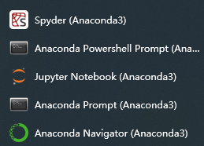
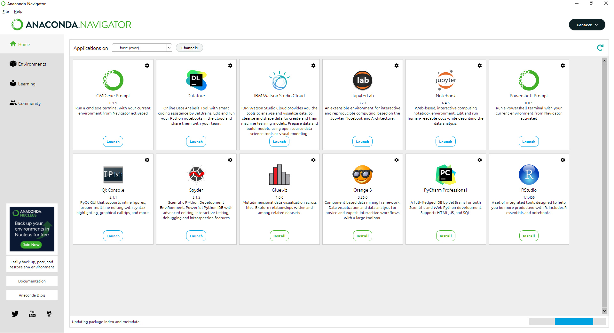

tags:: [[Anaconda]]
---

- ## 安装 Anaconda
	- 具体安装步骤参考 [[Miniconda 安装与配置]] .
		- 安装后包括的软件如下：
		- 
	- Anaconda Navigator 是一个可视化面板，管理 Anaconda 已安装的软件.
		- 点击 Environments 可以管理 Python 的库.
		- {:height 573, :width 944}
	- Jupyter Notebook 是基于网页的用于交互计算的应用程序。
		- 它可以用于开发、文档编写、运行代码（不止Python）和展示结果。
	- Spyder 是一个简单的集成开发环境.
		- 和其他的 Python 开发环境相比，它最大的优点就是模仿 MATLAB 的 “工作空间” 的功能，可以很方便地观察和修改数组的值。
- ## 安装问题
	- 参见: [[Anaconda 与 Miniconda 安装疑难杂症]]
- ## 配置 Conda Channel
	- 参见: [[Conda Channel]]
- ## 参考
	- [Anaconda Installers](https://www.anaconda.com/download/success)
	  logseq.order-list-type:: number
	- [Anaconda Distribution](https://www.anaconda.com/docs/getting-started/anaconda/main)
	  logseq.order-list-type:: number