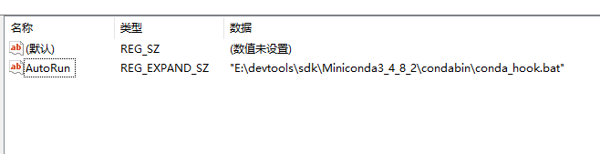

tags:: [[Anaconda]], [[Miniconda]]
---

- ## Windows - 系统找不到指定的路径
	- ### 问题描述
		- Windows下卸载 `Anaconda` 后又安装 `Miniconda` ，发现 `命令行窗口` 会出现 `系统找不到指定的路径。` 字样。
		- 此问题甚至导致 `mvn package` 失败（真是天理难容啊）。
	- ### 解决办法
		- 参考: [关于cmd打开时提示“系统找不到指定的路径”问题](https://blog.csdn.net/jindaxiaoooo/article/details/108436982)
		- 注册表进入 `计算机\HKEY_CURRENT_USER\Software\Microsoft\Command Processor` 路径。
			- 
		- 将 `Autorun` 注册表项的值，改为 `Minconda` 的。
		- 重启 `cmd` 恢复正常。
		- `mvn package` 也恢复正常。
- ## Windows - ERROR REPORT
	- ### 问题描述
		- ```crystal
		  # >>>>>>>>>>>>>>>>>>>>>> ERROR REPORT <<<<<<<<<<<<<<<<<<<<<<
		  
		    Traceback (most recent call last):
		      File "E:\devtools\sdk\conda\miniconda4.11.0\lib\site-packages\conda\cli\main.py", line 143, in main      
		        return activator_main()
		      File "E:\devtools\sdk\conda\miniconda4.11.0\lib\site-packages\conda\activate.py", line 1222, in main     
		        print(activator.execute(), end='')
		    UnicodeEncodeError: 'gbk' codec can't encode character '\ue1bb' in position 912: illegal multibyte sequence
		  
		  `$ E:\devtools\sdk\conda\miniconda4.11.0\Scripts\conda-script.py shell.powershell activate base`
		  
		  environment variables:
		                 CIO_TEST=<not set>
		        CONDA_DEFAULT_ENV=ein
		                CONDA_EXE=E:\devtools\sdk\conda\miniconda4.11.0\Scripts\conda.exe
		               CONDA_HOME=E:\devtools\sdk\conda\miniconda4.11.0
		             CONDA_PREFIX=E:\devtools\sdk\conda\miniconda4.11.0\envs\ein
		               CONDA_ROOT=E:\devtools\sdk\conda\miniconda4.11.0
		              CONDA_SHLVL=1
		           CURL_CA_BUNDLE=<not set>
		                   GOPATH=E:\devtools\repos\go\public
		                 HOMEPATH=\Users\nigre
		                NODE_PATH=E:\devtools\sdk\nodejs\node_global\node_modules
		                     PATH=E:\devtools\sdk\conda\miniconda4.11.0;E:\devtools\sdk\conda\miniconda4
		                          .11.0\Library\mingw-w64\bin;E:\devtools\sdk\conda\miniconda4.11.0\Libr
		                          ary\usr\bin;E:\devtools\sdk\conda\miniconda4.11.0\Library\bin;E:\devto
		                          ols\sdk\conda\miniconda4.11.0\Scripts;E:\devtools\sdk\conda\miniconda4
		                          .11.0\bin;E:\devtools\sdk\conda\miniconda4.11.0\envs\ein;E:\devtools\s
		                          dk\conda\miniconda4.11.0\envs\ein\Library\mingw-w64\bin;E:\devtools\sd
		                          k\conda\miniconda4.11.0\envs\ein\Library\usr\bin;E:\devtools\sdk\conda
		                          \miniconda4.11.0\envs\ein\Library\bin;E:\devtools\sdk\conda\miniconda4
		                          .11.0\envs\ein\Scripts;E:\devtools\sdk\conda\miniconda4.11.0\envs\ein\
		                          bin;E:\devtools\sdk\conda\miniconda4.11.0\condabin;E:\devtools\VMware\
		                          bin;E:\devtools\SecureCRT;C:\Windows\system32;C:\Windows;C:\Windows\Sy
		                          stem32\Wbem;C:\Windows\System32\WindowsPowerShell\v1.0;C:\Windows\Syst
		                          em32\OpenSSH;E:\devtools\sdk\jdk\jdk-11.0.1\bin;E:\devtools\version\gi
		                          t\cmd;E:\devtools\version\svn\bin;E:\devtools\version\TortoiseSVN\bin;
		                          E:\devtools\sdk\nodejs;E:\devtools\sdk\nodejs\node_global;C:\Program
		                          Files (x86)\National Instruments\Shared\LabVIEW
		                          CLI;D:\software\calibre;C:\Program Files\Docker\Docker\resources\bin;C
		                          :\ProgramData\DockerDesktop\version-bin;D:\software\winrar;E:\devtools
		                          \ide\寰俊web寮€鍙戣€呭伐鍏穃dll;E:\devtools\sdk\go\go1_18\bin;E:\devtools\sdk\
		                          conda\miniconda4.11.0\Scripts;E:\devtools\sdk\conda\miniconda4.11.0\Li
		                          brary\bin;E:\devtools\sdk\conda\miniconda4.11.0\Library\mingw-w64\bin;
		                          E:\devtools\sdk\conda\miniconda4.11.0\Library\usr\bin;E:\devtools\sdk\
		                          conda\miniconda4.11.0;C:\Users\nigre\AppData\Local\Microsoft\WindowsAp
		                          ps;C:\Users\nigre\AppData\Roaming\npm;C:\Users\nigre\AppData\Local\Byp
		                          assRuntm;C:\Users\nigre\go\bin
		             PSMODULEPATH=C:\Users\nigre\Documents\WindowsPowerShell\Modules;C:\Program Files\Wi
		                          ndowsPowerShell\Modules;C:\Windows\system32\WindowsPowerShell\v1.0\Mod
		                          ules;E:\devtools\version\svn\PowerShellModules
		               PYTHONPATH=E:\devtools\sdk\conda\miniconda4.11.0
		       REQUESTS_CA_BUNDLE=<not set>
		            SSL_CERT_FILE=<not set>
		  
		     active environment : ein
		    active env location : E:\devtools\sdk\conda\miniconda4.11.0\envs\ein
		            shell level : 1
		       user config file : C:\Users\nigre\.condarc
		  populated config files : C:\Users\nigre\.condarc
		          conda version : 4.12.0
		    conda-build version : not installed
		         python version : 3.9.7.final.0
		       virtual packages : __cuda=11.5=0
		                          __win=0=0
		                          __archspec=1=x86_64
		       base environment : E:\devtools\sdk\conda\miniconda4.11.0  (writable)
		      conda av data dir : E:\devtools\sdk\conda\miniconda4.11.0\etc\conda
		  conda av metadata url : None
		           channel URLs : https://conda.anaconda.org/pytorch/win-64
		                          https://conda.anaconda.org/pytorch/noarch
		                          https://conda.anaconda.org/anaconda/win-64
		                          https://conda.anaconda.org/anaconda/noarch
		                          https://conda.anaconda.org/conda-forge/win-64
		                          https://conda.anaconda.org/conda-forge/noarch
		                          https://conda.anaconda.org/msys2/win-64
		                          https://conda.anaconda.org/msys2/noarch
		                          https://conda.anaconda.org/bioconda/win-64
		                          https://conda.anaconda.org/bioconda/noarch
		                          https://conda.anaconda.org/menpo/win-64
		                          https://conda.anaconda.org/menpo/noarch
		                          https://conda.anaconda.org/simpleitk/win-64
		                          https://conda.anaconda.org/simpleitk/noarch
		                          https://conda.anaconda.org/nogil/win-64
		                          https://conda.anaconda.org/nogil/noarch
		                          https://conda.anaconda.org/ehmoussi/win-64
		                          https://conda.anaconda.org/ehmoussi/noarch
		                          https://conda.anaconda.org/cctbx202112/win-64
		                          https://conda.anaconda.org/cctbx202112/noarch
		                          https://conda.anaconda.org/jasonb857/win-64
		                          https://conda.anaconda.org/jasonb857/noarch
		                          https://conda.anaconda.org/mirror-test/win-64
		                          https://conda.anaconda.org/mirror-test/noarch
		                          https://conda.anaconda.org/prometeia/win-64
		                          https://conda.anaconda.org/prometeia/noarch
		                          https://conda.anaconda.org/cdat-forge/win-64
		                          https://conda.anaconda.org/cdat-forge/noarch
		                          https://repo.anaconda.com/pkgs/main/win-64
		                          https://repo.anaconda.com/pkgs/main/noarch
		                          https://repo.anaconda.com/pkgs/r/win-64
		                          https://repo.anaconda.com/pkgs/r/noarch
		                          https://repo.anaconda.com/pkgs/msys2/win-64
		                          https://repo.anaconda.com/pkgs/msys2/noarch
		          package cache : E:\devtools\sdk\conda\miniconda4.11.0\pkgs
		                          C:\Users\nigre\.conda\pkgs
		                          C:\Users\nigre\AppData\Local\conda\conda\pkgs
		       envs directories : E:\devtools\sdk\conda\miniconda4.11.0\envs
		                          C:\Users\nigre\.conda\envs
		                          C:\Users\nigre\AppData\Local\conda\conda\envs
		               platform : win-64
		             user-agent : conda/4.12.0 requests/2.27.1 CPython/3.9.7 Windows/10 Windows/10.0.19044
		          administrator : False
		             netrc file : None
		           offline mode : False
		  
		  
		  An unexpected error has occurred. Conda has prepared the above report.
		  
		  If submitted, this report will be used by core maintainers to improve
		  future releases of conda.
		  Would you like conda to send this report to the core maintainers?
		  
		  
		  
		  No report sent. To permanently opt-out, use
		  
		    $ conda config --set report_errors false
		  
		  
		  Invoke-Expression : 所在位置 行:1 字符: 2
		  + [y/N]:
		  +  ~
		  属性或类型文本末尾缺少 ]。
		  所在位置 行:1 字符: 4
		  + [y/N]:
		  +    ~
		  必须在“/”运算符后面提供一个值表达式。
		  所在位置 行:1 字符: 4
		  + [y/N]:
		  +    ~~~
		  表达式或语句中包含意外的标记“N]:”。
		  所在位置 E:\devtools\sdk\conda\miniconda4.11.0\shell\condabin\Conda.psm1:107 字符: 9
		  +         Invoke-Expression -Command $activateCommand;
		  +         ~~~~~~~~~~~~~~~~~~~~~~~~~~~~~~~~~~~~~~~~~~~
		    + CategoryInfo          : ParserError: (:) [Invoke-Expression], ParseException
		    + FullyQualifiedErrorId : EndSquareBracketExpectedAtEndOfAttribute,Microsoft.PowerShell.Commands.InvokeExpressionCommand
		  
		  ```
	- ### 解决方案
		- 可能是因为没加这个几个环境变量。
			- ```yaml
			  %CONDA_HOME%\Library\bin
			  %CONDA_HOME%\Library\mingw-w64\bin
			  %CONDA_HOME%\Library\usr\bin
			  ```
			- 为什么说可能，因为加上后没有解决问题，但是重启电脑后发现问题解决了。
		- 也可能是要删除，注册表 `计算机\HKEY_CURRENT_USER\Software\Microsoft\Command Processor` 路径下的 `AutoRun`。
			-