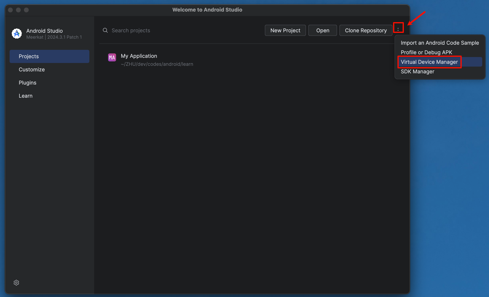
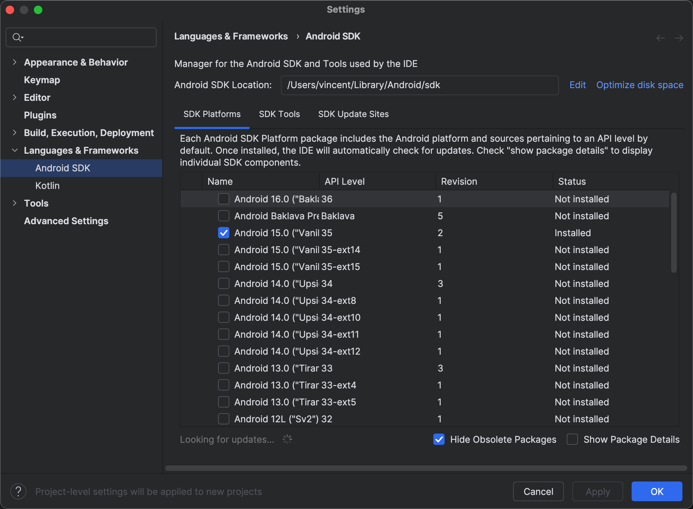
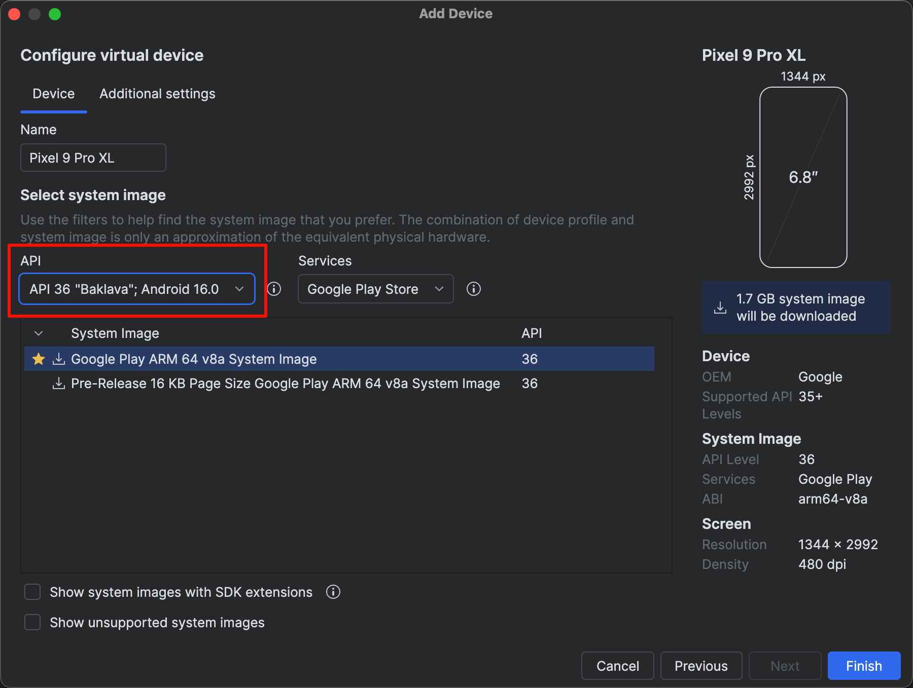

tags:: [[Android Studio]], [[Simulator]] 
---

- ## 从 Android Studio 欢迎界面进入
	- 在 Android Studio 欢迎界面, 点击右上角三个点.
		- {:height 596, :width 697}
	- 可以发现有 `Virtual Device Manager` 和 `SDK Manager` 两个条目.
- ## 安装 Android SDK
	- ### 安装 SDK Platform
		- `SDK Manager` : 是指 Android SDK 版本管理, 是创建模拟器需要的 Android 底层依赖.]
			- 勾选指定版本的 SDK 后 , 点击 `Apply` 即可开始安装 (安装完成后 `Status` 显式 `Installed` ) .
			- {:height 605, :width 657}
	- ### 安装 SDK Tools
		- 勾选如下工具, 点击 `Apply` 开始安装 (安装完成后 `Status` 显式 `Installed` ) :
			- **Android SDK Build-Tools**
			  logseq.order-list-type:: number
			- **Android SDK Command-line Tools**
			  logseq.order-list-type:: number
			- **Android SDK Platform-Tools**
			  logseq.order-list-type:: number
- ## 安装模拟器
	- `Virtual Device Manager` : 虚拟设备 (模拟器) 的管理.
		- 这里的 API , 就是 Android SDK 的版本, 可以选择不同版本.
		- 安装如果很慢, 记得开启代理.
		- {:height 517, :width 654}
	- 安装完成后, 点击 `Additional settings` , 打开 `Emulated Performance` 下的 `Graphics acceleration` 下拉框, 选择提及 `Hardware` 的选项.
- ## 删除模拟器
	- 进入 Android Studio 的 Device Manager 界面, 删除设备.
	  logseq.order-list-type:: number
		- 相当于执行了如下命令:
		- ``` zsh
		  rm -rf ~/.android/avd/<模拟器名称>.avd
		  rm -f ~/.android/avd/<模拟器名称>.ini
		  ```
	- (可选) 如果镜像也不需要了, 可以删除 `~/Library/Android/sdk/system-images/` 目录中的相关镜像.
	  logseq.order-list-type:: number
- ## 参考
	- [Flutter Docs - Set up Android development](https://docs.flutter.dev/platform-integration/android/setup)
	  logseq.order-list-type:: number