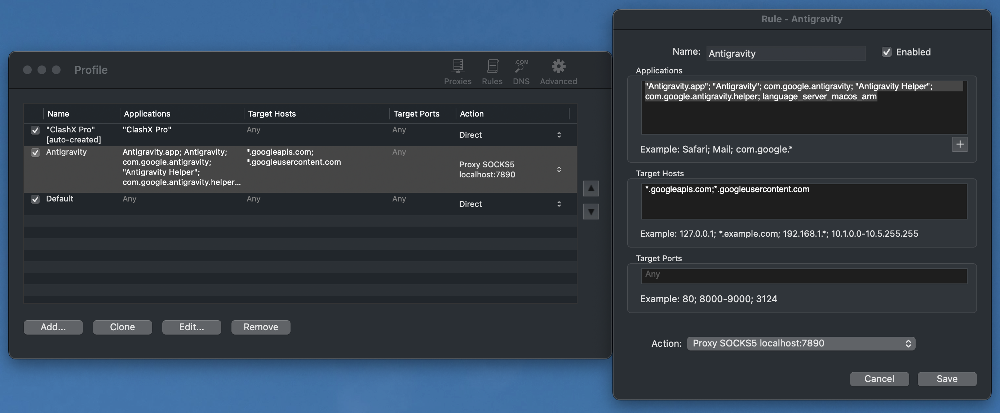

tags:: [[Antigravity]]
---

- ## 使用 Proxifier
	- 直接使用代理软件的话, 需要开启 `TUN` / 增强模式. 这对访问其他网站是有影响的.
	- 使用 Proxifier , 按如下图片设置:
		- {:height 425, :width 860}
		- ``` sh
		  # Applications
		  "Antigravity.app"; "Antigravity"; com.google.antigravity; "Antigravity Helper"; com.google.antigravity.helper; language_server_macos_arm
		  
		  # Target Hosts (这个一定要加, 不加就不行)
		  *.googleapis.com;*.googleusercontent.com
		  ```
	- DNS 配置
		- {:height 513, :width 549}
		- 取消 `Detect DNS settings automatically` , 勾选 `Resolve hostnames through proxy` .
- ## 本机网络 DNS 配置
	- ==以下是或许有效的操作==
	- 发现 Proxifier 日志有这类报错
		- `[12.07 02:12:08] WriteDatagram failed: cannot send data to [fe80::5]:53 with error 65`
	- `fe80::5` 其实就是局域网路由器的 IPv6 地址, 这块是通过这个 IPv6 去做 DNS 解析.
	- AI 建议给本机网络 IPv6 DNS 配置为 `2001:4860:4860::8888` .
- ## 配置编辑器插件代理
	- ==以下操作貌似没必要, 我看不配置也能访问==
	- Settings > Editor Settings > Application > Proxy
		- 配置 `Proxy (Applies to all profiles)` 为我们的代理地址.
- ## 参考
	- [保姆级教程教你如何解决antigravity登不上，我奶奶看了都能学会](https://linux.do/t/topic/1190137)
	  logseq.order-list-type:: number
		- 只有这个教程提到要加 `Target Hosts`
	- [Antigravity 如何使用代理模式访问，需要改什么配置？ tun 模式使用不方便](https://v2ex.com/t/1173881)  > [发现了Antigravity登录时浏览器无法跳转的解决办法](https://linux.do/t/topic/1185942)
	  logseq.order-list-type:: number
	-