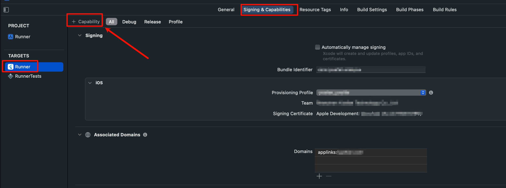

tags:: [[Apple Dev]]
---

- ## 如何开启 App 的能力
	- 方法一:
		- 进入 [Identifiers](https://developer.apple.com/account/resources/identifiers/list) > 进入一个 App Id
		  logseq.order-list-type:: number
		- 勾选要开启的能力.
		  logseq.order-list-type:: number
	- 方法二:
		- 用 Xcode 打开工程.
		  logseq.order-list-type:: number
		- 进入 TARGETS > 选择 TARGET > Signing & Capabilities > 点击 `+ Capability` 新增能力.
		  logseq.order-list-type:: number
			- 
- ## 苹果应用可以使用的能力
	- [[Apple: Associated domains]]
	  logseq.order-list-type:: number
		- [[Apple: Universal Links]]
		  logseq.order-list-type:: number
	- [[Apple: URL Scheme]]
	  logseq.order-list-type:: number
-