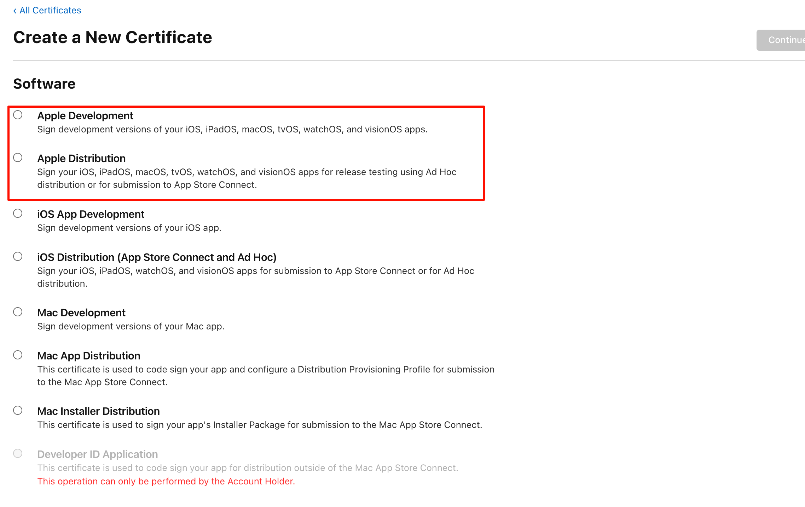
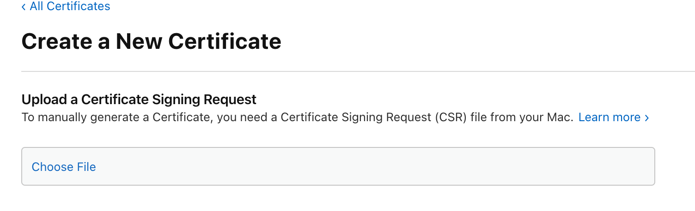
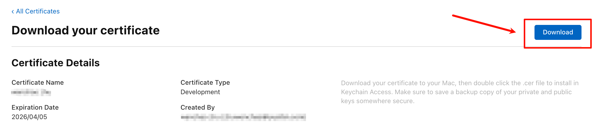
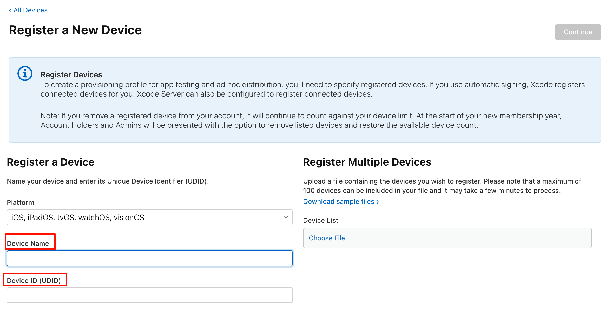
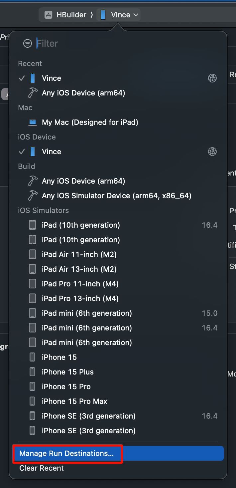
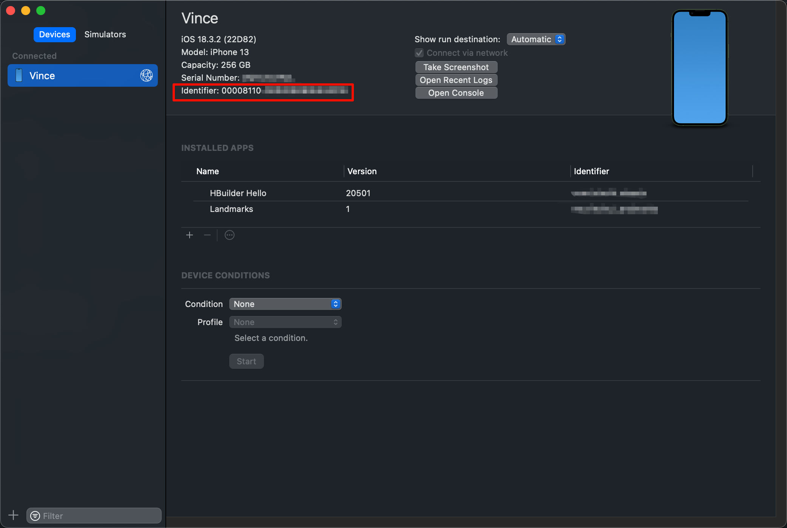
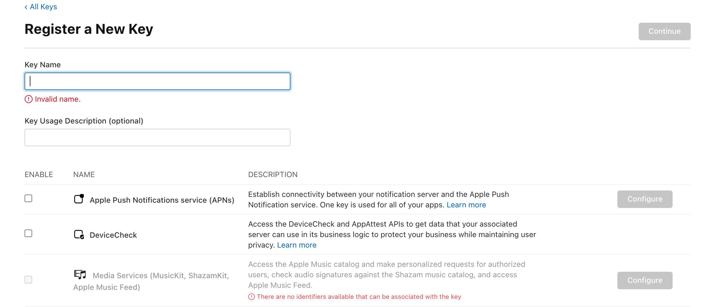

tags:: [[Apple Developer]] 
---

- ## Identifiers
	- App ID , Services ID 等唯一标识.
	- App ID 一般命名为 `com.domainname.appname` .
- ## Certificates
	- ### 什么是 Certificate
		- 即 证书, 是 Apple 颁发给开发者, 用于验证开发者身份的文件.
		- 常见证书:
			- `Development` 证书 : 用于开发测试 .
			  logseq.order-list-type:: number
			- `Distribution` 证书 : 用于发布到 App Store .
			  logseq.order-list-type:: number
	- ### 创建一个 Certificate
		- 选择证书类型.
		  logseq.order-list-type:: number
			- {:height 567, :width 660}
		- 在 macOS 创建一个 Certificate Signing Request (CSR) 文件, 并上传.
		  logseq.order-list-type:: number
			- 参见: [[Keychain Access Certificate]] 进行创建
			- {:height 202, :width 537}
		- 下载并安装 Certificate.
		  logseq.order-list-type:: number
			- {:height 236, :width 913}
			- 参见: [[Keychain Access Certificate]]
	- ### 导出证书为 .p12 文件
		- 参见: [[Keychain Access Certificate]]
- ## Devices
	- ### 什么是 Devices
		- 即 开发运行 用的设备.
		- 设备需要事先注册, 才能运行要开发的 App .
	- ### 注册一个设备
		- {:height 317, :width 936}
		- 此处需要填写 UDID (Unique Device ID)
	- ### 通过 Xcode 获取设备 UDID (Unique Device ID)
		- {:height 403, :width 326}
		- 下图中 Identifier 即为 UDID
		- {:height 399, :width 998}
- ## Provisioning Profiles
	- ### 什么是 Provisioning Profile
		- 参考: [Provisioning profile updates](https://developer.apple.com/help/account/provisioning-profiles/provisioning-profile-updates)
		- Provisioning Profile 文件, 用于授权应用访问某些服务, 验证开发者身份.
	- ### 创建一个 Provisioning Profile 文件
		- 选择 Provisioning Profile 文件类别 .
		  logseq.order-list-type:: number
		- 选择已创建的 App ID .
		  logseq.order-list-type:: number
		- 选择已创建的 Certificate .
		  logseq.order-list-type:: number
		- 选择已注册的设备.
		  logseq.order-list-type:: number
		- 编辑 Provisioning Profile 名称.
		  logseq.order-list-type:: number
	- ### 安装 Provisioning Profile 文件
		- 下载 Provisioning  Profile 文件, 双击即可安装.
		- 或者在 Xcode 中下载开发者账号关联的 Provisioning Profile 文件.
			- 参见: [[Xcode 证书相关]]
- ## Keys
	- ### 什么是 Keys
		- 参考:  [Create a private key to access a service](https://developer.apple.com/help/account/keys/create-a-private-key)
		- Key (私钥) 用于访问某些应用服务的通信, 如:
			- Apple 推送通知服务 (APNs)
			  logseq.order-list-type:: number
			- DeviceCheck
			  logseq.order-list-type:: number
			- MusicKit
			  logseq.order-list-type:: number
			- WeatherKit
			  logseq.order-list-type:: number
		- 我们将在请求该服务的 JSON Web Token (JWT) 中使用 Key .
	- ### 创建一个 Key
		- 填写相关字段, 选择相关服务, 即可创建一个 Key
			- {:height 334, :width 843}
		- 下载时, 它是一个 `.p8` 类型的文件.
		-