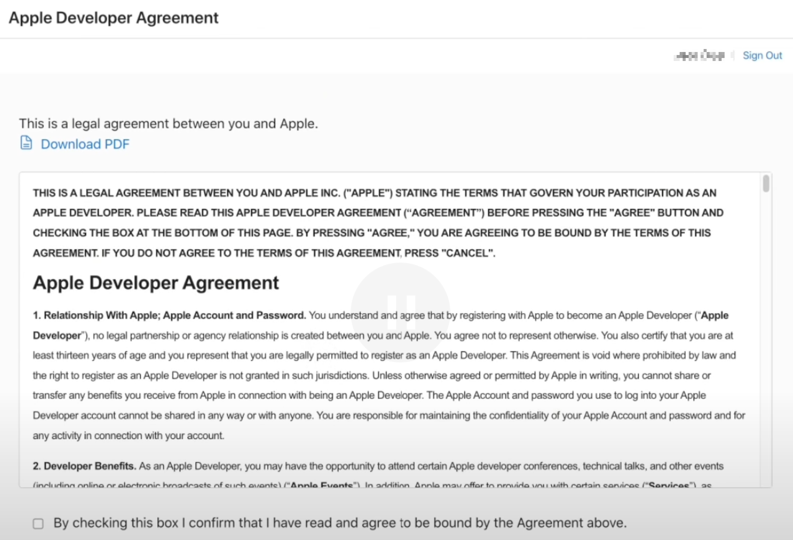

tags:: [[Apple Developer]]
---

- ## 开发者账号分类
	- 参考:
		- [About your account](https://developer.apple.com/help/account/basics/about-your-developer-account)
		  logseq.order-list-type:: number
		- [Account landing page](https://developer.apple.com/help/account/basics/account-landing-page)
		  logseq.order-list-type:: number
		- [Choosing a Membership](https://developer.apple.com/support/compare-memberships/)
		  logseq.order-list-type:: number
	- 普通开发者账号 (Apple Account) .
	  logseq.order-list-type:: number
		- 有如下权限:
			- sign up for developer communications and events (报名相关活动)
			  logseq.order-list-type:: number
			- download beta software and tools (下载工具)
			  logseq.order-list-type:: number
			- test your apps on your device (在设备上测试 APP)
			  logseq.order-list-type:: number
			- post on the forums (在论坛上发帖)
			  logseq.order-list-type:: number
			- report bugs (提交 Bug)
			  logseq.order-list-type:: number
			- ......
	- 加入 **Apple Developer Program (ADP, 苹果开发者计划)** 的开发者账号.
	  logseq.order-list-type:: number
		- 作为个人开发者, 可以通过 **个人注册** 或者 **加入组织** 的方式, 加入 Apple Developer Program .
		- 除了拥有 普通开发者账号 的权限以外, 还拥有如下权限:
			- 访问 App Store Connect (一套用于提交和管理我们要发布的 APP 的工具) .
			  logseq.order-list-type:: number
			- 使用 TestFlight (分享软件 Beta 版本的工具)
			  logseq.order-list-type:: number
			- 管理 Certificates, Identifiers & Profiles 等内容
			  logseq.order-list-type:: number
			- 查看分析数据
			  logseq.order-list-type:: number
			- ......
		- 如果是 **组织账号** , 还拥有 **团队成员管理** 的权限.
	- ==查看两种账号比较: [Choosing a Membership](https://developer.apple.com/support/compare-memberships/)==
- ## 注册普通开发者账号
	- ### 若已有 Apple ID
		- 访问 [Apple Account](https://account.apple.com/sign-in) , 填写账号密码进行登录.
		  logseq.order-list-type:: number
		- 登录之后, 会弹出如下协议, 我们点击同意并提交即可.
		  logseq.order-list-type:: number
			- {:height 514, :width 744}
	- ### 若还没有 Apple ID
		- 进入 [Create Your Apple Account](https://account.apple.com/account) , 填写相关信息进行注册, 有协议点击同意即可.
		  logseq.order-list-type:: number
			- 如果注册失败, Country/Region 改成美国试试.
		- 注册完成, 登录即可.
		  logseq.order-list-type:: number
- ## 加入 Apple Developer Program
	- 参见: [Enrolling, verifying, and renewing with the Apple Developer app](https://developer.apple.com/help/account/membership/enrolling-in-the-app)
	-
- ## 还有哪些计划 Program
	- 参考: [Programs overview](https://developer.apple.com/help/account/membership/programs-overview)
	- 加入 Apple Developer Program 的账号, 如果符合条件, 还可以加入如下计划:
	  logseq.order-list-type:: number
		- Fee waivers.
		  logseq.order-list-type:: number
		- App Store Small Business Program. 
		  logseq.order-list-type:: number
		- Apple Video Partner Program.
		  logseq.order-list-type:: number
		- News Partner Program. 
		  logseq.order-list-type:: number
	- Apple Developer Enterprise Program (ADEP)
	  logseq.order-list-type:: number