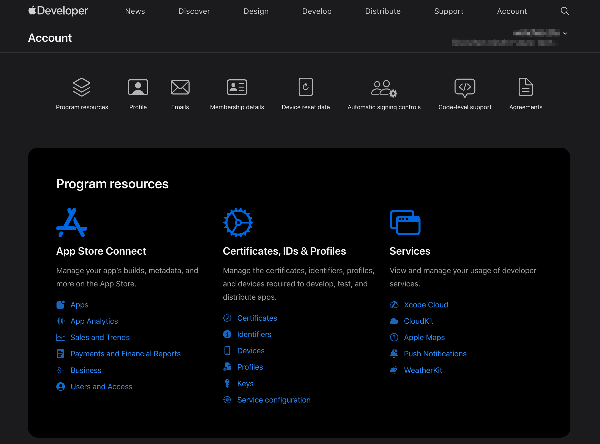

tags:: [[Apple Technology]]
---

- ## 学习路径
	- [[Apple Developer 账号注册]]
	  logseq.order-list-type:: number
	- [[Apple Developer 证书相关]]
	  logseq.order-list-type:: number
	- logseq.order-list-type:: number
- ## Index
	- ### 账号管理
		- 开发者账号相关管理: [Apple Developer Account](https://developer.apple.com/account)
		  logseq.order-list-type:: number
			- {:height 569, :width 624}
		- 证书相关资源管理: [Certificates, Identifiers & Profiles](https://developer.apple.com/account/resources/certificates/list)
		  logseq.order-list-type:: number
		- 团队管理: [Users and Access](https://appstoreconnect.apple.com/access/users)
		  logseq.order-list-type:: number
	- ### 文档
		- 开发者账号帮助文档: [Apple Developer Account Help Docs](https://developer.apple.com/help/account/)
		  logseq.order-list-type:: number
-