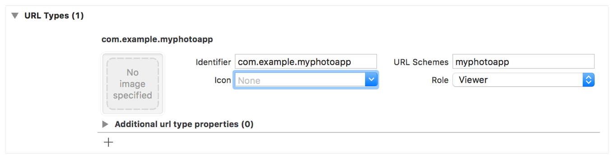
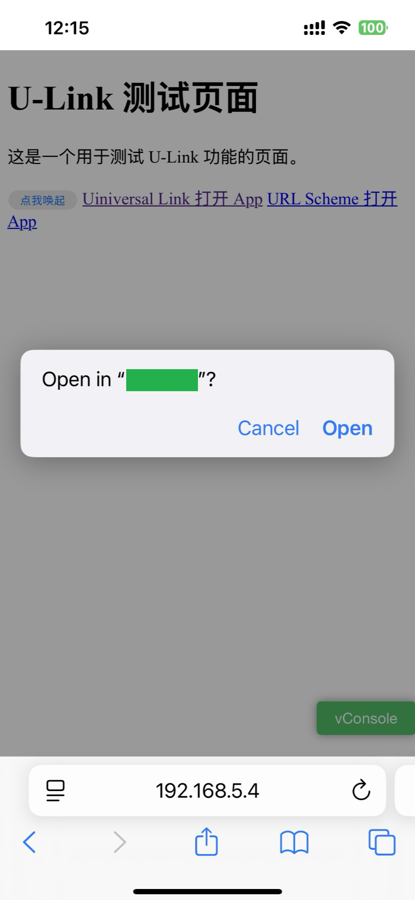

tags:: [[URL Scheme]], [[Apple Technology]], [[Deep Linking]] 
---

- ## Apple 系统保留的 Scheme
	- 参见: [About Apple URL Schemes](https://developer.apple.com/library/archive/featuredarticles/iPhoneURLScheme_Reference/Introduction/Introduction.html#//apple_ref/doc/uid/TP40007899-CH1-SW1)
	- `mailto`
	  logseq.order-list-type:: number
	- `tel`
	  logseq.order-list-type:: number
	- `sms`
	  logseq.order-list-type:: number
	- `facetime`
	  logseq.order-list-type:: number
- ## 如何使用
	- ### 1. Xcode 工程注册 URL Scheme
		- Xcode 工程中, 进入 TARTGETS > 选择 TARGET > 顶部 Info 标签 > URL Types > 新增一个 URL Type
		- 有如下参数:
			- `Identifier` : App 的标识符
				- 可使用 **域名反写** (如 `com.myapp`) 来确保唯一性.
				- 用于将 Scheme 一致的 App 区分开.
				- 但这无法阻止其他 App 处理相同 Scheme .
			- `URL Schemes` : 用于打开 App 的 Scheme
			- `Icon` :
			- `Role` : Scheme 的类型.
				- Editor : 系统知道你这个 Scheme 可以用来 “编辑” 某种内容
				- Viewer : 系统知道这个 Scheme 只是用来看内容, 不会修改
				- None : 系统不会做任何假设, 只是纯粹注册 URL Scheme
				- ==这个参数只是用来做一个标识, 实际 URL Scheme 怎么处理, 还是看具体的代码实现==
		- 
	- ### 2. 目标 App 处理传入的 URL
	- ### 3. 源 App 打开 URL
		- 见下文.
- ## Browser 打开 URL
	- ### Flutter 3.27.0 + a 标签
		- Flutter 3.27.0
		  logseq.order-list-type:: number
		- 浏览器 `<a>` 标签
		  logseq.order-list-type:: number
			- ``` html
			  <a href="myapp://home">URL Scheme 打开 App</a>
			  ```
		- 出现确认弹窗.
		  logseq.order-list-type:: number
			- {:height 397, :width 166}
			-
		- ==可以正常打开==
	- ### Flutter 3.32.0 + a 标签
		-
- ## 参考
	- [Defining a custom URL scheme for your app](https://developer.apple.com/documentation/xcode/defining-a-custom-url-scheme-for-your-app)
	  logseq.order-list-type:: number