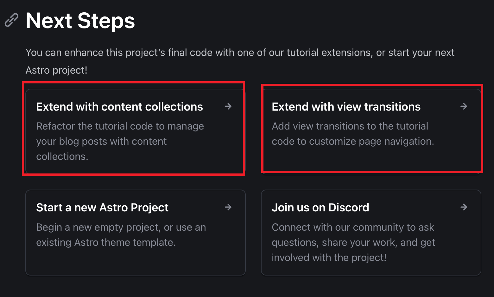

tags:: [[Site]]
---

- ## 学习路线
	- [[Astro 入门]]
	  logseq.order-list-type:: number
- ## 学习进度
	- [Astro Docs](https://docs.astro.build/en/getting-started/)
		- 接下来学习 [Tutorial: Build a Blog  结束后的扩展教程](https://docs.astro.build/en/tutorial/6-islands/3/) ，然后解释 从 Core Concept 开始
			- {:height 241, :width 429}
	-