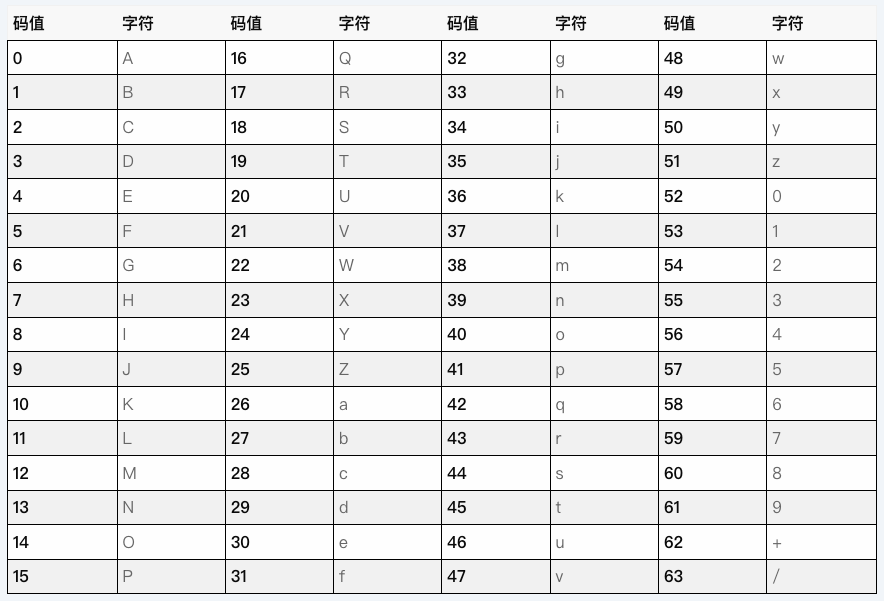

tags:: #编码

- ---
## 介绍
	- **Base64** 是一种将二进制数据转成 **ASCII 可见字符** 数据的方案。
	- **Base64** 主要作用并不是数据加密，它的主要作用是防止在数据传输过程中，特殊字符的处理异常。
- ## 编码原理
	- 参考：https://juejin.cn/post/6844903663459106829
	- 1. 将二进制数据按每 **24 bit (即 3 Byte)** 分割，如果最后不足 24 bit ，则在末尾补0至 24 bit。
	- 2. 将 每 24 bit 再按 6 bit 分割，每个 6 bit 在 Base64 编码表可以对应一个ASCII字符；而末尾如果存在 `000000` ，且所有 0 都是之前补全的，则对应字符为 `=` ( 而不是编码表中的 `A` )。
	- 64 指的是编码后的字符有64种（不包括等号）。
- ## 编码对照表
	- 图片来源：https://tooltt.com/base64-table/
	- 