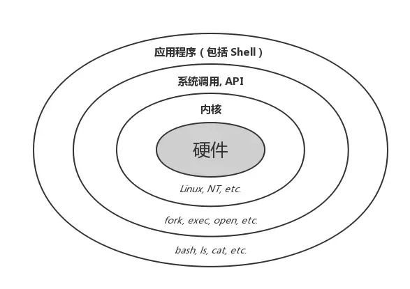

tags:: [[Shell]]
---

- ## CLI 与 GUI
	- `CLI` ( `Command-line Interface` ，命令行界面) 和 `GUI` ( `Graphical User Interface`  ，图形用户界面) ，描述的是 **人机交互的方式**。
		- 前者，通过 `纯文本命令` 的方式，给程序发送指令。
		- 后者，通过 `鼠标、键盘等图形化操作` 的方式，给程序发送指令。
	- `CLI` 和 `GUI` 在调用系统功能上没有本质区别，他们的区别只是给用户提供了不同的给计算机发送指令的方式。
		- ==私以为：==
			- Interface 翻译成 `界面` 并不好理解，会让人以为 `CLI` 和 `GUI` 与界面显示有关；
			- 但实际上他们都只是运行在计算机上的程序，只负责接收输入、调用系统功能、输出结果，与显示无关，显示是 `Terminal` 设备的职责；
				- `CLI 程序` 执行的结果会有一些样式的控制 (比如颜色)，`Terminal` 会对这些样式进行解析渲染。
				- `GUI 程序` 应该也会给 `Terminal`  返回一些需要渲染的图像信息。
				- 但他们并不处理最终的显示。
			- 所以，对于程序员来说，直接翻译成 `接口` 更好理解。
		- 实际上，即便我们没有显示设备，也可以向 `CLI` 和 `GUI` 程序发送指令。
			- 前者，使用纯文本指令即可；
			- 后者，可能需要有一些模拟图形界面操作的指令。
	- 交互设备：
		- 早期的计算机程序都是 `CLI 程序` ，需要用到专门的 `Terminal` 设备进行交互。
		- 后来有了 `GUI` ，无需专门的 `Terminal` 设备，只需用到通用的鼠标、键盘和显示器即可进行交互。
- ## Terminal, TTY 与 Console
	- 早年间，计算机比较笨重，会被安置在单独的机房中；人们通过一些与机房连接的 **外部硬件设备** ，与计算机进行交互，这就是 `Terminal` (终端/终端机) 。
	  logseq.order-list-type:: number
	  id:: 675ce902-0dcb-447e-b3ef-b3922543ed8c
		- 这种外部设备通常需要提供输入功能以供用户 **输入** 、提供显示功能以供 **显示** 处理结果。
	- `Console` 也属于 `Terminal` ，也是 **外部硬件设备** ，但它专门用于系统管理员管理主机，比普通 `Terminal` 拥有更高的权限。
	  logseq.order-list-type:: number
		- 如今，随着个人电脑的普及，我们如今的外部设备 (键盘与显示器)，既可以认为是 `Console` ，也可以认为是 `Terminal` 。
			- 当你在管理系统时，它们是 `Console` ；
			- 当你在做一般的工作时，它们就是普通  `Terminal` 。
		- 所以，如今可以认为  `Console` 等同于 `Terminal` 。
- ## TTY
	- 由于外部设备都比较昂贵，所以 Unix 创始人当年采用 `Teletype` ( 即 `TTY` , **电传打字机** ) 当成 `Terminal` 设备使用。
		- `TTY` 是 Unix 系统的第一个 `Terminal` 。
		- `TTY` 演示：[TWO TELETYPE MODEL 37s LINK FOR RELAY CHAT AT 150 BAUD](https://www.youtube.com/watch?v=MikoF6KZjm0)
		- 为了支持这些 `TTY` 设备，Unix 也设计了名为 `tty` 的子系统，后面的类 Unix 系统都继承了这一名称。
	- 由于 Unix 的 `TTY` 设备使用太广泛，后来即便 `Terminal` 设备早就不使用 `TTY` 了，人们还是习惯把 `Terminal` 设备叫做 `TTY` 设备。
- ## Terminal Emulator
	- 随着计算机的发展，我们已经看不到专门的 `Terminal` 设备了，而是通用的 **键盘和显示器** 。
	- 但是，由于早年的计算机都是 `CLI 程序` ，需要使用专门的 `Terminal` 设备处理用户的 **输入和显示** ，才能与这些 `CLI 程序` 进行交互。
	- 而如今通用的 **键盘和显示器** 只能直接与 `GUI 程序` 进行交互，无法直接与 `CLI 程序` 进行交互。
	- 所以，为了解决这个问题，我们有了 `Terminal Emulator` (终端模拟器)，用于模拟传统的 `Terminal` 设备。它是这样工作的：
		- 接收用户的 `键盘` 输入。
		  logseq.order-list-type:: number
		- 将用户输入发送给 `CLI 程序` 。
		  logseq.order-list-type:: number
		- 获取程序执行结果 。
		  logseq.order-list-type:: number
		- 将执行结果渲染到 `显示器` 。
		  logseq.order-list-type:: number
	- 经典的 `Terminal Emulator` 有：
		- GNU/Linux：gnome-terminal、Konsole；
		- macOS：Terminal.app、iTerm2；
		- Windows：Win32 控制台、ConEmu 等。
	- 由于专门的 `Terminal` 设备已经快消失了，所以如今 `Terminal Emulator` 也被直接称为 `Terminal` 。
- ## Terminal Window 与 Virtual Console
	- 大部分 `Terminal Emulator` 运行在 `GUI 程序` 中，所以这种被称作 `Terminal Window` (终端窗口) 。
	- 也有由操作系统内核直接提供的 `Terminal Emulator` ，这种由内核提供的 `Terminal Emulator` 被称作 `Virtual Console` (虚拟控制器)
		- 比如 在 GNU/Linux 操作系统中，按下 Ctrl + Alt + F1,F2...F6 等组合键可以切换出好几个黑不溜秋的全屏终端界面，而按下 Ctrl + Alt + F7 才是切换回图形界面。
	- 如果 `GUI 程序`  挂掉了，会导致运行于它上面  `Terminal Emulator` 也挂掉，这个时候可以切到 `Virtual Console` 用于救火。
- ## Shell
	- 作为用户，我们无法直接操作系统内核，操作系统在内核之上，为我们提供了 Shell 。
	- Shell 可以帮我们解释并执行命令，从而调用系统内核功能。
		- 
	- Shell 本质上也是一个程序，Shell 可分为 `CLI Shell` 和 `GUI Shell` (只是人机交互方式不同)
		- GUI Shell：Windows 的 Explorer，macOS 的 Finder，Linux 的 GNOME 桌面
		- CLI Shell：Windows 的 cmd 与 PowerShell，类 Unix 的 sh、bash、zsh、fish 等。
	- 我们在谈到 Shell 时 , 通常是指 `CLI Shell` .
- ## Terminal Emulator, Shell 与 CLI 的区别
	- 首先，Shell 本质上也是一个程序，Shell 可分为 `CLI Shell` 和 `GUI Shell` (只是人机交互方式不同) 。
	  logseq.order-list-type:: number
	- 一般操作系统内的 CLI 程序，除了有 CLI Shell (bash、zsh 等) ，还有其他 CLI 程序 (git、java) 。
	  logseq.order-list-type:: number
	- 用户 CLI 指令的调用链路是这样的：用户 -> 键盘 -> Terminal Emulator -> CLI Shell -> Shell 脚本/其他 CLI 程序 -> 操作系统
	  logseq.order-list-type:: number
		- `Terminal Emulator` 只是用于处理输入输出，其本身并不执行用户的指令；
		- 用户输入的指令一般都会通过 `Terminal Emulator` 先发送给 `CLI Shell` ，再由 `CLI Shell` 决定 (一般无法绕过，除非做特别配置)：
			- 是自己执行 (如 Shell 内置命令、Shell 脚本)，还是交给其他 CLI 程序执行 (如 git，java 命令)。
- ## 总结
	- 历史上：
		- `Terminal` 是用于与主机交互的 **外部硬件设备** 。
			- `Console` 是拥有更高权限的 `Terminal` 。
			- `TTY` 是当年 `Terminal`  的一种具体实现，后来也成为管理 `Terminal` 的子系统名称。
		- `Terminal Emulator` 是对 `Terminal` 设备的模拟。
			- 运行在 `GUI 程序` 中的 `Terminal Emulator` ，被称作 `Terminal Window` 。
			- 由 `操作系统内核` 直接提供的 `Terminal Emulator` ，被称作 `Virtual Console` 。
	- 如今：
		- `Console` , `Terminal` , `TTY` 和 `Terminal Emulator`  基本等同，一般都叫 `Terminal` 。
- ## 参考
	- [命令行界面 (CLI)、终端 (Terminal)、Shell、TTY，傻傻分不清楚？](https://segmentfault.com/a/1190000016129862)
	  logseq.order-list-type:: number
	- ChatGPT
	  logseq.order-list-type:: number