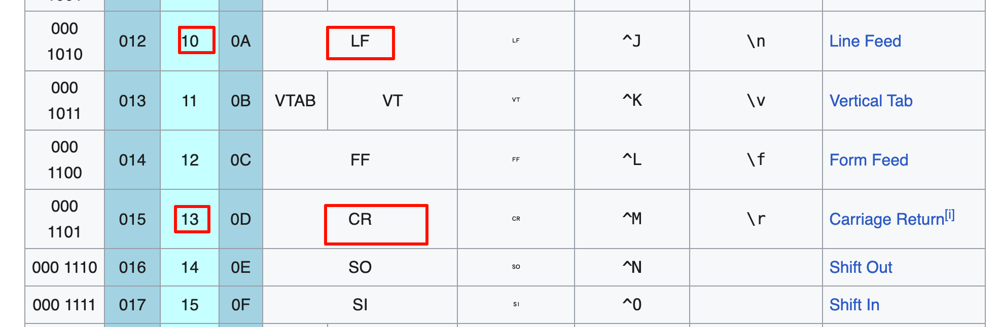
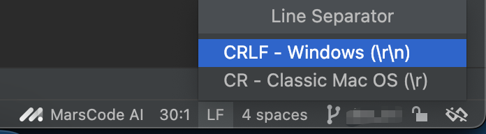
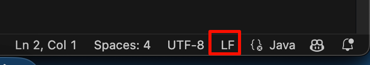

tags:: [[History]], [[Character]], [[EOL]] 
---

- ## 什么是 CRLF
	- `CR` 即 `Carriage Return` , 回车.
	- `LF` 即 `Line Feed` , 换行.
	- 这两个概念来自电传打字机：
		- 打字机打完一行字，需要将 `字车` 推到行首 (即 `Carriage Return` ), 然后让滚筒上卷一行,  以便输入下一行。
	- 所以我们编写文档时使用的回车键，准确来讲是 **回车换行键** .
- ## ASCII 码和转义字符
	- CRLF 的概念, 后来被搬到了计算机上, 作为两个特殊字符。
	- ASCII 码表示：
		- 
		- [图片来源](https://en.wikipedia.org/wiki/ASCII)
	- 这两个符号在 C 语言中的表示 (也广泛用于其他编程语言)：
		- `\r` 表示 `CR` .
		- `\n` 表示 `LF` , `\n` 也被称为 `Newline Character`
- ## 行结束符 (end-of-line terminator)
	- 各系统行结束符：
		- ~~macOS 早期使用 `\r` 作为行结束符.~~
		- 类 Unix 系统 和 现代 macOS 采用 `\n` 作为行结束符.
		- Windows 系统采用 `\r\n` 作为行结束符.
	- 其实，通常我们不会直接输入行结束符，我们通常是使用键盘的 `ENTER` 键来换行；所以，也就是说：
		- 在 类 Unix 系统 和 现代 macOS  中，我们按下 `ENTER` 键时，系统为我们输入了 `\n` 符。
		- 在 Windows 系统 中，我们按下 `ENTER` 键时，系统为我们输入了 `\r\n` 符。
		- 也就是说，我们输入同样的若干行文字，最终存储的字符是不一样的。
- ## 如何兼容
	- ### 编辑器
		- 现代的编辑器，基本都能识别 `\r\n` 和 `\n` , 并正常显示，即便文件被多系统编辑后，既有 `\r\n` 又有 `\n` .
		- 现代编辑器通，通常都能设置编辑用的换行符.
		- IDEA：
			- 
		- VS Code:
			- 
	- ### Git
		- 用户在各自系统编辑时，使用自己 系统 或 编辑器 的行结束符。
		  logseq.order-list-type:: number
		- 在提交到远程仓库时，将行结束符转换为固定的某一种。
		  logseq.order-list-type:: number
		- 用户在拉取远程仓库的文件时，再将行结束符转为自己系统的。
		  logseq.order-list-type:: number
		- 另外，Git 也可以通过 `.gitattributes` 配置，配置 行结束符 。
	-
- ## 参考
	- [回车”（carriage return）和”换行”（line feed）的区别和来历-（附：ASCII表）](https://www.cnblogs.com/ricksteves/p/9899907.html)
	  logseq.order-list-type:: number
	- [03 - Linux、Mac、Windows换行符及对'\r'和'\n'的不同处理 ｜ 青训营](https://juejin.cn/post/7268936556583976995)
	  logseq.order-list-type:: number
	- ChatGPT
	  logseq.order-list-type:: number
-