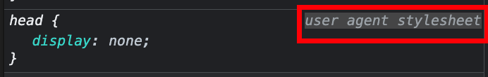

tags:: [[CSS]]
---

- ## 什么是CSS
	- Cascading Style Sheets, 层叠样式表
- ## CSS的作用
	- `document` : 指 HTML , SVG , XML 等标记语言构建的文件。
	- `presenting` :  意味着将 `document` 转换成受众可用的形式，这就是 **浏览器** 的作用
	- **浏览器** 通常被称为 `user agent` (即代表人的计算机程序)；除了 **浏览器** 外，如那些将 HTML  和 CSS 转换成 PDF 的工具也可以被称为 `user agent` 。
	- CSS的作用：
		- **基础样式** ，如颜色、尺寸等
		- **布局**
		- **效果** ，如动画
- ## 关于默认样式
	- ### 解释
		- 之所以不 **显式** 使用 `CSS` 浏览器就能为不同的元素渲染不同的样式，是因为浏览器使用了 **默认样式** 。
		- `browser defaults` , `user agent styles` , `UA styles` , `UA styles sheets` 这几个词都是表示浏览器的 **默认样式** 。
		- **默认样式** 通常长时间内不会改变，不过我们可以使用 [reset.css](https://meyerweb.com/eric/tools/css/reset/) 或者 [normalizer.css](https://github.com/necolas/normalize.css/) 等工具去覆盖 **默认样式** 。
	- ### 查看默认样式
		- inspector 带有 `user agent stylesheet` 字样的样式即为 **默认样式**
		- 
		- [各浏览器的默认样式文件](https://stackoverflow.com/a/6867287)
- ## CSS语法
	- ### 解释
		- CSS 是一个 **rule-based** 语言 ：通过指定应用于网页上 **特定元素或元素组** 的 **样式组** 来定义规则。
	- ### 语法
		- ```css
		  h1 {
		    color: red;
		    font-size: 5em;
		  }
		  ```
		- 以 `selector` 开头。
		- 以 `{}` 包裹多个 `属性: 值` 对，以 `;` 分隔多个样式。
	- ### 属性值
		- 不同的属性，可选的值不同。
			- 比如 `color` 只能使用颜色; `font-size` 只能使用不同单位的尺寸。
		- 可以在这里查看可以使用的CSS属性:  [CSS reference](https://developer.mozilla.org/en-US/docs/Web/CSS/Reference)
		- 可以通过搜索引擎搜索 `mdn css-feature-name` 来搜索相应的属性，如 `mdn color`
	- ### CSS结构
		- 冒号前的叫: **property**
		- 冒号后的叫: **value**
		- 大括号中的一个 **property-value** 对被称为 **CSS declaration** ; 多个 **CSS declaration** 组成 **CSS declaration block** (下图高亮部分)。
		- 
		- **selector** 和 大括号中的 **CSS declaration block** 的组合被称为 **CSS ruleset** 或 **CSS rule** (如下图高亮部分可称为  `h1` rule )
		- 
		- **property** 与 **value** 都 **大小写不敏感** ；若拼写错误，CSS engine 将会忽略该 CSS declaration 。
- ## CSS specifications
	- CSS 规范，由 W3C 的 CSS Working Group 维护，它由 **浏览器厂商** 、 **一些对CSS感兴趣的公司** 和 **特邀专家** 组成。
	- 新的 CSS 特性被开发，通常有以下几种情况：
		- 某个浏览器厂商，对一些新能力感兴趣。
		  logseq.order-list-type:: number
		- Web 设计者和开发者想要新功能。
		  logseq.order-list-type:: number
		- 工作组本身确定了一个新需求。
		  logseq.order-list-type:: number
	- 关于 CSS 规范一个关键的事情是：新版规范不应该打破原来的规则。
	- CSS 规范主要是作为 user agent 实现功能的参考，不是为我们开发者准备的。
	- 不同浏览器对 CSS 的支持情况不同，我们可以在  [CSS reference](https://developer.mozilla.org/en-US/docs/Web/CSS/Reference) 查看各浏览器对属性的支持情况。
- ## Apply CSS
	- ### external stylesheet
		- ```html
		  <!-- 放到 head 元素中 -->
		  <link rel="stylesheet" href="styles/style.css" />
		  <link rel="stylesheet" href="styles/general/style.css" />
		  <link rel="stylesheet" href="../styles/style.css" />
		  ```
	- ### internal stylesheet
		- ```html
		  <!DOCTYPE html>
		  <html lang="en-GB">
		  <head>
		  <meta charset="utf-8" />
		  <title>My CSS experiment</title>
		  <style>
		    h1 {
		      color: blue;
		      background-color: yellow;
		      border: 1px solid black;
		    }
		    p {
		      color: red;
		    }
		  </style>
		  </head>
		  <body>
		  <h1>Hello World!</h1>
		  <p>This is my first CSS example</p>
		  </body>
		  </html>
		  ```
		- 当我们无法编辑 **外部CSS** 文件时，这十分有效。
		- 但是，当我们有多个页面要使用一个统一的样式时， **internal stylesheet** 变得很低效，因为：
			- 你必须在每个页面中写入相同的样式内容。
			- 当样式需要修改时，你需要修改每个页面中的样式。
	- ### inline styles
		- ```html
		  <!DOCTYPE html>
		  <html lang="en-GB">
		  <head>
		    <meta charset="utf-8" />
		    <title>My CSS experiment</title>
		  </head>
		  <body>
		    <h1 style="color: blue;background-color: yellow;border: 1px solid black;">
		      Hello World!
		    </h1>
		    <p style="color:red;">This is my first CSS example</p>
		  </body>
		  </html>
		  ```
		- 除非不得已，不然不要使用此方法，因为：
			- 样式需要修改时，你需要在页面多个地方修改。
			- HTML 混合 CSS 使代码可读性降低。
		- 当你能编辑的只有 `<body>` 中的元素时，你只能使用 **inline styles** 。
			- 在电子邮件中，经常能看到 **inline styles** ，这是为了兼容更多的邮件客户端。
- ## selectors
	- ```css
	  h1
	  a:link
	  .manythings
	  #onething
	  *
	  .box p
	  .box p:first-child
	  h1, h2, .intro
	  ```
	- ### .class
	  
	  ```css
	  .special {
	    color: orange;
	    font-weight: bold;
	  }
	  ```
	- ### element.class
		- 表示包含指定class的element
		- ```css
		  li.special {
		    color: orange;
		    font-weight: bold;
		  }
		  ```
	- ### element element
		- ` ` (空格) 被称为: **descendant combinator** (子代组合符)
		- 表示选择 一个元素的某个 **子孙元素** (即子子孙孙，并非只作用于子元素)。
		- ```css
		  li em {
		    color: rebeccapurple;
		  }
		  ```
	- ### element + element
		- `+` 被称为: **adjacent sibling combinator** (邻近兄弟组合符)
		- 表示 一个元素同层级的下一个 **相邻** 的指定元素 (即 不会作用到上一个; 而如果下一个相邻的元素非指定的元素，也不会起作用)。
		- ```css
		  h1 + p {
		    font-size: 200%;
		  }
		  ```
	- ### element:state
		- ```css
		  a:link {
		    color: pink;
		  }
		  a:visited {
		    color: green;
		  }
		  a:hover {
		    text-decoration: none;
		  }
		  ```
	- ### 多个 selector 和 combinator 的组合
		- ```css
		  /* selects any <span> that is inside a <p>, which is inside an <article>  */
		  article p span {
		  }
		  - /* selects any <p> that comes directly after a <ul>, which comes directly after an <h1>  */
		  h1 + ul + p {
		  }
		  - /*This will style any element with a class of special, which is inside a <p>, which comes just after an <h1>, which is inside a <body> */
		  body h1 + p .special {
		    color: yellow;
		    background-color: black;
		    padding: 5px;
		  }
		  ```
- ## CSS 优先级
	- CSS 优先级有两条规则：**cascade** 和 **specificity**
	- ### cascade rule
		- 即靠后的样式，覆盖前面的样式。
	- ### specificity rule
		- 越具体的选择器，优先级越高（即覆盖其他选择器的指定的样式）。
			- 比如 类选择器 优先级 高于 元素选择器。
- ## accessibility
	- 一个朴素的HTML文档通常对所有用户来说都是 **可访问的** ，当我们对其设置样式时，要避免降低它的 **可访问性** 。
- ---
- ## 参考
	- MDN : [What is CSS?](https://developer.mozilla.org/en-US/docs/Learn/CSS/First_steps/What_is_CSS)
	  logseq.order-list-type:: number
-