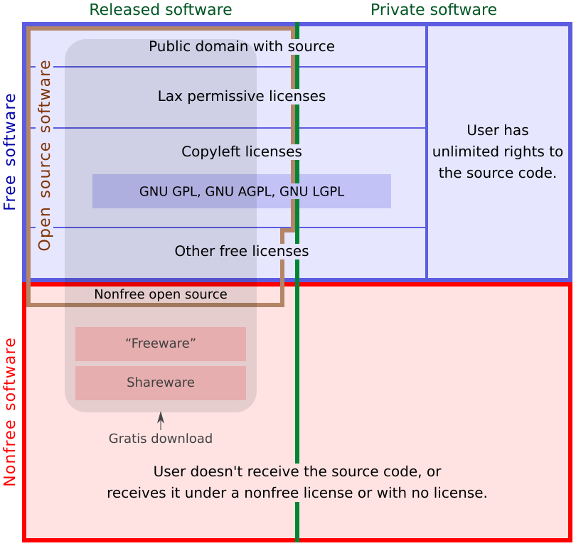

tags:: [[Free Software]], [[Open Source Software]]
---

- ## 软件分类
	- 
	- 图源: [Categories of Free and Nonfree Software](https://www.gnu.org/philosophy/categories.html)
- ## Open Source Software & Free Software
	- 理想状态下, Free Software 应该都可以被划分到 Open Source Software .
		- 但是, 或许可能存在某些 Free Software 不被 [[Open Source Definition]] 认可.
		- ==这或许正是上面 Open Source Software 右下有个缺角的原因==
	- Open Source Software 存在一部分软件, 不被承认为 Free Software .
		- 具体参见: [[Open Source & Free Software]]
- ## 参考
	- [Categories of Free and Nonfree Software](https://www.gnu.org/philosophy/categories.html)
	  logseq.order-list-type:: number
-