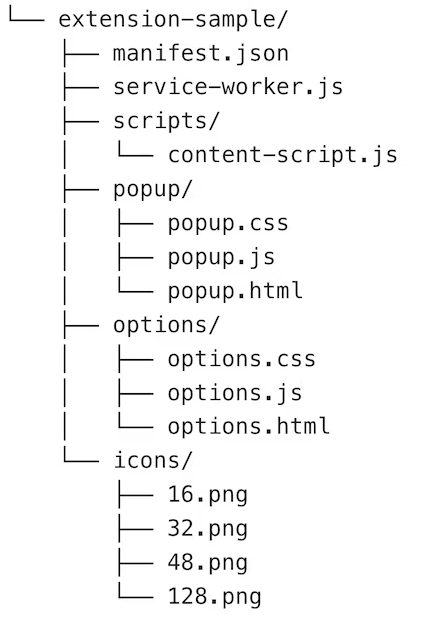
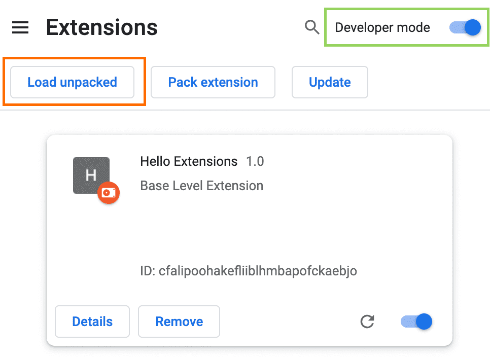
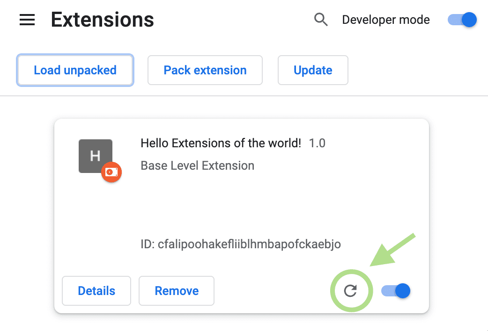
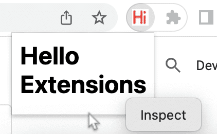

## Extension files
	- ### Files Structure
		- 图片来源: `https://wd.imgix.net/image/BhuKGJaIeLNPW9ehns59NfwqKxF2/Txq5CxeXjQz7i4wmP8zO.png?auto=format&w=439`
		- {:height 644, :width 434}
	- ### 常用文件
		- manifest
		- service worker
		- content scripts
		- popup and other pages
	- ### manifest
		- extension 唯一的必要文件 .
		- 文件名必须为 `manifest.json` , 且必须位于 extension 的根目录 .
		- 记录一些重要的 `metadata` .
	- ### service worker
		- 监听 和 处理 `browser events` (如 关闭一个 tab) .
		- 可以调用所有 `Chrome Api` .
		- 不能直接与网页内容交互 .
	- ### content scripts
		- 可以在网页中执行 Javascript .
		- 可以读取和修改网页的 `DOM`.
		- 可以直接调用部分 `Chrome Api`.
		- 可以通过与 `service worker` 交互, 间接调用剩下的那部分 `Chrome Api` .
	- ### popup and other pages
		- Extension 可以包含各种 HTML 页面:
			- 一个 [popup](https://developer.chrome.com/docs/extensions/mv3/user_interface/#popup)
			  logseq.order-list-type:: number
			- 一个 [options page](https://developer.chrome.com/docs/extensions/mv3/options/)
			  logseq.order-list-type:: number
			- [其它 HTML pages](https://developer.chrome.com/docs/extensions/mv3/architecture-overview/#html-files)
			  logseq.order-list-type:: number
- ## Minimal Start
	- 创建一个新文件夹，保存插件的所有文件。
	  logseq.order-list-type:: number
	- 根目录创建 `manifest.json` 文件，编辑如下内容:
	  logseq.order-list-type:: number
		- 只有三个字段是必须的:
			- `"manifest_version"` : 只填 3，这是最新版本.
			- `"name"` : 插件名称.
			- `"version"` : 插件版本.
		- ``` json
		  {
		      "manifest_version": 3,
		      "name": "extension's name",
		      "version": "0.0.1"
		  }
		  ```
	- 在浏览器中加载此插件进行调试.
	  logseq.order-list-type:: number
		- 加载插件文件夹即可.
		- {:height 272, :width 375}
	- pin 这个插件，以方便调试。
	  logseq.order-list-type:: number
- ## Reload Extension
	- 修改代码后，可能需要按如下方式 reload 插件.
		- {:height 272, :width 378}
	- 有些修改需要 reload , 有些不需要.
		- | Extension component | Requires extension reload |
		  | ---- | ---- | ---- |
		  | The manifest | Yes |
		  | Service worker | Yes |
		  | Content scripts | Yes (plus the host page) |
		  | The popup | No |
		  | Options page | No |
		  | Other extension HTML pages | No |
- ## Debug Extension
	- ### Inspect Pages
		- 右击插件的 page , 点击 inspect .
			- {:height 121, :width 274}
			- (图中是 popup page)
	- ### Error logs
		- {:height 315, :width 364}
		- 插件管理页面可以看到插件的错误日志.
- ## Manifest Comment
	- 注意, 在开发阶段 `manifest.json` 文件中可以使用 `//` 注释, 但是发布时，所有注释都必须去掉.
	-
- ---
- ## 参考
	- ~~[Architecture overview](https://developer.chrome.com/docs/extensions/mv3/architecture-overview/)~~ 官网文档经过调整后此页面找不到了
	  logseq.order-list-type:: number
	- [Hello World](https://developer.chrome.com/docs/extensions/get-started/tutorial/hello-world)
	  logseq.order-list-type:: number
	- logseq.order-list-type:: number