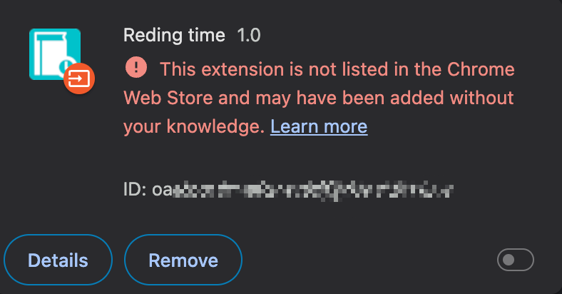
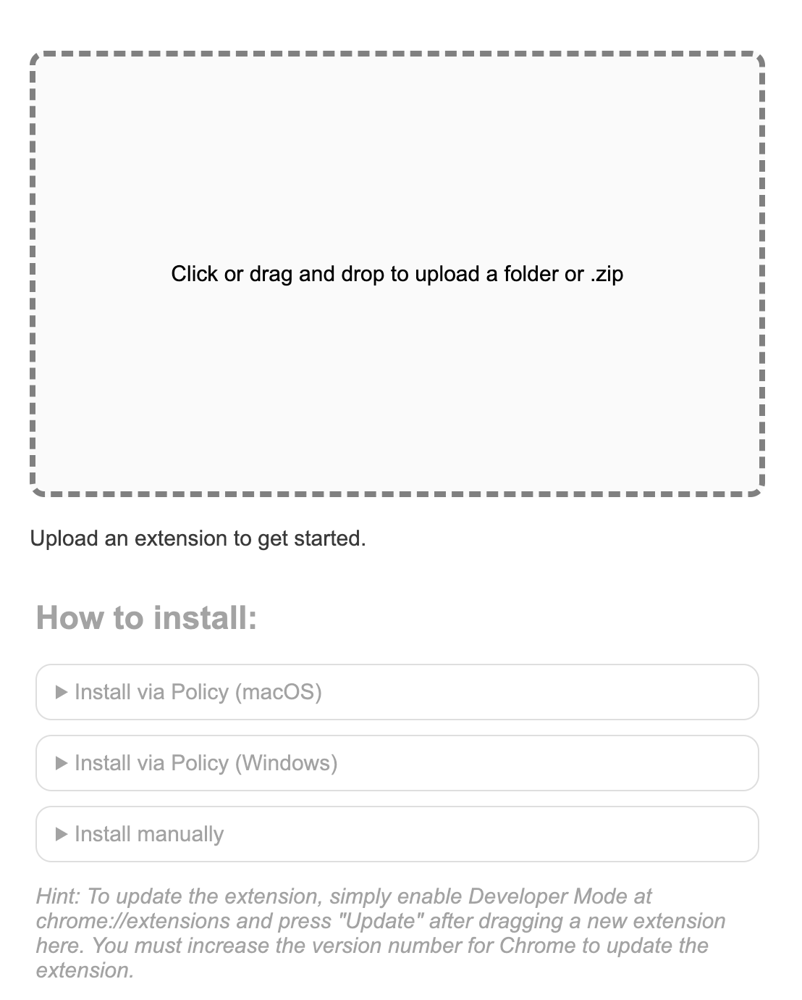
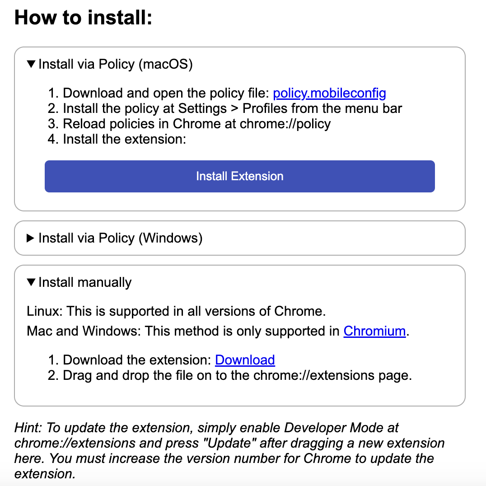
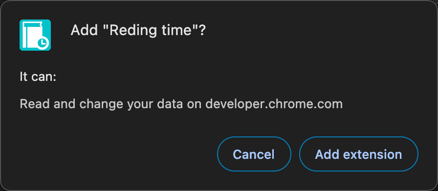
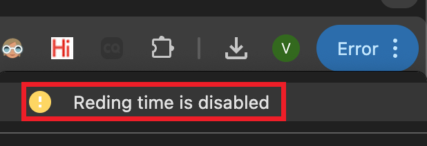
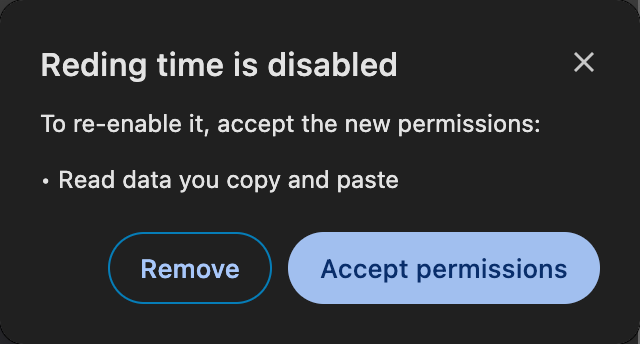
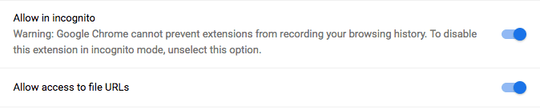
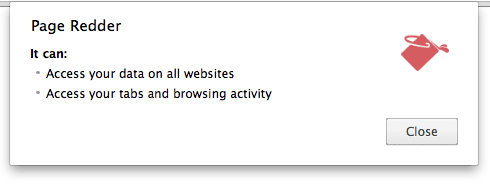
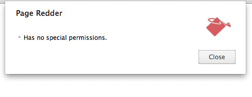

## Declare permissions
	- ==参考:== [Declare permissions](https://developer.chrome.com/docs/extensions/develop/concepts/declare-permissions)
	- ### Introduction
		- 使用插件的大多数 API 和 Feature 时，都要在 `manifest.json` 中声明权限。
		- 有如下几个 key 可以声明权限:
			- `permissions`
			- `optional_permissions`
			- `content_scripts.matches`
			- `host_permissions`
			- `optional_host_permissions`
		- ``` json
		  {
		    "name": "Permissions Extension",
		    ...
		    "permissions": [
		      "activeTab",
		      "contextMenus",
		      "storage"
		    ],
		    "optional_permissions": [
		      "topSites",
		    ],
		    "host_permissions": [
		      "https://www.developer.chrome.com/*"
		    ],
		    "optional_host_permissions":[
		      "https://*/*",
		      "http://*/*"
		    ],
		    ...
		    "manifest_version": 3
		  }
		  ```
	- ### Manifest - permissions
		- 权限变动时会触发 warning.
		- 所有可以配置的权限: [Reference - Permissions](https://developer.chrome.com/docs/extensions/reference/permissions-list)
	- ### Manifest - optional_permissions
		- 作用与 `permissions` 一致.
			- 只不过 `permissions` 是在 install time 弹出 warning , 需要用户确认;
			- 而 `optional_permissions` 是在 runtime 弹出 warning , 需要用户确认.
	- ### Manifest - content_scripts.matches
		- content scripts 配置的 host permission , 参见 [[Chrome Extension/Content Scripts]]
		- 权限变动时会触发 warning .
	- ### Manifest - host_permissions
		- 配置 host permission , 某些 Chrome API 除了需要 API 本身的权限外, 还需要配置 `host_permissions` .
		- 权限变动时会触发 warning .
	- ### Manifest - optional_host_permissions
		- 作用与 `host_permissions` 一致.
			- 只不过 `host_permissions` 是在 install time 弹出 warning , 需要用户确认;
			- 而 `optional_host_permissions` 是在 runtime 弹出 warning , 需要用户确认.
- ## Permission warning
	- ==参考:== [Permission warning guidelines](https://developer.chrome.com/docs/extensions/develop/concepts/permission-warnings)
	- ### Introduction
		- 用户从 Chrome Web Store 安装插件时，可能出现 permission warning ，需要用户确认。
			- 本地 `Load Unpacked` 安装插件，貌似不会出现 permission warning .
			- 注意：貌似，目前 Chrome 无法通过 `.crx` 文件安装插件 (将后缀改成 `.zip` 貌似也不行).
				- 安装成功后有告警, 貌似必须配置好 policy , 让系统信任此插件 .
				- {:height 154, :width 320}
		- 权限所对应的 warning 参见 [Reference - Permissions](https://developer.chrome.com/docs/extensions/reference/permissions-list)
			- 并非所有权限都会展示 permission warning .
			  logseq.order-list-type:: number
			- 有些权限和其他权限一起声明的时候, 也不会展示它的 permission warning .
			  logseq.order-list-type:: number
	- ### Best practices
		- 参考: [Use of Permissions](https://developer.chrome.com/docs/webstore/program-policies/permissions)
		- 首先保证插件只实现单一功能 (single purpose) , 保证插件使用尽可能少的权限.
		  logseq.order-list-type:: number
			- 不要为未实现的功能配置权限.
		- 使用 **optional permissions** .
		  logseq.order-list-type:: number
			- 这样，用户可以在使用到具体功能时，再决定要不要允许相应权限.
		- 使用 `activeTab` 权限.
		  logseq.order-list-type:: number
			- 这个权限不会展示 warning .
	- ### Test warnings
		- 参照以下步骤，在本地测试安装时的 permission warning :
			- Clone [extension-update-testing-tool](https://github.com/GoogleChromeLabs/extension-update-testing-tool) repository .
			  logseq.order-list-type:: number
			- Run `npm install` in the root of the repository.
			  logseq.order-list-type:: number
			- Run `npm start` .
			  logseq.order-list-type:: number
			- Open the local server at `http://localhost:8080` in Chrome.
			  logseq.order-list-type:: number
			- Drag an unpacked extension to the page. (貌似 `.zip` 文件不行)
			  logseq.order-list-type:: number
				- {:height 395, :width 309}
			- 按照 `Install via Policy` 的步骤, 进行操作 (先安装 policy, 再刷新 policy, 最后再安装插件) .
			  logseq.order-list-type:: number
				- {:height 345, :width 321}
				- permission warning 如下图所示
					- {:height 156, :width 346}
				- 如果直接按照 `Install manually`进行安装, 虽然也会显示 permission warning, 但会显示如下告警
					- {:height 154, :width 320}
					- > This extension is not listed in the Chrome Web Store and may have been added without your knowledge.
			- 更新插件时, 只需在 `chrome://extensions` 点击 `update` 即可.
			  logseq.order-list-type:: number
	- ### Test Updating Permission
		- 当插件的新版本的权限发生变化时, 我们可以采用如下方式进行测试 (确保插件版本号有增大):
			- 在 `http://localhost:8080` 重新拖入插件目录.
			  logseq.order-list-type:: number
			- 在 `chrome://extensions` 页面点击 `update` .
			  logseq.order-list-type:: number
				- 可以看到右上角出现 `Error` 提示, 此时插件被 disable .
				- {:height 142, :width 433}
			- 点击告警信息, 然后点击 `Accept permissions` 以允许新的权限请求.
			  logseq.order-list-type:: number
				- 这样, 插件又可以重新使用.
				- {:height 190, :width 429}
- ## File URLs and incognito mode permission
	- 右击插件 icon .
	  logseq.order-list-type:: number
	- 选择 **Manage Extension** .
	  logseq.order-list-type:: number
	- 开启如下选项
	  logseq.order-list-type:: number
		- 
- ## activeTab permission
  id:: 66234969-25eb-4e69-be3c-08961eae8400
	- ==参考:==
		- [Inject scripts into the active tab#Step 3: Enable the extension action](https://developer.chrome.com/docs/extensions/get-started/tutorial/scripts-activetab#step-3)
		  logseq.order-list-type:: number
		- [The activeTab permission](https://developer.chrome.com/docs/extensions/develop/concepts/activeTab)
		  logseq.order-list-type:: number
	- ### Introduction
		- `activeTab` permission 可以赋予插件 *临时访问当前页面* 的权限.
		- 当用户在当前这个 `tab` , 这个权限一直持续, 直到如下几种情况, 权限才被取消:
			- 用户离开当前 `tab` .
			  logseq.order-list-type:: number
			- 用户关闭当前 `tab` .
			  logseq.order-list-type:: number
			- 当前 `tab` 的 `origin` (由 **协议//:域名:端口** 唯一确定) 改变.
			  logseq.order-list-type:: number
		- 如果不配置这个权限, 可能需要配置 `<all_urls>` pattern 以匹配所有网站, 这样的话, 安装插件时将产生 permission warning .
			- Without "activeTab":
				- {:height 198, :width 490}
			- With "activeTab":
				- 
	- ### Enable activeTab permission
		- 需要在 `manifest.json` 中声明 `activeTab` 权限.
			- ``` json
			  {
			    ...
			    "permissions": ["activeTab"],
			    ...
			  }
			  ```
		- 如下几种情况, 可以开启 `activeTab` 权限:
			- Executing an [action](https://developer.chrome.com/docs/extensions/reference/api/action) (toolbar 上的 icon, 包括点击 icon 和打开 popup)
			  logseq.order-list-type:: number
			- Executing a [context menu item](https://developer.chrome.com/docs/extensions/reference/api/contextMenus) (右键菜单)
			  logseq.order-list-type:: number
			- Executing a keyboard shortcut from the [commands API](https://developer.chrome.com/docs/extensions/reference/api/commands) (快捷键)
			  logseq.order-list-type:: number
			- Accepting a suggestion from the [omnibox API](https://developer.chrome.com/docs/extensions/reference/api/omnibox) (搜索框)
			  logseq.order-list-type:: number
	- ### What activeTab allows
		- 执行 `scripting.insertCSS()` 和 `scripting.executeScript()` (需要配置 `scripting` 权限).
		  logseq.order-list-type:: number
		- 通过 Chrome API 返回的 [`tabs.Tab`](https://developer.chrome.com/docs/extensions/reference/api/tabs#type-Tab) 对象, 可以获取当前 tab 的 URL, title, favicon 等, 插件临时获取 host permission .
		  logseq.order-list-type:: number
		- 通过使用`chrome.webRequest` API , 拦截当前 tab 到 当前 tab 的 `main frame origin` 的请求, 插件临时获取 `main frame origin` 的 host permissions .
		  logseq.order-list-type:: number
- ## scripting permission
	- ### Introduction
		- 注入 JavaScript 或 CSS 文件，到指定页面。
		- 与 content scripts 的作用类似，只不过 `chrome.scripting` 可以在运行时执行.
	- ### Manifest
		- 除了在 `manifest.json` 声明 `scripting` 权限，还需要额外声明 `activeTab` 权限, 或者 `host_permissions` key .
		- ``` json
		  {
		    "name": "Scripting Extension",
		    "manifest_version": 3,
		    "permissions": ["scripting", "activeTab"],
		    ...
		  }
		  ```
-
- ---
- ## 参考
	-
	- logseq.order-list-type:: number