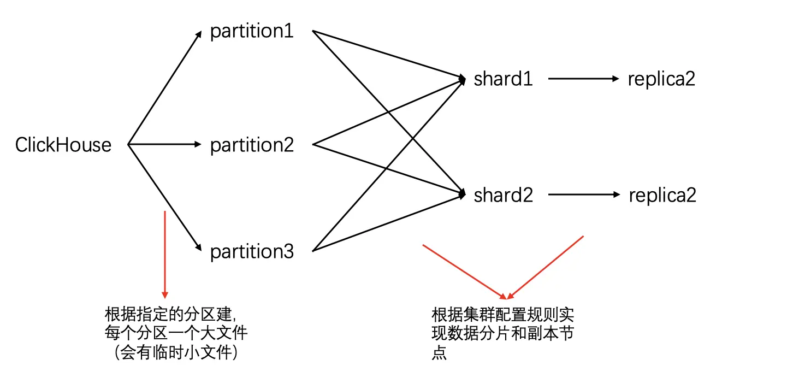

tags:: [[ClickHouse]]
---

-
- ## 分区与分片的理解
	- 参考: [对ClickHouse分片和分区的简单理解](https://www.jianshu.com/p/178a01e0ae6e)
	- 
	- **分区** 是根据分区规则，在物理层面将 **每一行数据** 分别存储在指定文件中。
	- **分片** 是根据分片规则，将 **每一行数据** 分别存储在指定节点上，而在每个节点上，数据还是会按照 **分区** 的规则存储在指定文件。
	-
-