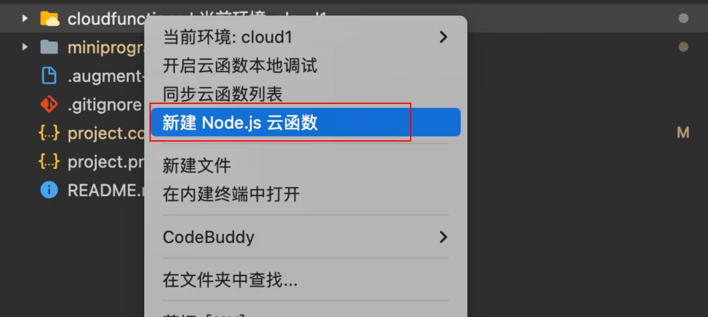

tags:: [[CloudBase 云函数]]
---

- ## 什么是 CloudBase 云函数
	- CloudBase 云函数, 是 CloudBase 提供的一种 [[Serverless]] 服务.
	- CloudBase 云函数分为:
		- **普通云函数 (Custom Function)** : 开发者只需编写 **业务逻辑函数** (而无需编写完整的服务)
		  logseq.order-list-type:: number
		- **HTTP 云函数 (HTTP Function)** : 开发者需要编写 **完整的 Web 服务** (但相比 [[CloudBase 云托管]] 受一些限制)
		  logseq.order-list-type:: number
- ## CloudBase 云函数支持的语言
	- 不管是 **普通云函数** 还是 **HTTP 云函数** , 都支持如下语言:
		- `Node.js / Python / Java / Go / PHP`
	- 对于 `Node.js` **HTTP 云函数** , 可以引入 **CloudBase** 提供的 **Functions Framework** 框架进行开发.
		- 它提供了简洁的 **函数式编程** 体验. (参见: [[CloudBase Functions Framework]] )
- ## CloudBase 云函数创建方式
	- **CloudBase 云函数** 有如下创建方式:
		- **通过模板创建**
		  logseq.order-list-type:: number
			- [CloudBase 控制台 - 云函数 - 通过模板创建](https://tcb.cloud.tencent.com/dev?#/scf/function/create)
		- **本地代码上传**
		  logseq.order-list-type:: number
			- 手动上传代码 (参见: [CloudBase 控制台 - 云函数 - 手动上传代码](https://tcb.cloud.tencent.com/dev?#/scf/function/create?type=package) )
			  logseq.order-list-type:: number
			- CLI 上传代码 (参见: [[CloudBase CLI]] )
			  logseq.order-list-type:: number
		- **微信开发者工具** 创建并上传 (貌似仅支持 **Node.js** 普通云函数)
		  logseq.order-list-type:: number
			- {:height 284, :width 498}
- ## 触发普通云函数 (Custom Function)
	- **普通云函数** , 由 **事件**  触发, 所以也被称为 **事件云函数** .
	- 包括如下 **事件** :
		- `主动调用`
		  logseq.order-list-type:: number
			- SDK 调用
			  logseq.order-list-type:: number
				- 需调用微信生态能力 :
				  logseq.order-list-type:: number
					- 小程序端 / 公众号网页端 / Node.js 服务端 (云函数) : [[微信云开发 SDK]]
				- 无需调用微信生态能力:
				  logseq.order-list-type:: number
					- Web 浏览器端 / Node.js 服务端 : [[CloudBase JS SDK]]
			- HTTP 请求
			  logseq.order-list-type:: number
				- HTTP 网关 :
				  logseq.order-list-type:: number
					- 在 [CloudBase 控制台 - HTTP 网关](https://tcb.cloud.tencent.com/dev?#/env/http-access) 配置 **云函数** 的公网路径, 调用方可以使用 **公网路径** 调用.
				- HTTP API :
				  logseq.order-list-type:: number
					- 参见: [[CloudBase HTTP API]]
		- `定时任务`
		  logseq.order-list-type:: number
			- 可以给云函数配置 **定时触发器** (参见: [CloudBase 云函数 - 定时触发器](https://docs.cloudbase.net/cloud-function/timer-trigger) )
		- `云产品事件`
		  logseq.order-list-type:: number
			- 如 云数据库数据变化 / 云存储文件上传
			- ==不知道为啥, 找不到配置的方式==
- ## 触发 HTTP 云函数 (HTTP Function)
	- **HTTP 云函数** , 只能由 **HTTP 请求** 触发.
	- `HTTP 请求` :
		- HTTP 网关 :
		  logseq.order-list-type:: number
			- 在 [CloudBase 控制台 - HTTP 网关](https://tcb.cloud.tencent.com/dev?#/env/http-access) 配置 **云函数** 的公网路径, 调用方可以使用 **公网路径** 调用.
				- 参见: [[CloudBase HTTP 网关]]
		- HTTP API :
		  logseq.order-list-type:: number
			- 参见: [[CloudBase HTTP API]]
- ## CloudBase 云函数执行流程
	- ### 执行流程
		- **冷启动** 流程: 触发云函数 → 函数实例启动 → 执行代码 → 返回结果 → 实例回收 (若干时间没有请求才会回收)
		- **实例回收** 流程: 如果 **函数实例** 在一段时间内没有被调用, 则会被回收
			- ==注意: 实例如何回收, 完全由 CloudBase 决定, 我们无法控制.==
		- **热启动** 流程: 触发云函数 → 复用未回收的函数实例 → 执行代码 → 返回结果
	- ### 实例复用带来的问题
		- 观察如下 **云函数** :
			- ``` js
			  let i = 0;
			  exports.main = async (event = {}) => {
			    i++;
			    console.log(i);
			    return i;
			  };
			  ```
			- 如果对其实例进行复用, 则会导致: 第一次返回 1, 第二次返回 2.
		- 所以, 在编写云函数时, 应注意保证:
			- **云函数是无状态的、幂等的** .
	- ### 利用实例复用做性能优化
		- 观察如下云函数:
			- ``` js
			  // 在 handler 外缓存不常更新的数据，热启动时复用
			  let cache;
			  
			  exports.main = async (event) => {
			    if (!cache) {
			      // 仅在冷启动时执行一次
			      cache = await fetchColdData();
			    }
			    return cache;
			  };
			  ```
		- 可以把 `HTTP client` , `SDK 客户端` , `只读配置` 等对象, 放到 **函数外** 声明;
			- 在函数内判断其是否有值:
				- 若未赋值, 则 **初始化** ;
				- 若有值, 则 **无需重复初始化** .
- ---
- ## 参考
	- [CloudBase 云函数 - 概述](https://docs.cloudbase.net/cloud-function/introduce)
	  logseq.order-list-type:: number
	- [CloudBase 云函数 - 运行环境支持](https://docs.cloudbase.net/cloud-function/runtime-support)
	  logseq.order-list-type:: number
	- [CloudBase 云函数 - 函数类型](https://docs.cloudbase.net/cloud-function/quickstart/select-types)
	  logseq.order-list-type:: number
	- [CloudBase 云函数 - 快速开始 - 普通云函数 - 快速开始](https://docs.cloudbase.net/cloud-function/quick-start)
	  logseq.order-list-type:: number
	- [CloudBase 云函数 - 实例复用](https://docs.cloudbase.net/cloud-function/instance)
	  logseq.order-list-type:: number