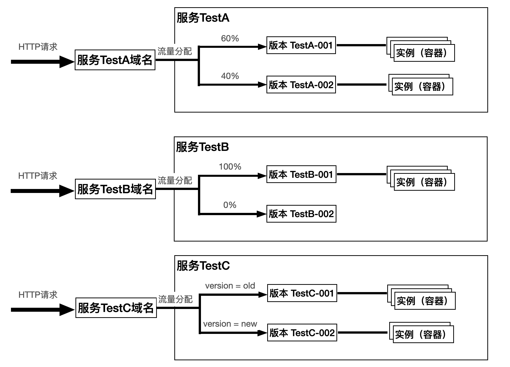

tags:: [[CloudBase 云托管]]
---

- ## 什么是 CloudBase 云托管
	- **CloudBase 云托管** , 也称为 **腾讯云托管** , 英文为 **Tencent CloudBase Run** , 也称为 **云托管 CloudBase Run** , 或 **CloudBase Run** .
	- **CloudBase 云托管** 是 [[腾讯云 CloudBase]] 提供的 **云原生应用引擎 (App Engine 2.0)** , 可以 **容器化部署** 任意语言的应用.
- ## 云托管资源模型
	- 云托管采用三层资源模型: `服务 → 版本 → 实例` .
		- `服务 (Service)` : 开发者的 **业务单元** , 通常对应一个 **独立的应用或微服务** .
			- 每个服务有 **独立的访问域名** .
		- `版本 (Revision)` : **服务** 的 **不同部署版本** , 支持 **多版本并存** .
			- 可实现: [[灰度发布]], [[AB 测试]], [[蓝绿部署]]
		- `实例 (Instance)` : 实际运行的 **容器** , 数量根据负载 **自动伸缩** .
	- 示意图:
		- {:height 330, :width 466}
- ## 云托管运行模式
	- 云托管支持如下 **运行模式** :
		- 始终自动扩缩容 ==推荐== : 
		  logseq.order-list-type:: number
			- 自动调整实例数量
		- 持续运行 : 
		  logseq.order-list-type:: number
			- 保持 **固定数量** 的实例持续运行
			- 比如: 需要保持长连接和内存状态的业务.
		- 白天持续运行, 夜间自动扩缩容: 
		  logseq.order-list-type:: number
			- 工作时间保持固定实例, 非工作时间自动伸缩
		- 自定义
		  logseq.order-list-type:: number
			- 灵活配置 **自动扩缩容** 和 **定时扩缩容** 策略
		- 手工启停实例
		  logseq.order-list-type:: number
			- 完全手动控制实例数量
- ## 参考
	- [腾讯云文档中心 - 云托管 CloudBase Run](https://cloud.tencent.com/document/product/1243)
	  logseq.order-list-type:: number