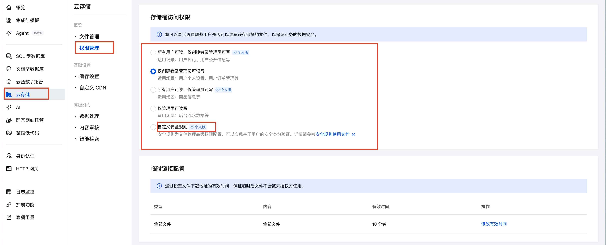

tags:: [[CloudBase 传统模式云存储]]
---

- https://docs.cloudbase.net/storage/data-permission
-
- ## 访问权限配置
	- 可以在 [控制台 - 云存储 - 权限管理](https://tcb.cloud.tencent.com/dev?#/storage/permission) 配置云存储的权限.
		- 其中, 可以配置 **自定义安全规则** .
		- 
	- **用户**: 通过 [[CloudBase 身份认证]] 的客户端的请求.
		- ==注意: **小程序端** 自动完成了认证, 无需显式进行身份认证.==
	- **管理员**: 服务端 (云函数/云托管等) 的请求.
	-
- 默认情况下，不允许 A 用户覆盖写 B 用户的文件
-