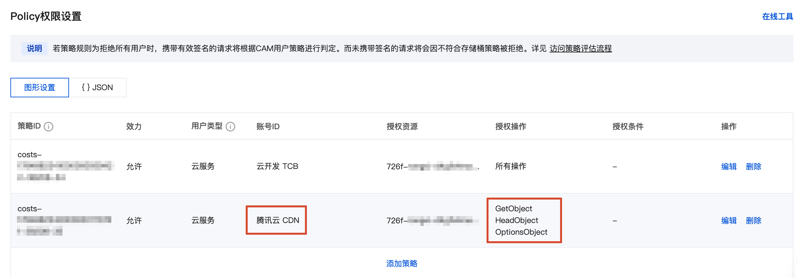

tags:: [[CloudBase 传统模式云存储]]
---

- https://docs.cloudbase.net/storage/data-permission
- ## 问题
	- `fileID` 如何使用?
	  logseq.order-list-type:: number
	- 云存储对象 CDN 临时地址 如何使用?
	  logseq.order-list-type:: number
	- 如果将 云存储权限设置为 READONLY 或 ADMINWRITE , 访问文件地址是否需要身份认证?
	  logseq.order-list-type:: number
	- 如果将 云存储权限设置为 CUSTOM 是否属于私有读?
	  logseq.order-list-type:: number
- ## COS 访问权限
	- 了解 **云存储** 底层的 **腾讯云 COS** 的访问权限: [[腾讯云 COS 访问权限]]
	- **CloudBase 云存储** 创建 **腾讯云 COS 存储桶** :
		- 其 **公共权限** 默认是: `私有读写` .
		- 即 只有 **腾讯云账号 (包括主账号和子账号)** 可以读写.
- ## CloudBase 用户分类
	- **游客用户**: 未进行 [[CloudBase 身份认证]] 的客户端.
	- **认证用户**: 通过 [[CloudBase 身份认证]] 的客户端.
		- ==注意: **小程序端** 自动完成了认证, 无需用户进行显式身份认证.==
	- **管理员**: 自动认证的服务端 (云函数/云托管等) .
- ## 配置 CloudBase 对 COS 的访问
	- 进入 [腾讯云 COS - 存储桶列表](https://console.cloud.tencent.com/cos/bucket) -> 选择 **存储桶** -> 点击侧边栏 **权限管理** .
		- 
	- **CloudBase** 环境创建后, 默认配置了:
		- **云开发 TCB** 对 **COS 存储桶** 的 `所有操作` 权限.
		  logseq.order-list-type:: number
		- **腾讯云 CDN** 对 **COS 存储桶** 的 `GetObject / HeadObject / OptionsObject` 权限.
		  logseq.order-list-type:: number
	- ==所有, 请求链路是这样的:==
		- `管理` : 客户端 / 服务端 -> 云开发 TCB (SDK + fileID) -> COS 存储桶
		- `客户端只读` : 客户端 -> 腾讯云 CDN (fileID 换取的 CDN 地址)  -> COS 存储桶
	- 这个请求链路, 相当于从内部访问 COS 存储桶, 所以不受 **存储桶** 本身的 **访问权限** 影响.
		- 所以, 即便存储桶的 **公共权限** 是 `私有读写` 也无妨.
		- ==所以, 无需关注 **COS 存储桶** 的访问权限, 而只需关注 **云存储** 的访问权限.==
- ## 云存储访问权限
	- ### 整个云存储的访问权限
		- 可以在 [控制台 - 云存储 - 权限管理](https://tcb.cloud.tencent.com/dev?#/storage/permission) 配置云存储的权限.
		- 有如下权限选项:
			- 公共读:
			  logseq.order-list-type:: number
				- `READONLY` : 所有用户可读, 仅创建者及管理员可写.
				  logseq.order-list-type:: number
					- ==**所有用户** 包括 **游客用户**==
				- `ADMINWRITE` : 所有用户可读，仅管理员可写
				  logseq.order-list-type:: number
					- ==**所有用户** 包括 **游客用户**==
			- 私有写:
			  logseq.order-list-type:: number
				- `PRIVATE` : 仅创建者及管理员可读写
				  logseq.order-list-type:: number
				- `ADMINONLY` : 仅管理员可读写
				  logseq.order-list-type:: number
			- `CUSTOM` : **自定义安全规则** .
			  logseq.order-list-type:: number
		- 
	- ### 文件的访问权限
		- **云存储** 不能单独配置 **文件的访问权限**
	- ### _openid
		- 文件上传到云存储后, 如果上传方有 `openid` , 则文件会存一个 `_openid` 属性, 用于标识文件的 **创建者** .
			- ==当前貌似只能在 **微信开发者工具的云开发控制台** 点击文件的 **查看详情** 看到.==
- 默认情况下，不允许 A 用户覆盖写 B 用户的文件
- ## 云存储文件标识
	- ### 云存储对象 fileID
		- 文件上传到云存储后, 可以得到一个 `fileID`
		- 格式如 `cloud://云环境标识.存储桶标识/文件路径` .
	- ### 云存储对象 CDN 永久地址
		- 可以传入 `fileID` 调用 SDK 得到.
		- 格式如: `https://存储桶标识.tcb.qcloud.la/文件路径`
	- ### 云存储对象 CDN 临时地址
		- 可以传入 `fileID` 调用 SDK 得到.
		- 格式如: `https://存储桶标识.tcb.qcloud.la/文件路径?sign=xxx&t=xxx`
		- 如果 云存储 对象 的权限配置是 **不能公有访问** , 但此时客户端又希望公有访问时 (因为一般不在客户端存放 云存储 认证需要的凭证):
			- 生成 **云存储 对象 CDN 临时地址** , 供客户端临时访问.