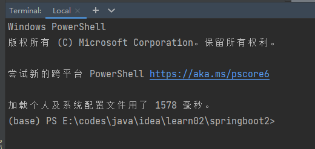

tags:: [[Conda]]
---

- ## 配置文件地址
	- macOS / Linux:  `~/.condarc`
	- Windows: `%HOMEPATH%\.condarc`
- ## 代理: proxy_servers
	- 在配置文件中中加入如下配置：
		- ```yaml
		  proxy_servers: {http: http://localhost:7890, https: http://localhost:7890}
		  ```
	- 若不使用 Channel 镜像, 直接使用代理访问官方 Channel , 则配置文件最终可以这样：
		- ```yaml
		  channels:
		    - anaconda
		    - conda-forge
		    - msys2
		    - bioconda
		    - menpo
		    - pytorch
		    - simpleitk
		    - defaults
		  
		  proxy_servers: {http: http://localhost:7890, https: http://localhost:7890}
		  ```
- ## 环境名称展示: changeps1
	- 参考: [changeps1](https://docs.conda.io/projects/conda/en/latest/user-guide/configuration/settings.html#changeps1-change-command-prompt)
	- Shell 默认会展示当前的 Conda 环境:
		- 
	- ``` yaml
	  # 改为 False 则不会展示 环境名称
	  changeps1: False
	  ```
-