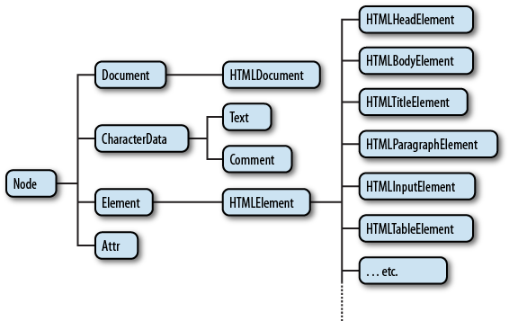
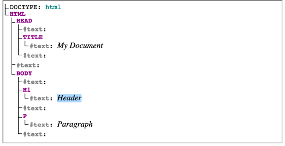

tags:: [[DOM]]
---

- ## Fundamental Data Types
	- 参考: [MDN - Introduction to DOM - Fundamental data types](https://developer.mozilla.org/en-US/docs/Web/API/Document_Object_Model/Introduction#fundamental_data_types)
	- 以下是 DOM API 的基本数据类型，属于接口类型，并非具体的实现，只包含 DOM 公共属性和方法。
	- ### Node
		- 参见: [MDN - Wen API - Node](https://developer.mozilla.org/en-US/docs/Web/API/Node)
		- 文档对象本身和文档中的每个对象都属于某种类型的 `node` ，都继承自 `Node` 接口 。
		- Node 的继承关系：
			- Node
				- Document
				- Element
				- DocumentFragment
				- Attr
				- CharacterData
					- Text
					- Comment
					- CDATASection
					- ProcessingInstruction
				- DocumentType
			- 
			- [图片来源](https://stackoverflow.com/questions/55924114/where-can-i-find-a-complete-description-of-javascript-dom-class-hierarchy)
	- ### Document
		- 参见: [MDN - Web API - Document](https://developer.mozilla.org/en-US/docs/Web/API/Document)
		- `Document` 继承自 `Node` 。
		- `Document` 代表整个文档内容。
			- 一个文档，只有一个 `document` 对象。
			- 当一个成员返回 `document` 对象，那么它就是 `root document object` 自身。
		- `Document` 接口只包含 DOM 文档共有的方法和属性。
			- HTML 文档的 `HTMLDocument` 以及 XML 和 SVG 文档的 `XMLDocument` 都继承自 `Document` 接口。
	- ### Element
		- 参见: [MDN - Web API - ELement](https://developer.mozilla.org/en-US/docs/Web/API/Element#instance_methods)
		- `Element` 继承自 `Node` 。
		- `Element` 接口包含 DOM 元素共有的方法和属性。
			- HTML DOM 的 `HTMLELement` 和 SVG DOM 的 `SVGElement` 都继承自 `Element` 接口。
			- 使用 `document.createElement()` 方法可以创建一个 `Element` 对象实例。
	- ### NodeList
		- `NodeList` 是 `Node` 的集合。
		- 进一步学习: [[DOM API/NodeList]]
	- ### Attr
		- 表示页面元素 (Element) 的属性 (Attribute) 。
		  id:: 67b08b26-8110-4acf-9805-068cb8d71ffe
		- 进一步学习: [[DOM API/Attr]]
	- ### NamedNodeMap
		- [MDN - Web API - NamedNodeMap](https://developer.mozilla.org/en-US/docs/Web/API/NamedNodeMap)
		- 与 `NodeList` 类似， `NamedNodeMap` 表示 `Attr` 的集合。
			- 但与 `NodeList` 不同的是， `NamedNodeMap` 内部的对象没有特定顺序，即便可以使用索引来访问。
		- `NamedNodeMap` 对象可以通过 `Element.attributes` 属性获取。
		- `NamedNodeMap` 是动态的 (Live) 。
			- 如果文档内容有修改， `NamedNodeMap` 对象相应的值也会动态修改。
- ## EventTarget
	- 参见: [MDN - Web API - EventTarget](https://developer.mozilla.org/en-US/docs/Web/API/EventTarget)
	- `EventTarget` 接口可以接收事件、添加事件侦听器和移除事件侦听器。
	- `Node` 继承了 `EventTarget`
		- 
		- 图片来源: [MDN - Wen API - Node](https://developer.mozilla.org/en-US/docs/Web/API/Node)
- ## JavaScript 如何查看继承关系
	- ``` js
	  // 原型链
	  document.__proto__.__proto__
	  
	  // instanceof 关键字
	  document instanceof Node
	  ```
- ## DOM Tree
	- 参考:  [MDN - Using the Document Object Model](https://developer.mozilla.org/en-US/docs/Web/API/Document_Object_Model/Using_the_Document_Object_Model)
	- ### 简化 DOM Tree
		- DOM 树是一种树形结构，用来表示文档的结构，其每个节点都表示文档中的一个内容。
		- 示例：
			- ``` html
			  <!doctype html>
			  <html lang="en">
			    <head>
			      <title>My Document</title>
			    </head>
			    <body>
			      <h1>Header</h1>
			      <p>Paragraph</p>
			    </body>
			  </html>
			  ```
		- 如上文档，可以用下图表示：
			- 
		- 当网页浏览器解析 HTML 文档时，它会构建一个 DOM 树，然后使用它来显示文档。
	- ### 真实 DOM Tree
		- 参见: [MDN - How whitespace is handled by HTML, CSS, and in the DOM](https://developer.mozilla.org/en-US/docs/Web/API/Document_Object_Model/Whitespace#dom_traversal_and_whitespace)
		- 上图为了简化，去掉了 `text` 节点 (这里的 text 节点内容是元素之间的文本内容，这个例子中，只包含 whitespace 字符)，真实 DOM 树如下：
			- {:height 296, :width 562}
	- ### Node Type
		- 参考: [MDN - Node - nodeType](https://developer.mozilla.org/en-US/docs/Web/API/Node/nodeType)
		- Node.ELEMENT_NODE (1) 元素节点
		  logseq.order-list-type:: number
			- 如 `<p>` , `<div>`
		- Node.ATTRIBUTE_NODE (2) 属性节点
		  logseq.order-list-type:: number
			- 元素的属性.
		- Node.TEXT_NODE (3) 文本节点
		  logseq.order-list-type:: number
		- ......
	- ### Node 相关术语
		- 参考: [MDN - DOM Scripting#The document object model](https://developer.mozilla.org/en-US/docs/Learn_web_development/Core/Scripting/DOM_scripting#the_document_object_model)
		- ``` html
		  <!doctype html>
		  <html lang="en-US">
		    <head>
		      <meta charset="utf-8" />
		      <title>Simple DOM example</title>
		    </head>
		    <body>
		      <section>
		        
		        <p>
		          Here we will add a link to the
		          <a href="https://www.mozilla.org/">Mozilla homepage</a>
		        </p>
		      </section>
		    </body>
		  </html>
		  ```
		- **Root node** (根节点) : DOM Tree 中的顶级节点 .
		  logseq.order-list-type:: number
			- HTML Document 中, 根节点就是 `<HTML>` (SVG 和 XML 中不同) .
		- **Child node** (子节点) : 直接位于另一个节点内的节点 .
		  logseq.order-list-type:: number
			- 比如, 上面 `` 就是 `<section>` 的 **Child node** .
		- **Descendant node** (后代节点) : 位于一个节点内部的任何节点 .
		  logseq.order-list-type:: number
			- 比如, `` 是 `<section>`  的 **Child node** , 也是 `<section>`  的 **Descendant node** .
			- 同时, `` 是 `<body>` 的 **Descendant node**  , 但不是 `<body>` 的 **Child node** .
		- **Parent node** (父节点) : 直接包含一个节点的节点 .
		  logseq.order-list-type:: number
		  id:: 67d52ba8-6d10-41d5-9e76-e5f86a267a5b
			- 比如,  `<body>` 是 `<section>` 的 **Parent node** .
		- **Ancestor node** (祖先节点) : 包含一个节点的节点 .
		  logseq.order-list-type:: number
			- 比如, `<section>` 是 ``  的 **Parent node** , 也是 ``  的 **Ancestor node** .
			- 同时, `<body>` 是 `` 的 **Ancestor node**  , 但不是 `` 的 **Parent node** .
		- **Sibling node** (兄弟节点)  : 位于同一 **Parent node** 下同一级的节点 .
		  logseq.order-list-type:: number
			- 比如, `` 和 `<p>` 是 **Sibling node** .
	- ### JS 处理 DOM Tree 中 Whitespace 的工具类
		- 参见: [MDN -How whitespace is handled by HTML, CSS, and in the DOM](https://developer.mozilla.org/en-US/docs/Web/API/Document_Object_Model/Whitespace#dom_traversal_and_whitespace)
		- ==`Node.firstChild` 等属性和 `Node.hasChildNodes()` 等方法的返回值，是包含 text 节点 (即便只有 whitespace 字符) 的，使用时需要注意。==
		- 参考如下工具类：
		- ``` js
		  /**
		   * Throughout, whitespace is defined as one of the characters
		   *  "\t" TAB \u0009
		   *  "\n" LF  \u000A
		   *  "\r" CR  \u000D
		   *  " "  SPC \u0020
		   *
		   * This does not use JavaScript's "\s" because that includes non-breaking
		   * spaces (and also some other characters).
		   */
		  
		  /**
		   * Determine whether a node's text content is entirely whitespace.
		   *
		   * @param nod  A node implementing the `CharacterData` interface (i.e.,
		   *             a `Text`, `Comment`, or `CDATASection` node)
		   * @return     `true` if all of the text content of `nod` is whitespace,
		   *             otherwise `false`.
		   */
		  function isAllWs(nod) {
		    return !/[^\t\n\r ]/.test(nod.textContent);
		  }
		  
		  /**
		   * Determine if a node should be ignored by the iterator functions.
		   *
		   * @param nod  An object implementing the `Node` interface.
		   * @return     `true` if the node is:
		   *                1) A `Text` node that is all whitespace
		   *                2) A `Comment` node
		   *             and otherwise `false`.
		   */
		  function isIgnorable(nod) {
		    return (
		      nod.nodeType === 8 || // a comment node
		      (nod.nodeType === 3 && isAllWs(nod))
		    ); // a text node, all ws
		  }
		  
		  /**
		   * Version of `previousSibling` that skips nodes that are entirely
		   * whitespace or comments. (Normally `previousSibling` is a property
		   * of all DOM nodes that gives the sibling node, the node that is
		   * a child of the same parent, that occurs immediately before the
		   * reference node.)
		   *
		   * @param sib  The reference node.
		   * @return     The closest previous sibling to `sib` that is not
		   *             ignorable according to `isIgnorable`, or `null` if
		   *             no such node exists.
		   */
		  function nodeBefore(sib) {
		    while ((sib = sib.previousSibling)) {
		      if (!isIgnorable(sib)) {
		        return sib;
		      }
		    }
		    return null;
		  }
		  
		  /**
		   * Version of `nextSibling` that skips nodes that are entirely
		   * whitespace or comments.
		   *
		   * @param sib  The reference node.
		   * @return     The closest next sibling to `sib` that is not
		   *             ignorable according to `isIgnorable`, or `null`
		   *             if no such node exists.
		   */
		  function nodeAfter(sib) {
		    while ((sib = sib.nextSibling)) {
		      if (!isIgnorable(sib)) {
		        return sib;
		      }
		    }
		    return null;
		  }
		  
		  /**
		   * Version of `lastChild` that skips nodes that are entirely
		   * whitespace or comments. (Normally `lastChild` is a property
		   * of all DOM nodes that gives the last of the nodes contained
		   * directly in the reference node.)
		   *
		   * @param sib  The reference node.
		   * @return     The last child of `sib` that is not ignorable
		   *             according to `isIgnorable`, or `null` if no
		   *             such node exists.
		   */
		  function lastChild(par) {
		    let res = par.lastChild;
		    while (res) {
		      if (!isIgnorable(res)) {
		        return res;
		      }
		      res = res.previousSibling;
		    }
		    return null;
		  }
		  
		  /**
		   * Version of `firstChild` that skips nodes that are entirely
		   * whitespace and comments.
		   *
		   * @param sib  The reference node.
		   * @return     The first child of `sib` that is not ignorable
		   *             according to `isIgnorable`, or `null` if no
		   *             such node exists.
		   */
		  function firstChild(par) {
		    let res = par.firstChild;
		    while (res) {
		      if (!isIgnorable(res)) {
		        return res;
		      }
		      res = res.nextSibling;
		    }
		    return null;
		  }
		  
		  /**
		   * Version of `data` that doesn't include whitespace at the beginning
		   * and end and normalizes all whitespace to a single space. (Normally
		   * `data` is a property of text nodes that gives the text of the node.)
		   *
		   * @param txt  The text node whose data should be returned
		   * @return     A string giving the contents of the text node with
		   *             whitespace collapsed.
		   */
		  function dataOf(txt) {
		    let data = txt.textContent;
		    // 合并连续 whitespace 为 单个 空格 
		    data = data.replace(/[\t\n\r ]+/g, " ");
		    // 去除首尾空格
		    if (data[0] === " ") {
		      data = data.substring(1, data.length);
		    }
		    if (data[data.length - 1] === " ") {
		      data = data.substring(0, data.length - 1);
		    }
		    return data;
		  }
		  
		  ```
- ## 参考
	-