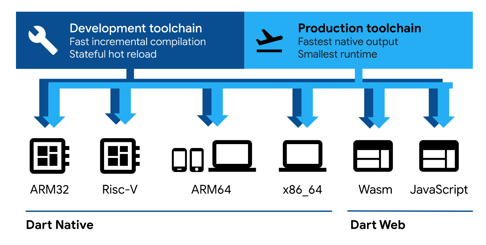

tags:: [[Dart]]
---

- ## Dart 特性
	- 参考: [Dart Overview](https://dart.dev/overview)
	- ### 支持多平台
		- {:height 379, :width 766}
		- [图源](https://dart.dev/overview#platform)
		- **Dart Native** :  Dart 代码可以被 **预编译器** 编译为原生 ARM 或 x64 机器码, 从而在 **各原生平台** 和 **服务器** 上执行.
		- **Dart Web** : Dart 代码可以被编译为 [[JavaScript]] 和 [[WebAssembly]] , 从而在浏览器中运行.
	- ### 一些概念
		- [[Dart Runtime]] : Dart 运行时.
		  logseq.order-list-type:: number
		- [[Dart Type System]] : 编译时, 进行 **静态类型检查 (Static Check)** ; 运行时,  进行 **动态类型检查** (有绕过 静态类型系统 的语法) .
		  logseq.order-list-type:: number
		- [[Null Safety]] : Dart 可以定义一个变量是否允许为 null .
		  logseq.order-list-type:: number
		- [[Dart Isolate]] : 类似于线程但不共享内存的 独立工作单元 , 仅通过消息进行通信.
		  logseq.order-list-type:: number
		-
-