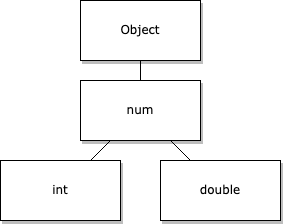
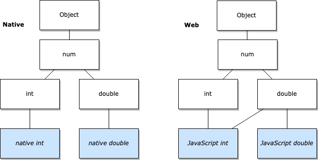

tags:: [[Dart Type]] 
---

- ## Number 类型的层次结构
	- 
	- `int` : 用于表示整数值.
	- `double` : 用于表示小数值.
- ## Number 类型的使用
	- ### 声明一个数字类型
		- 声明一个 `int` 型:
			- ``` dart
			  var x = 1;
			  var hex = 0xDEADBEEF;
			  ```
		- 声明一个 `double` 型:
			- ``` dart
			  var y = 1.1;
			  var exponents = 1.42e5;
			  ```
		- 声明一个 `num` 型, 既可以存 `int` 值, 也可以存 `double` 值:
			- ``` dart
			  num x = 1; // x can have both int and double values
			  x += 2.5;
			  ```
	- ### 字符串与数字的相互转换
		- ``` dart
		  // String -> int
		  var one = int.parse('1');
		  
		  // String -> double
		  var onePointOne = double.parse('1.1');
		  
		  // int -> String
		  String oneAsString = 1.toString();
		  
		  // double -> String
		  String piAsString = 3.14159.toStringAsFixed(2); // 保留两位小数, 结果为 3.14
		  ```
	- ### 使用数字分隔符 (digit separators)
		- ``` dart
		  var n1 = 1_000_000;
		  var n2 = 0.000_000_000_01;
		  var n3 = 0x00_14_22_01_23_45; // MAC address
		  var n4 = 555_123_4567; // US Phone number
		  var n5 = 100__000_000__000_000; // one hundred million million!
		  ```
		- 好像不管 `_` 放在数字的那个位置都可以, 也可以连续放多个 `_` .
	- ### 编译时常量 (Compile-time constants)
		- 数字字面量是编译时常量.
		  logseq.order-list-type:: number
		- 操作数为编译时常量的表达式, 也是编译时常量.
		  logseq.order-list-type:: number
		- ``` dart
		  // 字面量是编译时常量
		  const msPerSecond = 1000;
		  const secondsUntilRetry = 5;
		  // msUntilRetry 也是编译时常量
		  const msUntilRetry = secondsUntilRetry * msPerSecond;
		  ```
- ## Number 类型的平台差异
	- ### 平台分类
		- Dart 中的数字, 在不同平台的实现, 略有差异.
		- 大体可分为如下两类平台:
			- **Native Platform** : 通常指 64 位移动端或桌面端处理器.
			  logseq.order-list-type:: number
			- **Web Platform** : 以 JavaScript 为主要执行引擎.
			  logseq.order-list-type:: number
	- ### Number 表示的差异
		- | Representation | Native `int` | Native `double` | Web `int` | Web `double` |
		  | 64 位有符号补码 | ✅ |  |  |  |
		  | 64 位 IEEE 浮点数 |  | ✅ | ✅ | ✅ |
		- ==注意:==
			- 和某些语言不同, `int` 在 `Native` 平台上并不是 32 位的.
			  logseq.order-list-type:: number
			- 在 `Web` 平台上, `int` 是用浮点数表示的, 所以可能会出现一些意外情况.
			  logseq.order-list-type:: number
	- ### Number 底层实现的差异
		- 
		- `Native` 平台, `Native` 平台的 `int` 仅实现 `int` 接口.
		- 而 `Web` 平台, `JavaScript` 的 `int` 实现了 `int`  和 `double` 接口.
- ## Number 行为差异
	- ### int 的取值范围差异
		- | Representation |  `int` |
		  | Native | `-2^63` ~ `2^63 - 1` |
		  | Web |  `-2^53` ~ `2^53 - 1` |
	- ### Number 的 Equality 和 Identity 差异
		- `Equality` (相等性, 即比较值是否相等) : 在 `Native` 和 `Web` 平台行为一致.
		- `Identity` (同一性, 即比较两个对象是否是同一个) : 在 `Native` 和 `Web` 平台上行为有差异.
		- | Expression | Native | Web |
		  | `1.0 == 1` | `true` | `true` |
		  | `identical(1.0, 1)` | `false` | `true` |
		  | `0.0 == -0.0` | `true` | `true` |
		  | `identical(0.0, -0.0)` | `false` | `true` |
		  | `double.nan == double.nan` | `false` | `false` |
		  | `identical(double.nan, double.nan)` | `true` | `false` |
		  | `double.infinity == double.infinity` | `true` | `true` |
		  | `identical(double.infinity, double.infinity)` | `true` | `true` |
	- ### Number Type 的差异
		- 在  `Web` 平台:
			- 所有数字都是 `double` 类型.
			  logseq.order-list-type:: number
			- 一个数字可以同时是 `double` 和 `int` 类型.
			  logseq.order-list-type:: number
		- 在 `Web` 平台, 如果一个数字的小数部分为 `0` :
			- 那么 `x is int` 的结果就是 `true` .
		- | Expression | Native | Web |
		  | `1 is int` | `true` | `true` |
		  | `1 is double` | `false` | `true` |
		  | `1.0 is int` | `false` | `true` |
		  | `1.0 is double` | `true` | `true` |
		  | `(0.5 + 0.5) is int` | `false` | `true` |
		  | `(0.5 + 0.5) is double` | `true` | `true` |
		  | `3.14 is int` | `false` | `false` |
		  | `3.14 is double` | `true` | `true` |
		  | `double.infinity is int` | `false` | `true` |
		  | `double.nan is int` | `false` | `false` |
		  | `1.0.runtimeType` | `double` | `int` |
		  | `1.runtimeType` | `int` | `int` |
		  | `1.5.runtimeType` | `double` | `double` |
	- ### Number Bitwise 运算结果差异
		- `Web` 平台上 , Dart 采用 JavaScript 中 位运算（ `&` 、 `|` 、 `^` 、 `~` ）和 移位（ `<<` 、 `>>` 、 `>>>` ）运算实现方式.
			- JavaScript 会把操作数截断为 32 位无符号整数, 然后进行操作.
		- 这与 `Native` 平台不太一样.
	- ### Number 字符串表示的差异
		- | Expression | Native `toString()` | Web `toString()` |
		  | `1` | `"1"` | `"1"` |
		  | `1.0` | `"1.0"` | `"1"` |
		  | `(0.5 + 0.5)` | `"1.0"` | `"1"` |
		  | `1.5` | `"1.5"` | `"1.5"` |
		  | `-0` | `"0"` | `"-0.0"` |
		  | `math.pow(2, 0)` | `"1"` | `"1"` |
		  | `math.pow(2, 80)` | `"0"` | `"1.2089258196146292e+24"` |
- ## Number 多平台使用的最佳实践
	- ### 对于通常情况
		- 通常情况下, 我们代码中的数字类型, 无需为兼容多平台而做特殊处理.
			- 因为我们常见的代码逻辑 (比如使用遍历 list 索引), 在各个平台行为是一致的.
	- ### 对于数字转字符串
		- 如果要对数字字符串的值进行判断, 一点要注意小数部分有没有 0
			- ``` dart
			  void main() {
			    var count = 10.0 * 2;
			    var message = "$count cows";
			    if (message != "20.0 cows") throw Exception("Unexpected: $message");
			  }
			  ```
			- 如上代码建议改成如下代码
			- ``` dart
			  void main() {
			    var count = 10.0 * 2;
			    var message = "$count cows";
			    if (message != "${20.0} cows") throw Exception("Unexpected: $message");
			  }
			  ```
	- ### 对于位运算
		- 在执行位运算时, 确保操作数小于等于 32 位 (如果大于 32 位, 可以分块处理) .
		- 如果需要将 32 位数据块解释为有符号数, 可调用 `int.toSigned(32)` 方法.
	- ### 对于精度
		- 在需要精确处理的场景中:
			- 可以考虑使用 `BigInt` 类型.
			  logseq.order-list-type:: number
				- `BigInt` 类型在 `Native` 和 `Web` 平台均支持 任意精度整数运算 .
			- 也可以考虑使用 [`fixnum`](https://pub.dev/packages/fixnum) package .
			  logseq.order-list-type:: number
				- 提供严格的 64 位有符号数支持，即使在 `Web` 端也能确保精度.
		- 但是, 使用这几种类型, 会导致 代码体积增大 和 运行速度变慢 .
- ## 参考
	- [Numbers in Dart](https://dart.dev/resources/language/number-representation)
	  logseq.order-list-type:: number
	- [Dart Built-in types - Numbers](https://dart.dev/language/built-in-types)
	  logseq.order-list-type:: number
	-