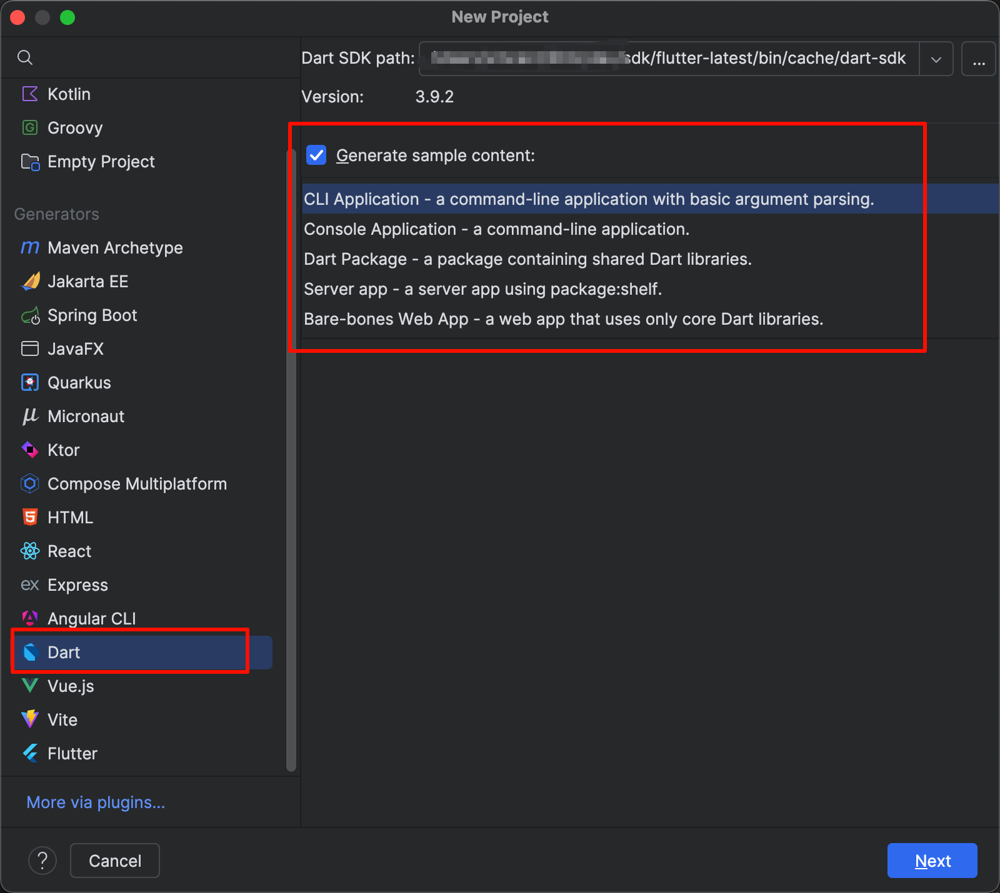

tags:: [[Dart]]
---

- ## 使用 VS Code 开发 Dart
	- [[VS Code 安装与配置]]
	  logseq.order-list-type:: number
	- 安装 [[Dart extension for VS Code]] .
	  logseq.order-list-type:: number
- ## 使用 Android Studio 或 Intellij IDEA 开发 Dart
	- ### 环境搭建
		- [[Android Studio 安装]] 或 [[Intellij IDEA 安装]] .
		  logseq.order-list-type:: number
		- 搜索并安装 Dart 插件 (安装 Flutter 插件会自动安装 Dart 插件) .
		  logseq.order-list-type:: number
	- ### 创建项目
		- 新建项目时, 选择 Dart 项目
		  logseq.order-list-type:: number
		- 选择 Dart SDK Path .
		  logseq.order-list-type:: number
			- 注意, 如果要使用 Flutter 内置的 Dart SDK, 这个路径需要配置为 `${Flutter 根目录}/bin/cache/dart-sdk` .
		- 可以选择生成示例代码.
		  logseq.order-list-type:: number
		- {:height 520, :width 541}
- ## 使用 dart 命令行工具开发 Dart
	- 参见:  [[Dart CLI: dart]]
	-