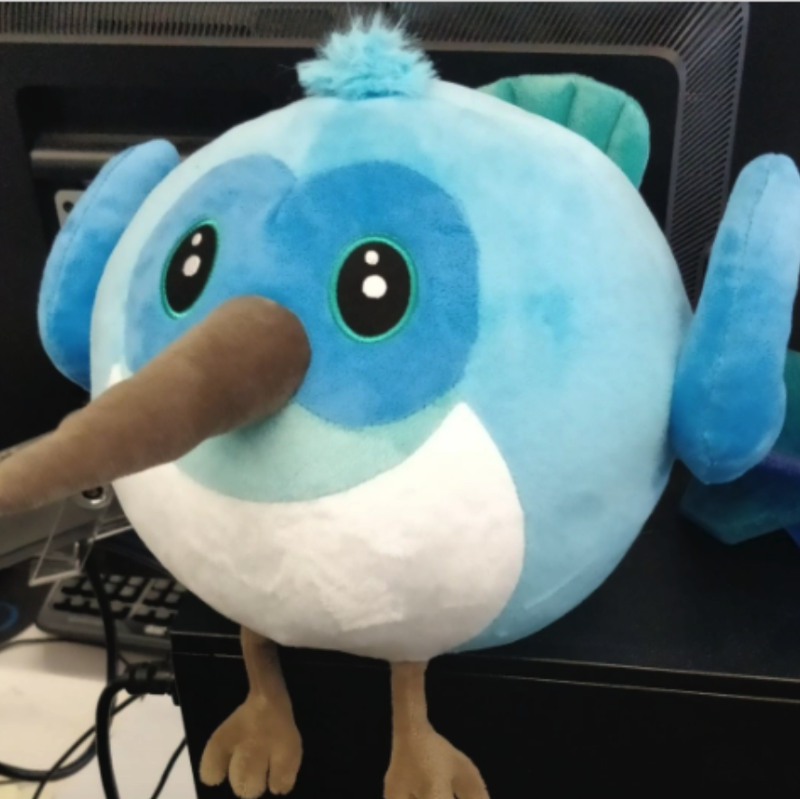
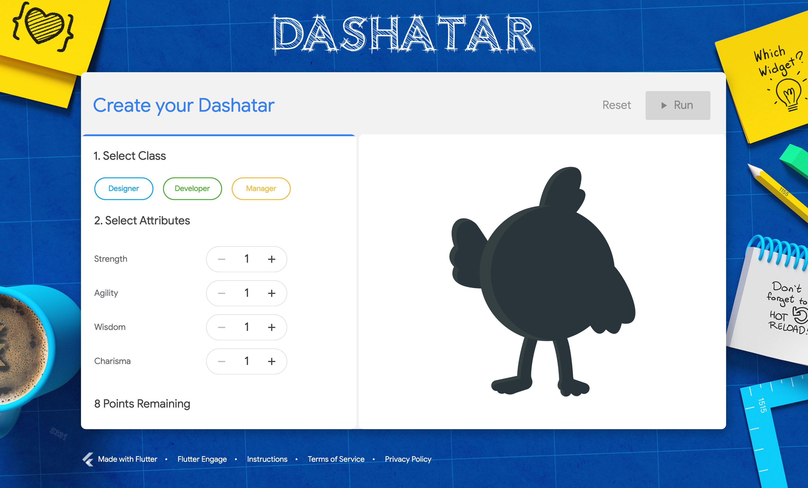

tags:: [[Dart]], [[Flutter]], [[Mascot]]
---

- ## Dash 是啥
	- Dash 是 Dart 和 Flutter 共同的吉祥物.
	- 它是一只蜂鸟 (Hummingbird) .
	- {:height 485, :width 357}
- ## Dashatar
	- 一个生成 Dash 形象的网站: [Dashatar](https://dashatar-dev.web.app/#/)
	- 
	-
- ## 参考
	- [Who is Dash?](https://docs.flutter.dev/dash)
	  logseq.order-list-type:: number