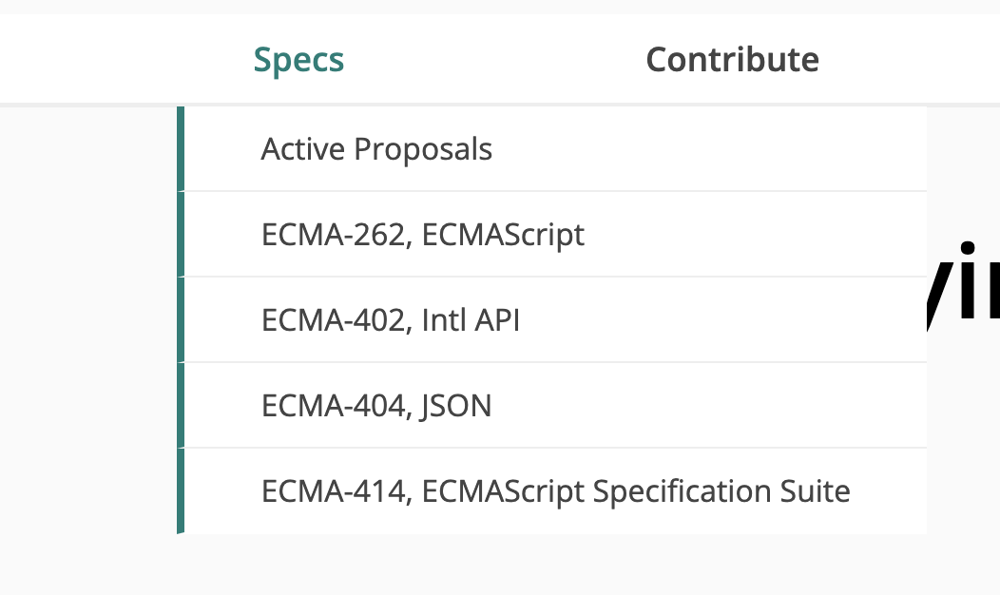

tags:: [[ECMA]], [[Working Group]] 
---

- ## 官方资料
	- [ECMA Committees - TC39](https://ecma-international.org/technical-committees/tc39)
	  logseq.order-list-type:: number
	- [TC39 官网](https://tc39.es/)
	  logseq.order-list-type:: number
- ## 啥是 ECMA TC39
	- 即 Technical Committee 39.
	- [[ECMA International]] 组织中, 维护 JavaScript 相关规范的一个小组.
- ## TC39 都维护哪些规范
	- 官网导航栏:
		- {:height 224, :width 437}
	- [[ECMAScript]] 规范
	- [[ECMAScript Internationalization API]] 规范
	-