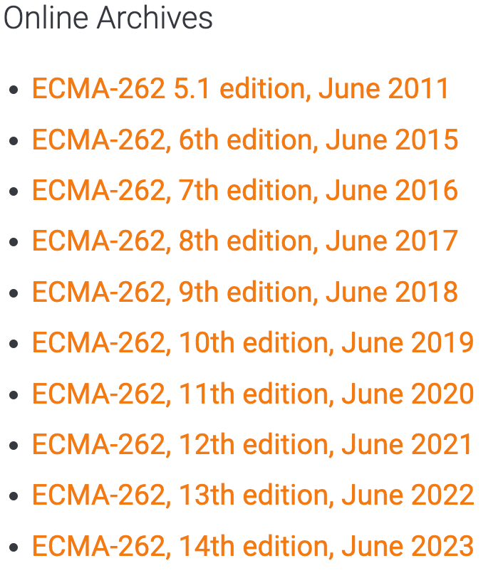

tags:: [[ECMAScript]]
---

- ## 什么是 ECMAScript
	- JavaScript 标准由 [[ECMA International]] 制定，这个标准版本的 JavaScript 被称为 ECMAScript，所以 JavaScript 是 ECMAScript 的一种实现。
	- ECMAScript 的标准由 [[ECMA TC39]] 负责维护 。
	- ECMAScript 标准的编号为 [ECMA-262](https://ecma-international.org/publications-and-standards/standards/ecma-262/) , 有很多版本:
		- {:height 295, :width 195}
		  id:: 66c70654-c177-43c4-b5d0-ae30fb9d7f22
		- 当前 (2024-08-22) 最新版本是: [ECMA-262, 15th edition, June 2024 ECMAScript® 2024 Language Specification](https://262.ecma-international.org/15.0/index.html) 。
- ## ES6 与 ES2015
	- 参考: [阮一峰 - ECMAScript 6 简介](https://es6.ruanyifeng.com/#docs/intro)
	- ECMAScript 2015 (ES2015) 是指 2015 年 6 月份的发布的 ECMAScript 标准，这是有史以来的第 6 个版本。
	- 由于后来每年 6 月份都会发布一个新版本，所以可以直接用年份来指代版本。
	- `ES6` 一般就是指 `ES2015` ，但也有可能指的是 5.1 版本之后的标准，涵盖了 ES2015、ES2016、ES2017 等。
	- `ES6` 之后, 规范以发布年份命名: `ES2017` , `ES2018`
- ## ECMAScript 定义了哪些内容
	- 参考: [MDN - JavaScript technologies overview#What falls under the ECMAScript scope?](https://developer.mozilla.org/en-US/docs/Web/JavaScript/Reference/JavaScript_technologies_overview#what_falls_under_the_ecmascript_scope)
	- Language syntax (语法)
	  logseq.order-list-type:: number
	- Error handling mechanisms (错误处理机制)
	  logseq.order-list-type:: number
	- Types (类型)
	  logseq.order-list-type:: number
	- A prototype-based inheritance mechanism (基于原型的继承机制)
	  logseq.order-list-type:: number
	- Built-in objects and functions (内置对象和函数)
	  logseq.order-list-type:: number
	- Strict mode (严格模式)
	  logseq.order-list-type:: number
	- Module system (模块系统)
	  logseq.order-list-type:: number
	- Basic memory model (基本内存模型)
	  logseq.order-list-type:: number
	- ...
	- id:: 67e7b649-d796-44cd-a608-24829b0cf775
- ## 参考
	- [MDN - JavaScript technologies overview](https://developer.mozilla.org/en-US/docs/Web/JavaScript/Reference/JavaScript_technologies_overview)
	  logseq.order-list-type:: number
	-