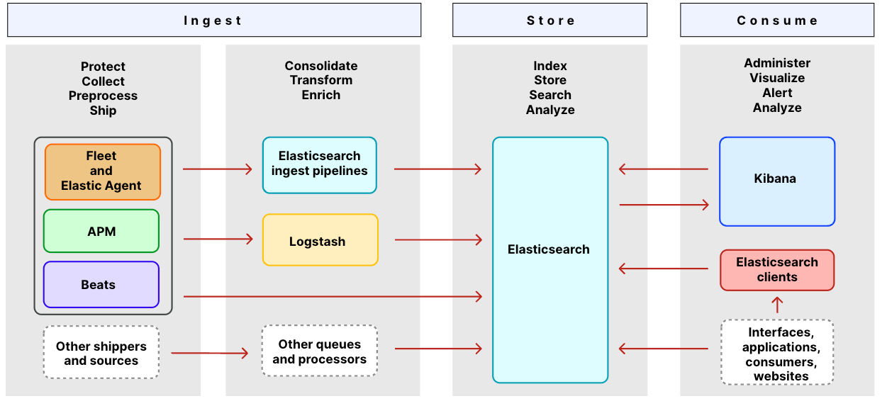

tags:: [[ELK]]
---

- ## 一句话解释
	- 即 Elasticsearch, Kibana, Beats 和 Logstash 以及相关工具。
- ## 架构
	- 参考: [ELK Home Page](https://www.elastic.co/guide/index.html#viewall)
	- ELK 中的组件
	  id:: 64fc0db3-37a2-4ede-b2c8-c74f797126f0
	- {:height 560, :width 1219}
	- ### Ingest 提取
		- #### Fleet and Elastic Agent
			- **Elastic Agent** 从各种数据源收集数据，同时提供安全保护。
			- **Fleet** 对所有 **Elastic Agent** 进行集中管理。
		- #### APM
			- **APM** 可以收集应用的 **实时性能数据** 。
		- #### Beats
			- **Beats** 用于将数据发送给 **Elasticsearch** .
		- #### Elasticsearch ingest pipelines
			- **Elasticsearch ingest pipelines** 可以配置一系列处理器，用于 **转换** 数据。
		- #### Logstash
			- **Logstash** 可以配置输入、过滤、输出插件，动态地收集和格式化数据，并将数据传输给其他数据源。
	- ### Store 存储
		- #### Elasticsearch
			- **Elasticsearch** 是 ELK 的核心，用于存储、索引、搜索和分析数据。
	- ### Consume 消费
		- #### Kibana
			- **Kibana** 用于 **分析** 和 **可视化** **Elasticsearch** 中的数据。
		- #### Elasticsearch clients
			- 各种语言管理 Elasticsearch 请求和响应的工具。
	-