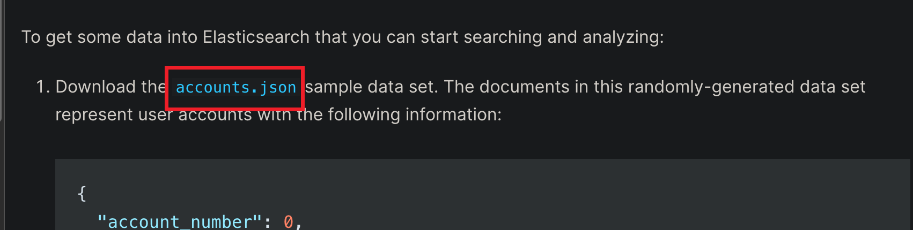

tags:: [[Elasticsearch]]
---

- ## 官网 accounts.json 数据不存在
	- ### 问题描述
		- 如下页面中 `accounts.json` 点击后出现 `404` .
		- 官网页面: [Index some documents](https://www.elastic.co/guide/en/elasticsearch/reference/7.10/getting-started-index.html)
		- 
	- ### 解决方案
		- 参考: [Github issue - can not find accounts.json in the official documentation](https://github.com/elastic/elasticsearch/issues/88146)
		- 其实就是这个文件在主分支中已被删除，但在旧版本的分支中仍然存在，地址: [accounts.json](https://github.com/elastic/elasticsearch/blob/7.5/docs/src/test/resources/accounts.json)
- ## 只能用 localhost 访问
	- elasticsearch 默认只能用 `localhost/127.0.0.1` 访问, 如果要用 ip 访问, 需要在 `config/elasticsearch.yml` 配置文件中配置 `network.host` .
	- ``` yml
	  # ---------------------------------- Network -----------------------------------
	  #
	  # By default Elasticsearch is only accessible on localhost. Set a different
	  # address here to expose this node on the network:
	  #
	  network.host: 192.168.1.111
	  
	  ```
	-
-