tags:: [[English Phonetic Symbol]]
---

- 下面以 DJ 音标 (IPA88) 为例。
- ## 元音图
	- 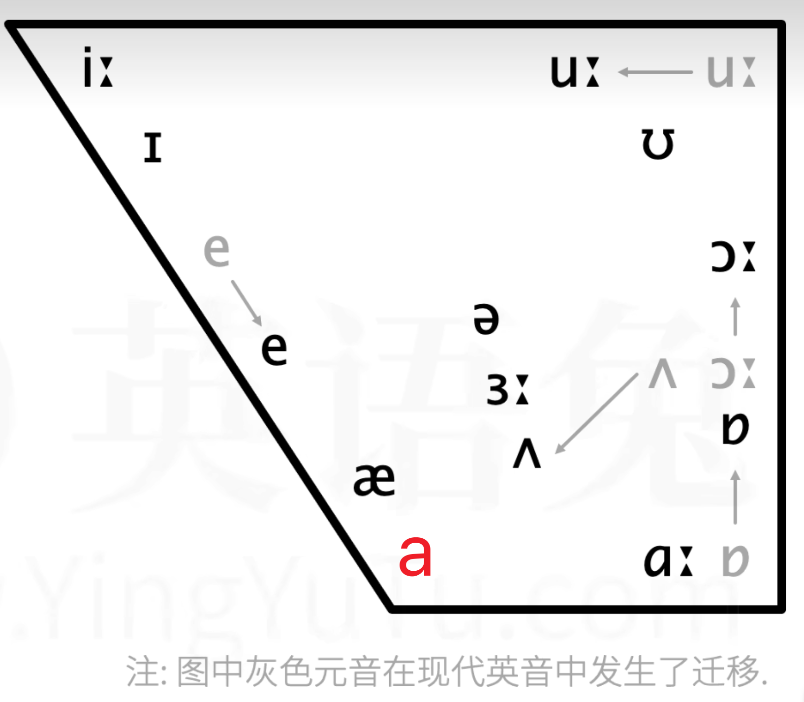{:height 189, :width 229}
- ## 单元音
	- ### /iː/、/i/ 与 /ɪ/
		- /iː/: 与普通话 `币` 的韵母发音类似，不过`币` 的韵母发音更短一些。
			- bee  -  /biː/
			- pee  -  /fiː/
		- /i/: /iː/ 的短音版本
			- happy  -  /ˈhæppi/
		- /ɪ/: 类似军训中的 **一二一** 的 **yi** .
			- lit  -  /lɪt/
			- hit  -  /hɪt/
			- fish  -  /fɪʃ/
	- ### /uː/、/u/ 与 /ʊ/ ==难==
	  id:: 66ac39e3-ea8b-41f5-85ce-89f23967b84b
		- /uː/: 比普通话的 `姑` 的韵母，嘴型略扁，舌头后缩。
			- too  -  /tuː/
			- food  -  /fuːd/
			- loose  -  /luːs/
			- music  -  /'mjuːzɪk/
		- /u/: /uː/ 的短音版本。
			- influence  -   /ˈɪnfluəns/
		- /ʊ/: 略微圆唇，比 /uː/ 舌位更低，发普通话 `饿`的音 (参考: [【美式音标详解】32个视频带你一口气学会英语音标～](https://www.bilibili.com/video/BV1gq4y1o7bL?p=11&vd_source=f1fbb083ddef12dcff3388779faac201))。
			- book  -  /bʊk/
			- look  -  /lʊk/
			- good  -  /gʊd/
		- /uː/ 与 /ʊ/ 的区别
			- 参见: [暴击口语 - 第5节：[ʊ]和[u]的发音！](https://www.bilibili.com/video/BV1wN4y1V7zm?p=1&vd_source=f1fbb083ddef12dcff3388779faac201)
			- /uː/ 嘴唇略扁，/ʊ/ 嘴唇略圆。
				- 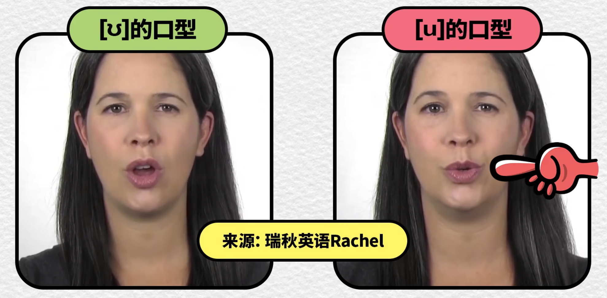{:height 170, :width 337}
				- 图中是 KK 音标
			- /uː/ 舌头后缩得多，/ʊ/ 后缩得少。
				- 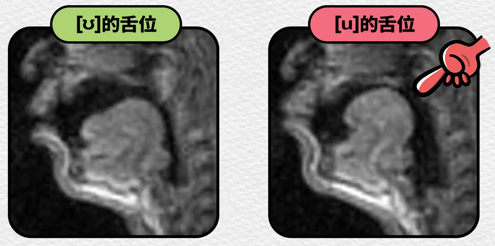{:height 170, :width 337}
				- 图中是 KK 音标
	- ### /e/
		- /e/: 与普通话 `也` 的韵母一致。
			- bed  -  /bed/
			- get  -  /get/
			- let  -  /let/
	- ### /ɜː/ 与 /ə/
		- /ɜː/: 比普通话 `饿` 的舌位低一些。
			- her  -  /hɜː/
			- bird  -  /bɜːd/
			- person  -  /'pɜːsn/
			- 英英中发这个音的字母后面一般都有 `r` ，在美音中会变成 `r 化元音`。
			- 所以用 DJ 音标标注美音会变成：
				- her  -  /hɜːr/
				- bird  -  /bɜːrd/
				- person  -  /'pɜːrsn/
		- /ə/: 中央元音(schwa) , 嘴自然张开，唇和舌都自然放松。
			- 将 /ə/ 重读，即让舌头和口腔肌肉紧张，并读足时长，会很接近 /ɜː/。
			- about  -  /ə'baʊt/
			- taken  -  /'teɪkən/
			- family  -  /'fæməli/
			- 这个 DJ 音标标注美式 `r 化元音` 会变成 /ər/ 。
	- ### /ʌ/、/ɑː/ 、a 与 /æ/
		- 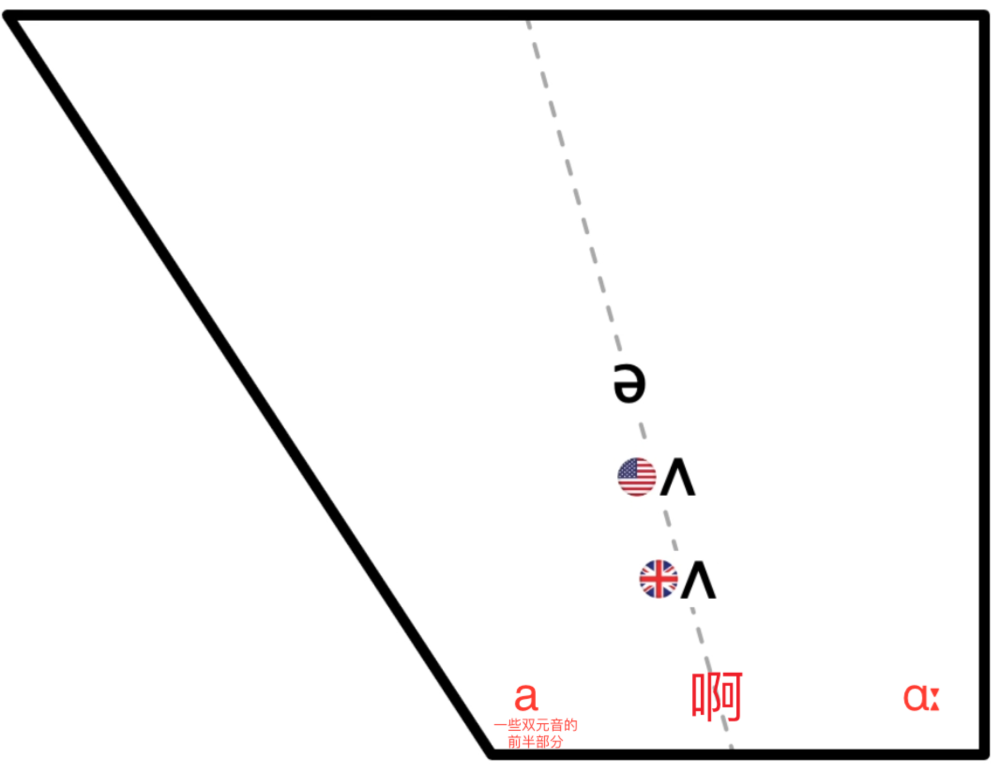{:height 365, :width 442}
		- /ʌ/: 相当于普通话 `啊(四声)` 舌位抬高些。
			- 这个音的美音舌位比英音更高些。
			- but  -  /bʌt/
			- hut  -  /hʌt/
			- must  -  /mʌst/
			- sun  -  /sʌn/
		- /ɑː/: 相当于普通话 `啊(四声)` 舌位靠后些。
			- father  -  /ˈfɑːðə/
			- fast  -  /fɑːst/
			- glass  -  /glɑːs/
			- 这个 DJ 音标标注美式 `r 化元音` 会变成 /ɑːr/ 。
			- ==很多单词在英音中发 /ɑː/ ，而在美音中发 /æ/== 。
		- a: 相当于普通话 `啊(四声)` 舌位靠前些。
			- 这不是一个单独的音标，是一些双元音的前半部分
		- /æ/: 是 a 过渡到 /e/ 的音 (或 可以用 a 的口型去发 /e/ ) .
			- 此音标被称为 ash，国内称为 梅花音。
			- 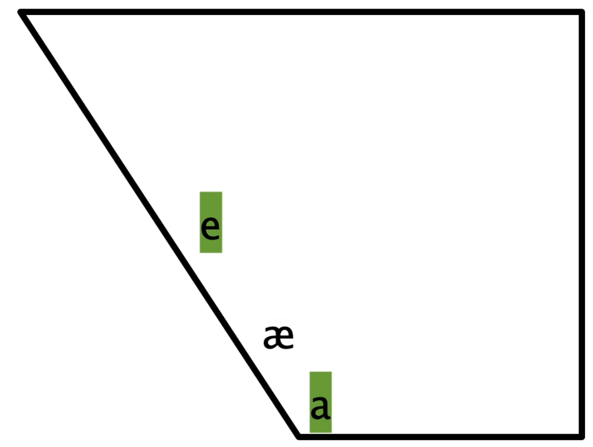{:height 214, :width 246}
			- 现代英音 /æ/ 在往 a 迁移，传统英音 /æ/ 会更靠近 /e/ 。
			- 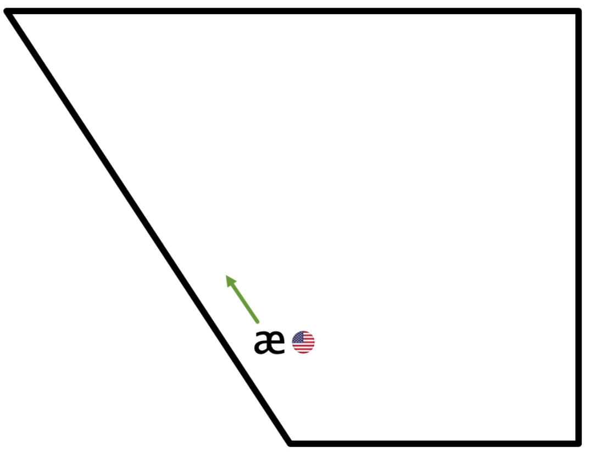{:height 214, :width 246}
			- 美音的 /æ/ 在某些辅音(尤其是鼻音)前，会有舌位向上的趋势；所以嘴型会更扁一些。
			- bad  -  /bæd/
			- mad  -  /mæd/
			- man  -  /mæn/
	- ### /ɔː/ 与 /ɒ/
		- /ɔː/:
			- ==英音==
				- 只是比普通话 `哦` 舌位略低，发音时长更长。
				- 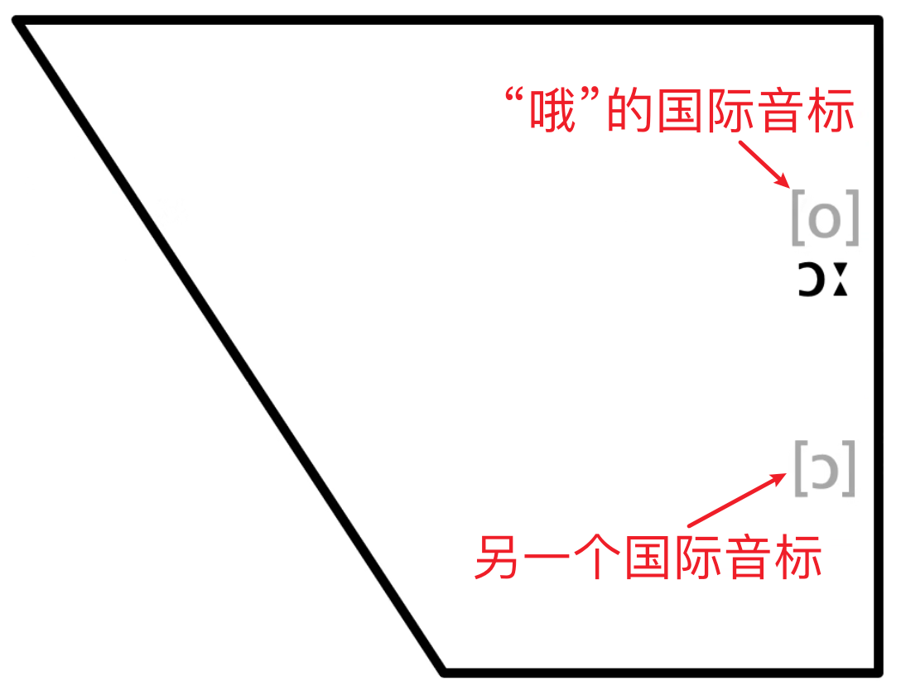{:height 214, :width 246}
			- ==美音==
				- 美音比英音舌位低很多
				- 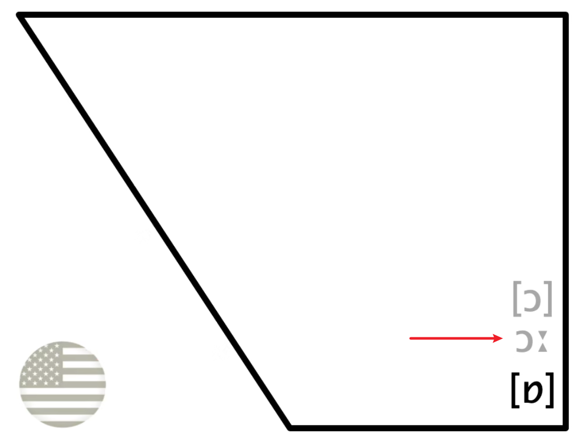{:height 214, :width 246}
				- 在美国一些地区，很多单词中的 /ɔː/ 会变成 /ɑː/ (被称为 Cot-Caught Merger)
			- caught  -  /kɔːt/
			- bought  -  /bɔːt/
			- law  -  /lɔː/
		- /ɒ/: 比 /ɔː/ 舌位低一些，音更短。
			- 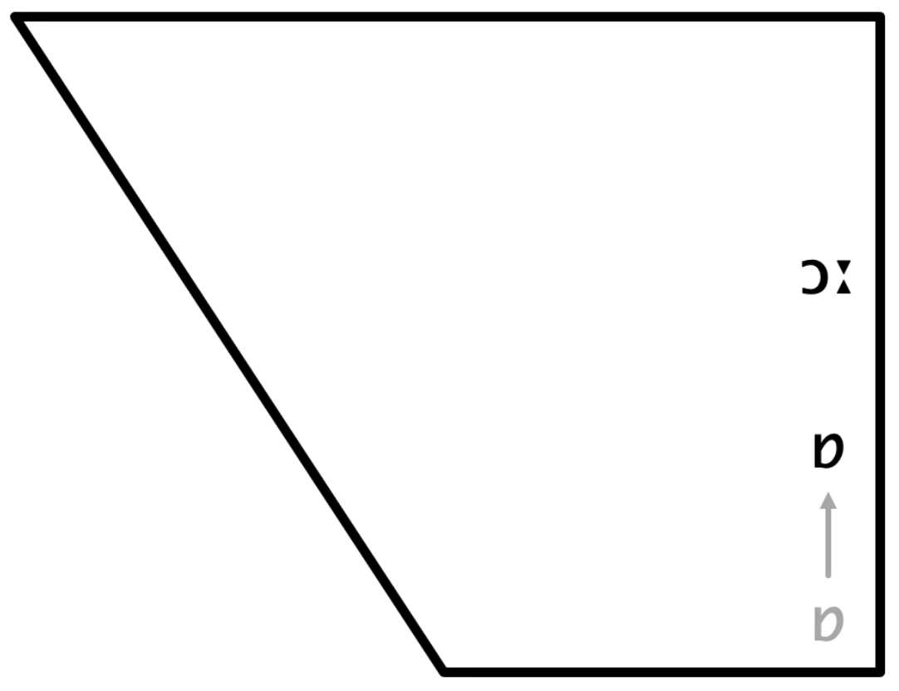{:height 214, :width 246}
			- top  -  /tɒp/
			- hot  -  /hɒt/
			- lot  -  /lɒt/
			- ==/ɒ/ 基本在美音中读作 /ɑː/，美音中没有 /ɒ/== 。
- ## 双元音
	- 双元音拥有两个元音的特性，在发音过程中，舌位从第一个音平滑变换到第二个音。
	- ### /eɪ/
		- 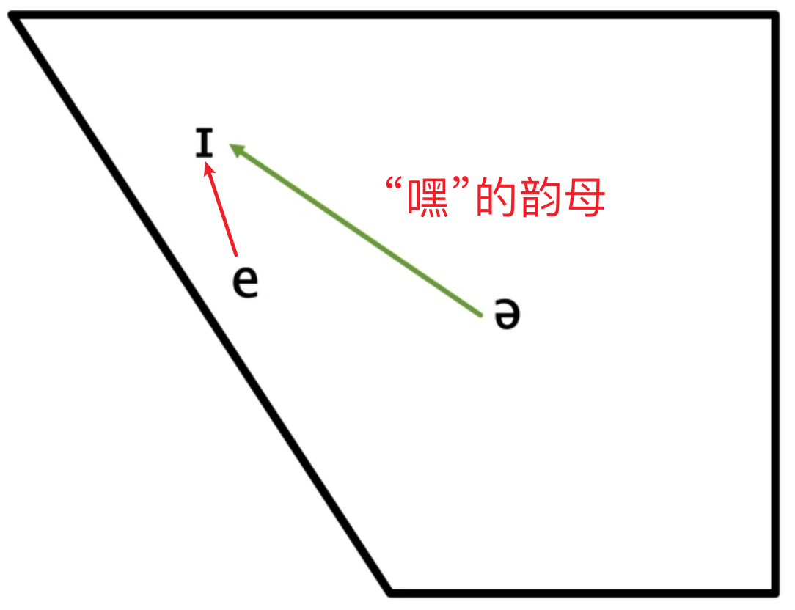{:height 214, :width 246}
		- 与普通话的 `嘿` 的韵母很像，区别在于 /eɪ/ 的起始音嘴角更向两边拉伸。
		- make  -  /meɪk/
		- date  -  /deɪt/
		- cake  -  /keɪk/
	- ### /ɔɪ/
		- 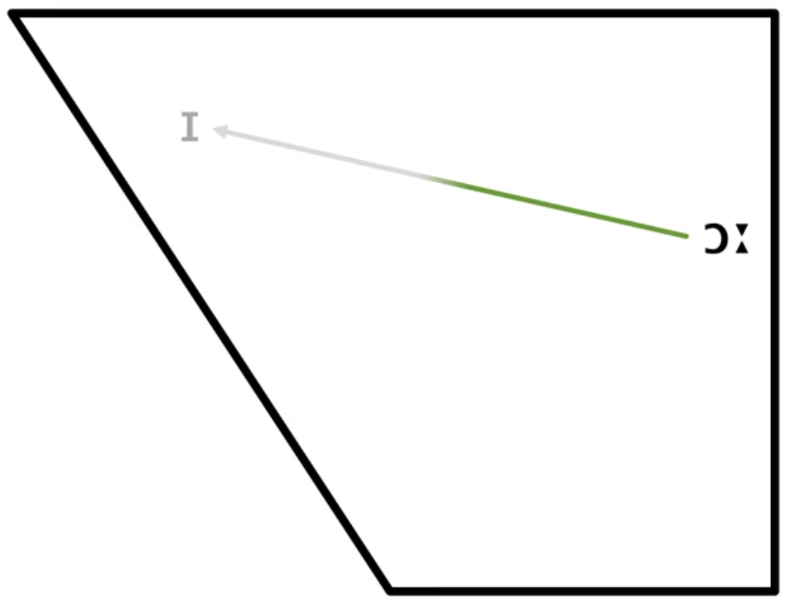{:height 214, :width 246}
		- 起始音更重，往往还没到 /ɪ/ 就结束了。
		- boy  -  /bɔɪ/
		- toy  -  /tɔɪ/
		- soy  -  /sɔɪ/
		- 美音起始元音，舌位更低些。
		- 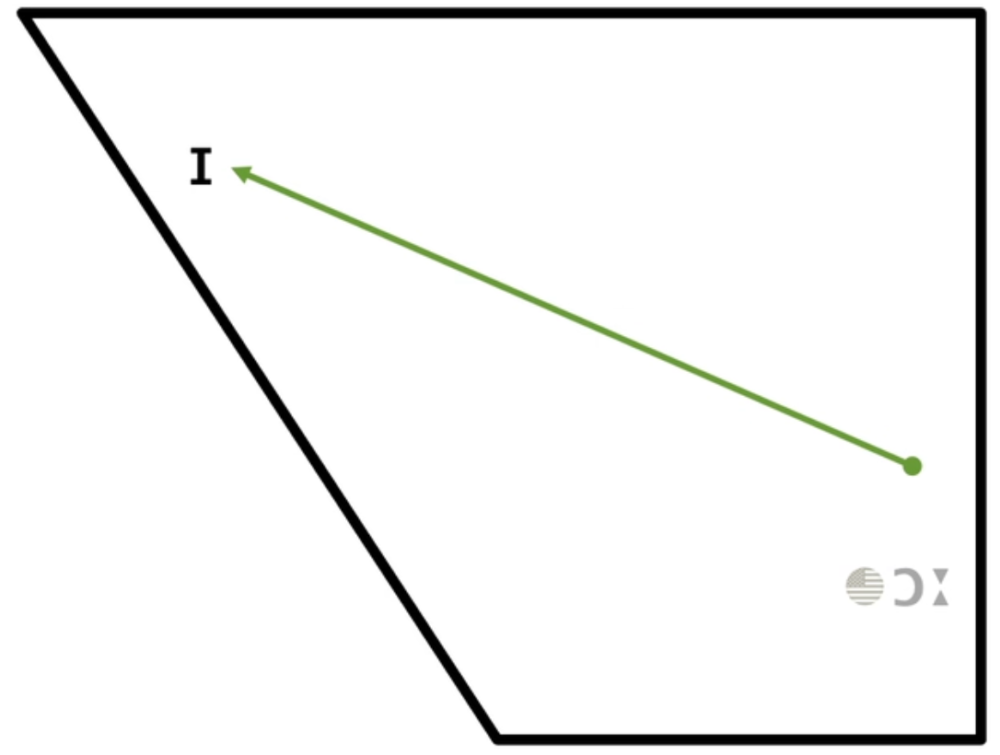{:height 214, :width 246}
	- ### /aɪ/
		- 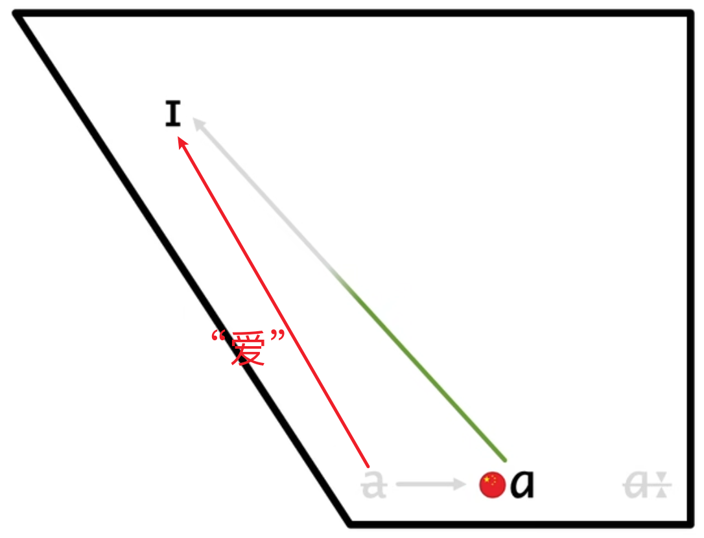{:height 214, :width 246}
		- 起始舌位比 a 更靠后些，可以认为是普通话的 `啊`；然后终止舌位并未到达 /ɪ/ 。
		  logseq.order-list-type:: number
		- 而普通话 `爱` 的起始音是 a ，所以比 /aɪ/ 起始音舌位靠前；
		  logseq.order-list-type:: number
		- 所以 `爱` 起始嘴角更向两边拉伸，而 /aɪ/ 则听上去更饱满一些。
		  logseq.order-list-type:: number
		- bike  -  /baɪk/
		- nice  -  /naɪs/
		- time  -  /taɪm/
	- ### /aʊ/
		- 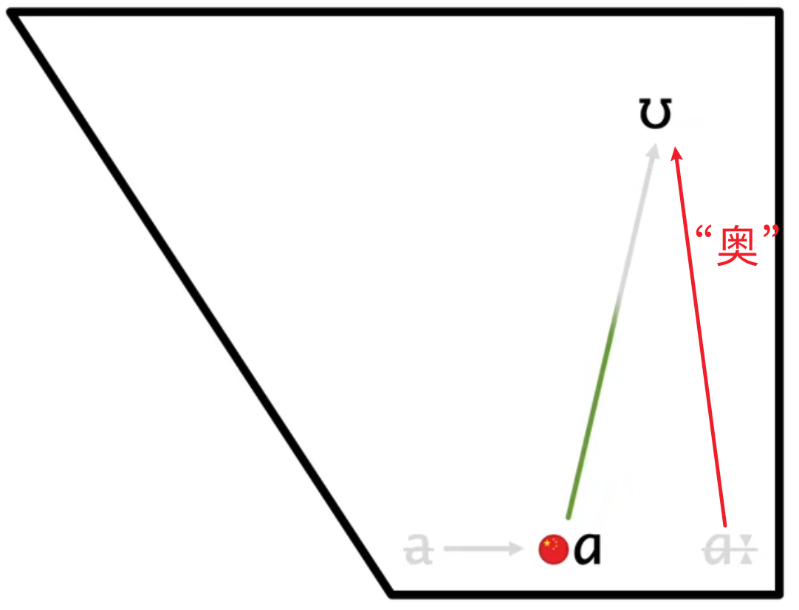{:height 214, :width 246}
		- 起始舌位比 a 更靠后些，可以认为是普通话的 `啊`；然后终止舌位并未到达 /ʊ/ 。
		  logseq.order-list-type:: number
		- 而普通话 `奥` 的起始音是 /ɑː/ 的短元音版本 ，所以比 /aʊ/ 起始音舌位靠后；
		  logseq.order-list-type:: number
		- 所以 /aʊ/ 的起始音嘴角更向两边拉伸。
		  logseq.order-list-type:: number
		- how  -  /haʊ/
		- cow  -  /kaʊ/
		  id:: 66b70fe7-7676-40c5-a7a1-626d6fef7314
		- allow  -  /ə'laʊ/
	- ### /əʊ/ 与 /oʊ/
		- 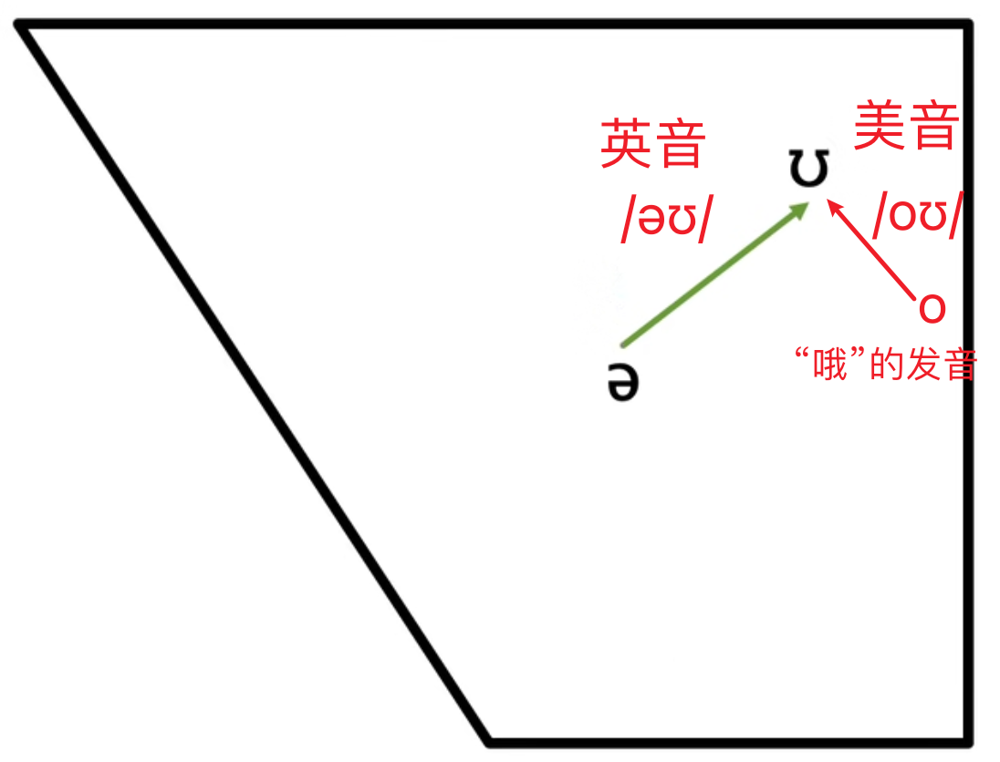{:height 214, :width 246}
		- /əʊ/ 是英音，从 /ə/ 过渡到 /ʊ/ (与普通话的 `欧` 发音基本一致)
		- /oʊ/ 是英音，从 o (相当于普通话的 `哦` ，比 /ə/ 舌位更高更厚，且圆唇) 过渡到 /ʊ/
		- 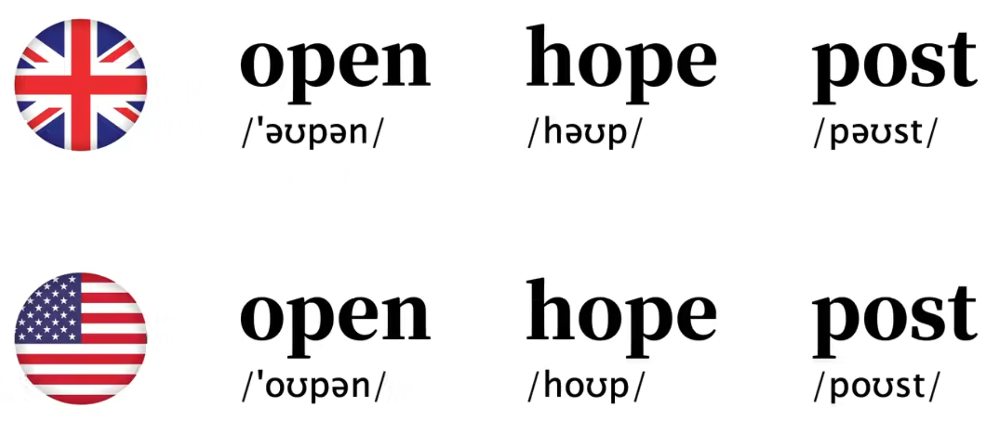{:height 174, :width 364}
	- ### /ʊə/
		- 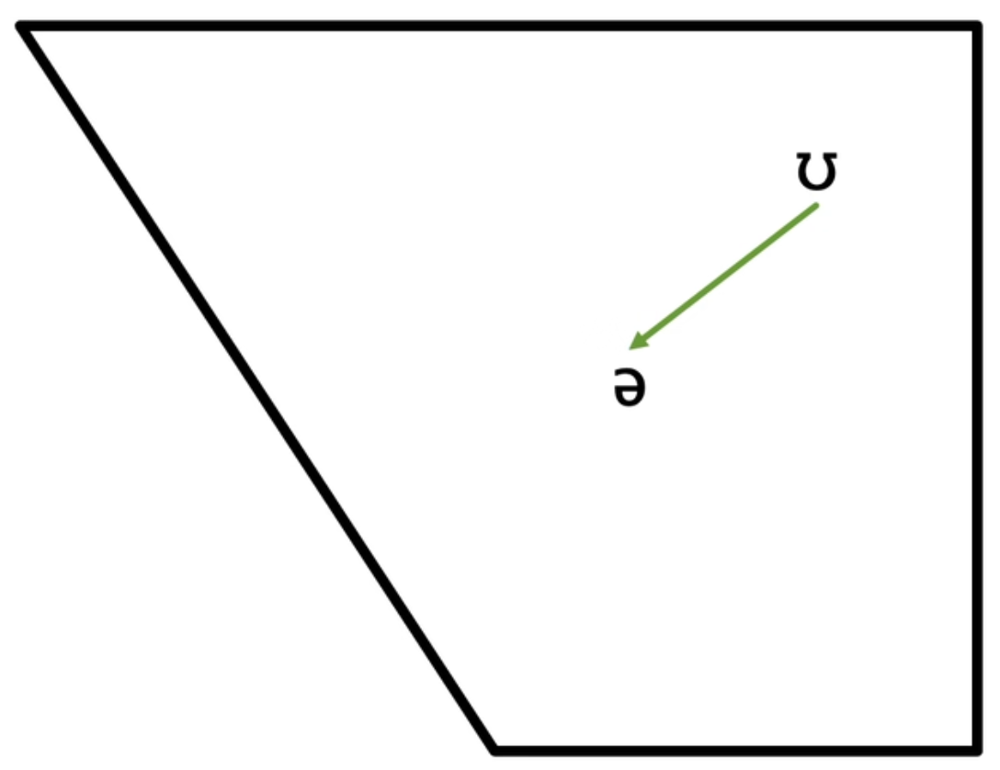{:height 214, :width 246}
		- 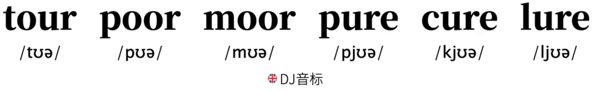{:height 105, :width 495}
		- 英音中发 /ʊə/ 音的字母后面，通常有字母 r，在美音中会变成 `r 化元音` 。
		- 用 DJ 音标标注美音 `r 化元音` 用 /ʊər/ 或 /ʊr/
		- 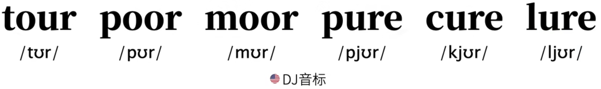{:height 85, :width 497}
	- ### /eə/
		- 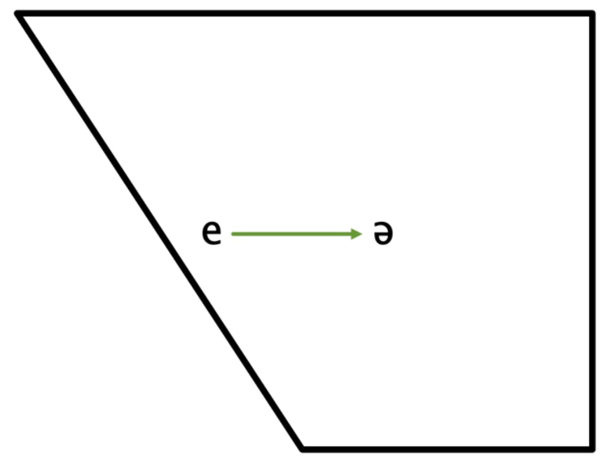{:height 214, :width 246}
		- 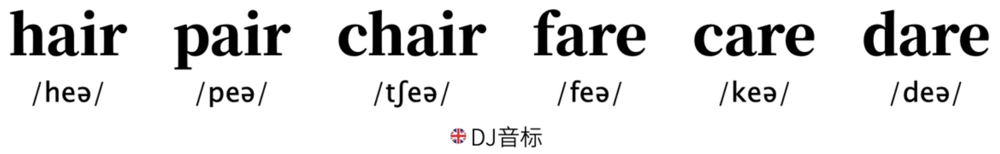{:height 105, :width 495}
		- 英音中发 /eə/ 音的字母后面，通常有字母 r，在美音中会变成 `r 化元音` 。
		- 用 DJ 音标标注美音 `r 化元音` 用 /eər/ 或 /er/ 。
		- 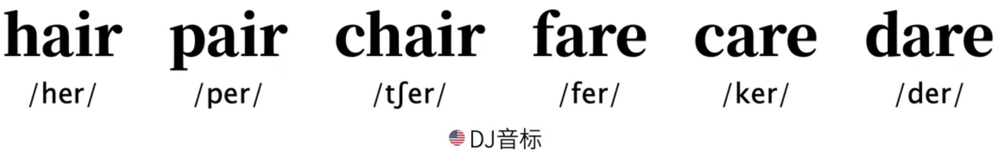{:height 105, :width 495}
	- ### /ɪə/
		- 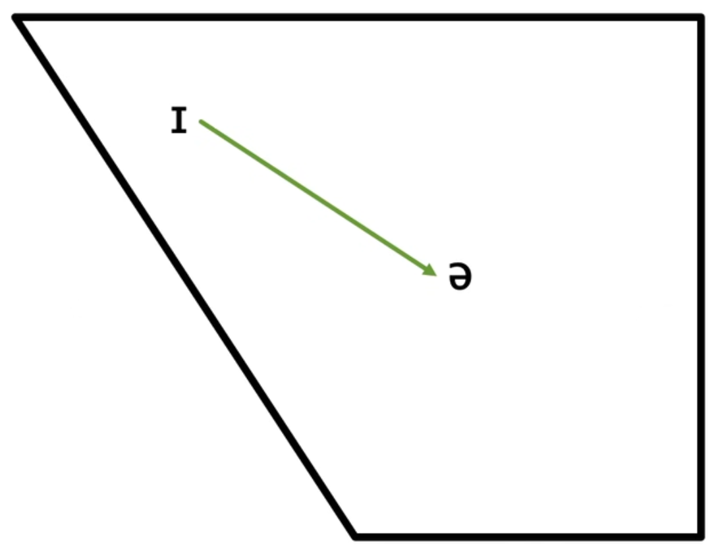{:height 214, :width 246}
		- 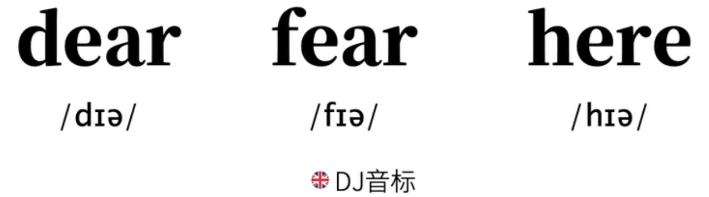{:height 131, :width 419}
		- 英音中发 /ɪə/ 音的字母后面，通常有字母 r，在美音中会变成 `r 化元音` 。
		- 用 DJ 音标标注美音 `r 化元音` 用 /ɪər/ 或 /ɪr/ 。
		- 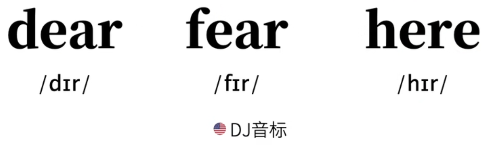{:height 83, :width 423}
		-
- ---
- ## 参考
	- [B 站 英语兔 - 全网最适合中国人的免费音标课(纯干货, 超详细!)](https://www.bilibili.com/video/BV1iV411z7Nj?p=7&vd_source=f1fbb083ddef12dcff3388779faac201)
	  logseq.order-list-type:: number
	- logseq.order-list-type:: number