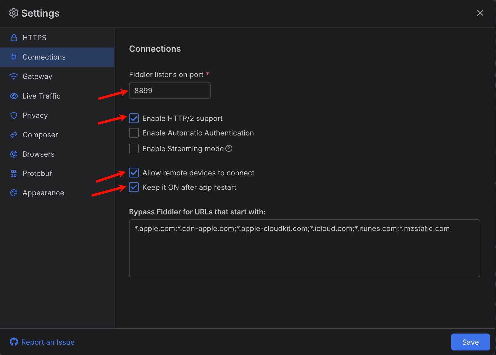
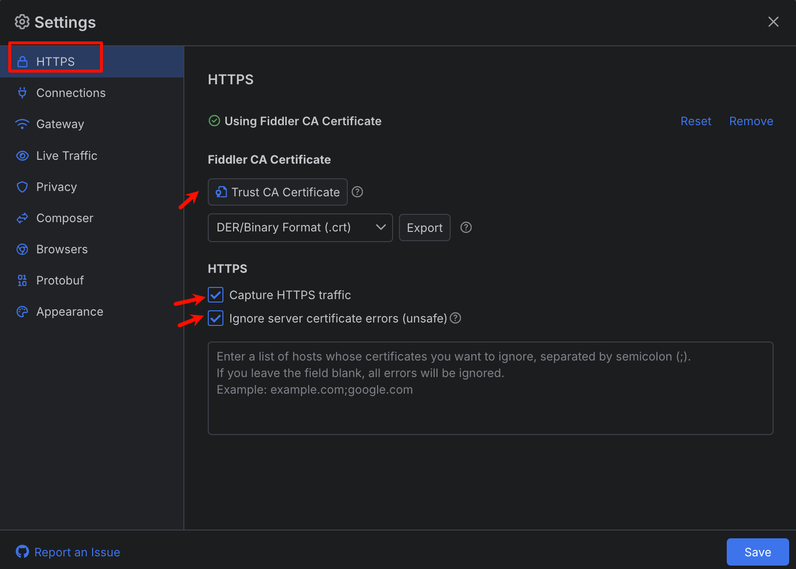
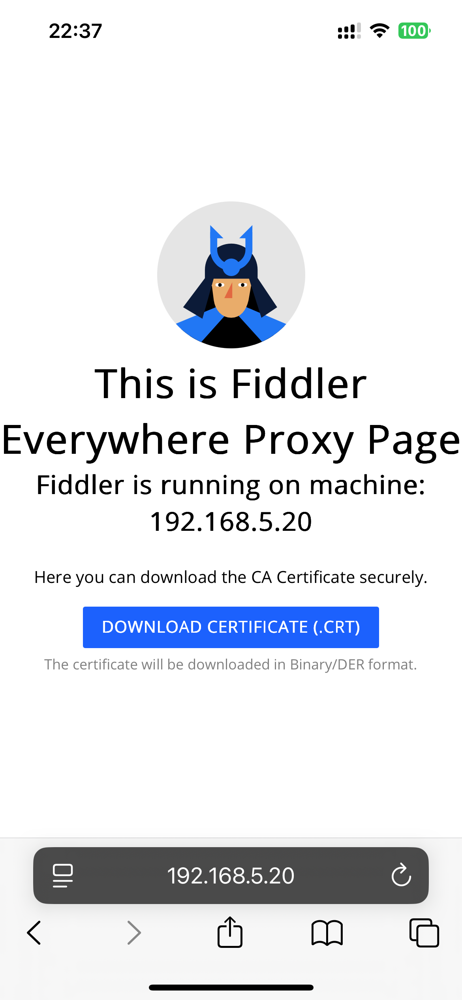
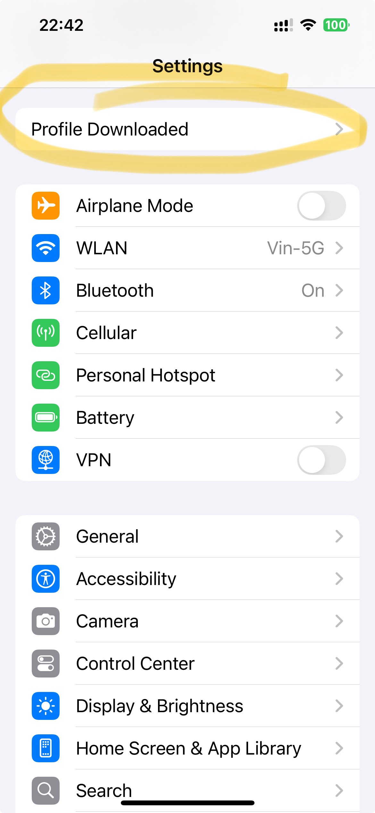
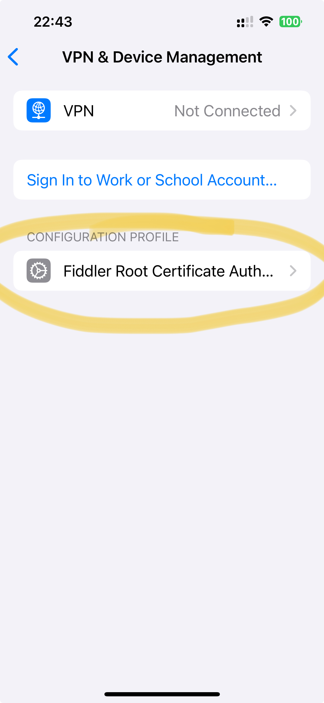
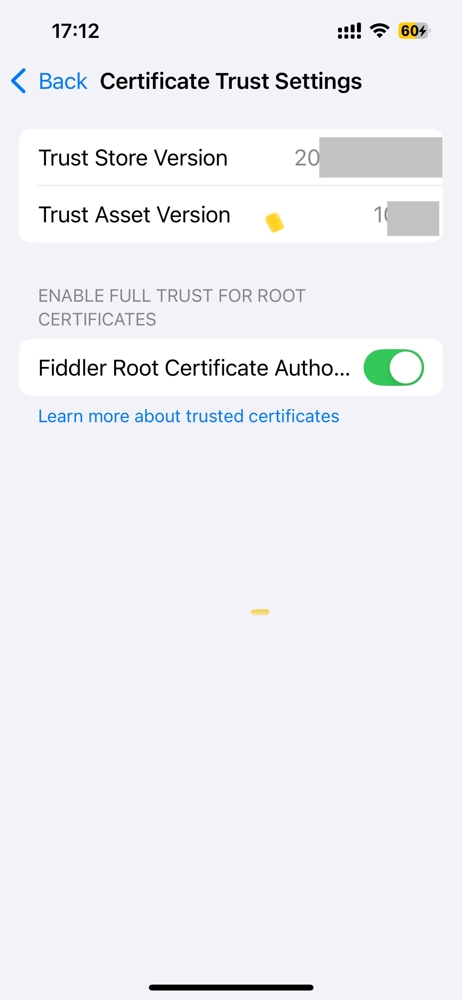

tags:: [[Fiddler Everywhere]]
---

- ## 抓包原理
	- 在 **查看抓包信息的机器** 上, 启动 Fiddler Everywhere , 并设置监听端口.
	  logseq.order-list-type:: number
	- 将 **需要被抓包的设备** 的网络代理, 设置为 Fiddler Everywhere 所在设备的 IP , 及其监听的端口.
	  logseq.order-list-type:: number
	- 那么, **需要被抓包的设备** 的网络请求, 就会流经 Fiddler Everywhere , 从而被 Fiddler Everywhere 抓包.
	  logseq.order-list-type:: number
- ## 操作步骤
	- ### 1. Fiddler Everywhere 连接配置
		- 进入 Fiddler Everywhere 的 `Settings` > `Connections` .
		  logseq.order-list-type:: number
		- 配置监听端口
		  logseq.order-list-type:: number
		- 勾选 `Enabe HTTP/2 support`
		  logseq.order-list-type:: number
		- 勾选 `Allow remote devices to connect` 以允许远程设备连接 .
		  logseq.order-list-type:: number
			- 默认只允许本机连接到此端口.
			- 在只需要捕获 本地 (本地宿主机 或 本地虚拟设备) 网络流量的情况下可以不勾选.
		- 勾选 `Keep it ON after app restart` .
		  logseq.order-list-type:: number
			- 默认情况下, `Allow remote devices to connect` 选项在 Fiddler Everywhere 重启后会被取消勾选
		- 点击 `Save` , 重启 Fiddler Everywhere (不重启貌似不生效?)
		  logseq.order-list-type:: number
		- {:height 687, :width 724}
	- ### 2. Fiddler Everywhere 开启 HTTPS 抓包
		- Fiddler Everywhere 默认不开启 HTTPS 抓包, 因为 HTTPS 抓包需要设备信任一个中间证书 (即 Fiddler Everywhere 的证书)
		- 按如下步骤, 开启 Fiddler Everywhere 的 HTTPS 抓包功能:
			- 进入 Fiddler Everywhere 的 `Settings` > `HTTPS` .
			  logseq.order-list-type:: number
			- 点击 `Trust CA Certificate` .
			  logseq.order-list-type:: number
			- 勾选 `Capture HTTPS traffic` .
			  logseq.order-list-type:: number
			- 勾选 `Ignore Server certificate errors (unsafe)`
			  logseq.order-list-type:: number
			- 点击 `Save` , 重启 Fiddler Everywhere (不重启貌似不生效?)
			  logseq.order-list-type:: number
			- {:height 556, :width 725}
	- ### 3. 设备下载 Fiddler 证书
		- 设备浏览器访问 Fiddler Everywhere 所在机器的 IP 及其监听的端口.
		  logseq.order-list-type:: number
			- 例如 : `http://192.168.5.20:8899` .
			- ==注意: iOS 一定要用 Safari 访问, 才能安装证书, 其他浏览器只能下载证书文件而无法安装.==
			- {:height 445, :width 179}
		- 点击 `DOWNLOAD CERTIFICATE (.CRT)` 下载 Fiddler 证书.
		  logseq.order-list-type:: number
	- ### 4. 设备安装 Fiddler 证书
		- #### iOS 安装证书流程
			- 进入 `Settings > Profile Downloaded` 无脑安装.
			  logseq.order-list-type:: number
				- {:height 445, :width 179}
			- 进入 `Settings > General > VPN & Device Management` 即可查看已安装的证书.
			  logseq.order-list-type:: number
				- {:height 445, :width 179}
			- 进入 `Settings > General > About > Certificate Trust Settings` 开启对根证书的完全信任.
			  logseq.order-list-type:: number
				- {:height 445, :width 179}
	- ### 5. 设备配置网络代理
		- ==以 wifi 网络为例:==
		- 进入 `Settings` > `WLAN` , 点击已连接的 WLAN 的详情
		  logseq.order-list-type:: number
		- 进入 `Configure Proxy` .
		  logseq.order-list-type:: number
		- 勾选 `Manual`, 编辑 `Server` 与 `Port` .
		  logseq.order-list-type:: number
			- {:height 445, :width 179}
			-
	- ### 注意事项
		- 其实, Fiddler Everywhere 运行时, 相当于创建并启动一个系统代理, 会捕获本机的所有网络请求.
		- 使用时注意, 不要与本地已有的代理发生冲突.
		- {:height 641, :width 694}
- ## 参考
	- [Fiddler对安卓模拟器里的APP抓包（步骤详细，各种抓包工具总结）](https://blog.csdn.net/Fiverya/article/details/120325676)
	  logseq.order-list-type:: number
	- [Fiddler Everywhere 安卓手机抓包配置](https://blog.csdn.net/taowen0315/article/details/122879569)
	  logseq.order-list-type:: number
	- [深入浅出，新一代跨平台抓包&调式利器Fiddler Everywhere](https://www.cnblogs.com/taylorshi/p/14494906.html)
	  logseq.order-list-type:: number
-