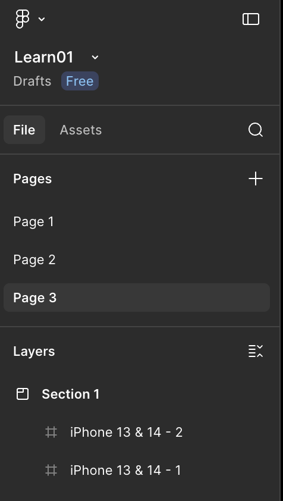
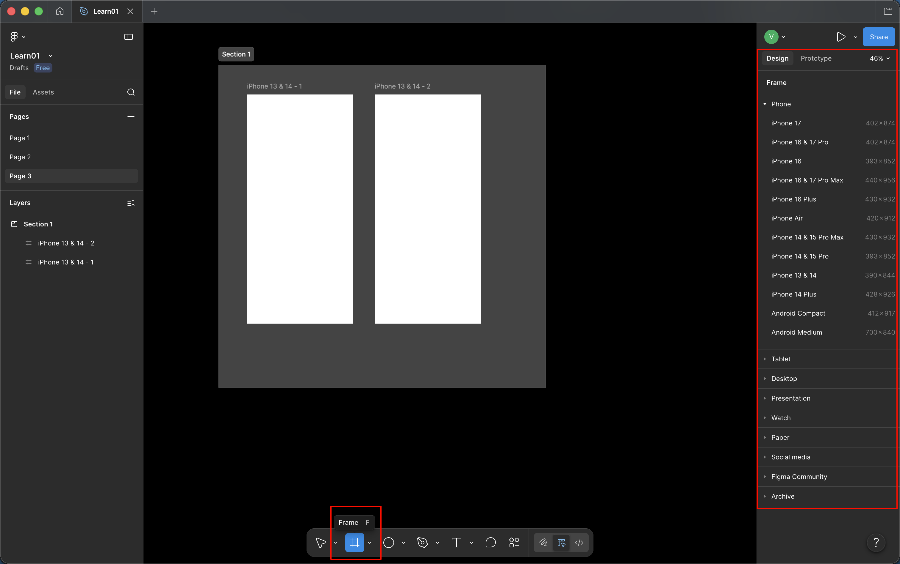

tags:: [[Figma]]
---

- ## Community
	- `Community` 是用户上传设计稿的社区.
- ## Team & File
	- 每个用户可以创建多个 `Team` .
	- 每个 `Team` 可以创建多个 `File` .
- ## Page, Frame, Section
	- {:height 422, :width 203}
	- 每个 `File` 可以创建多个 `Page` .
	- 每个 `Page` 可以创建各种元素, 其中 `Frame` 代表一个画框 (或者直接可以认为是 **设备页面** ).
		- 鼠标点击 `Frame` 或按下 `F` 键, 可以选择已有的 `Frame` 画幅 .
		- {:height 357, :width 548}
	- `Section` 不是可视元素, 只是用来给页面元素分组.
- ## Assets
	- `Assets` 代表当前 `File` 引入的设计库.
- ## 图层叠放
	- 左侧 `Layers` 的上下顺序, 即是 **图层的上下叠放顺序** .
	- 可以在左侧拖动各个元素, 调整各元素的 **分组** 和 **图层叠放顺序** .
-