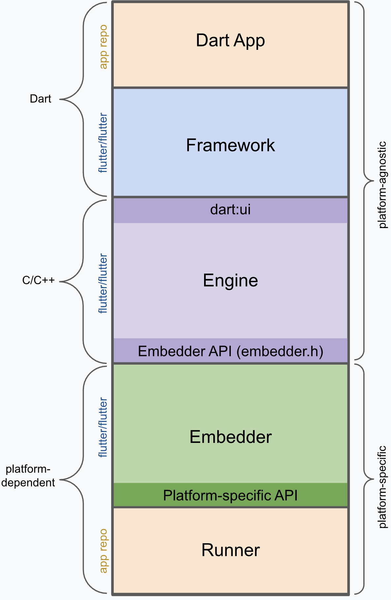

tags:: [[Flutter]]
---

- ## Layer Model
	- ### Overview
		- {:height 794, :width 706}
		- Flutter 被设计成一个 **可扩展的分层系统** :
			- 它由一系列 **独立的库** 组成, 每个库都依赖于底层.
			  logseq.order-list-type:: number
			- 任何 Layer 对其下一层 Layer 都是通过定义良好的 API 访问, 没有什么 **Privileged Access (特权访问)**  .
			  logseq.order-list-type:: number
	- ### Embedder Layer
		- #### 作用
			- **Platform-specific Embedder (平台特定的嵌入器)** 提供访问操作系统的 **入口 (entrypoint)** .
			- 通过它可以:
				- 访问操作系统的如下服务:
				  logseq.order-list-type:: number
					- Rendering surfaces (渲染界面)
					  logseq.order-list-type:: number
					- Accessibility (无障碍功能)
					  logseq.order-list-type:: number
					- Input (输入)
					  logseq.order-list-type:: number
				- 管理事件循环 (Event Loop)
				  logseq.order-list-type:: number
			- 通过 Embedder, Flutter 代码既可以构成 **独立的完整应用** ,  也能以 **模块形式** 集成到现有原生应用中.
		- #### 编写语言
			- Embedder 采用适合平台的语言进行编写.
				- `Android` : Java, C++
				- `iOS, macOS` : Swift, Objective-C/Objective-C++
				- `Windows, Linux` : C++
	- ### Engine Layer
		- #### 作用
			- **Engine** 是 Flutter 的核心.
			- 它实现了 Flutter 核心 API 的底层功能, 包括:
				- 图形渲染 (Graphics)
				  logseq.order-list-type:: number
					- 集成 [[Impeller]] 或 [[Skia]] 渲染引擎
				- 文本排版 (Text layout)
				  logseq.order-list-type:: number
				- 文件和网络  I/O (File and network I/O)
				  logseq.order-list-type:: number
				- 无障碍功能支持 (Accessibility support)
				  logseq.order-list-type:: number
				- 插件架构 (Plugin architecture)
				  logseq.order-list-type:: number
				- Dart Runtime
				  logseq.order-list-type:: number
				- 编译工具链 (Compile Toolchain)
				  logseq.order-list-type:: number
		- #### dart:ui
			- Engine 通过 `dart:ui` 向 Flutter Framework 开放接口.
			- `dart:ui` 将底层 C++ 代码封装为 Dart 类, 已提供底层功能.
	- ### Framework Layer
		- **Framework Layer** 的每个部分都被设计为 **可选 (optional)** 且 **可替换 (replaceable)** .
		- Framework 分层由下往上是 (以下分层, 在 flutter 框架中都有与之对应的库):
			- `基础层`  : **基础类库 (foundation)** 和 **基础功能库 (animation, painting, gestures 等)**  .
			  logseq.order-list-type:: number
			- `渲染层`  : **渲染库 (rendering)** .
			  logseq.order-list-type:: number
			- `组件层`  : **组件库 (widgets)**
			  logseq.order-list-type:: number
				- `渲染层` 中的每个 **渲染对象** , 都在 `组件层` 有对象的 类.
				- `组件层` 允许开发者自定义组件.
				- [[Reactive Programming]] 范式, 正是在这一层被引入.
			- `风格层` :  **material 库, cupertino 库** .
			  logseq.order-list-type:: number
- ## App Structure
	- 以下是使用 Flutter 开发的 APP 的结构:
		- {:height 584, :width 363}
	- 这是在 Layer Model 的基础上, 添加了由开发者控制的两个部分:
		- `Dart App` : Dart 代码, 开发 UI 和 业务逻辑.
		  logseq.order-list-type:: number
		- `Runner` : 由 `flutter create` 生成, 将 Embedder 提供的 `Platform-specifi API` 整合成可在目标平台运行的 App 包.
		  logseq.order-list-type:: number
	- 其中:
		- `Dart App` , `Framework` , `Engine` 是与平台无关的 (Platform-agnostic).
		- `Embedder` , `Runner` 是特定于平台的 (Platform-specific).
- ## Reactive UI
	- 说 Flutter 属于 [[Reactive Programming]] 的原因:
		- 当状态变化时, UI 会自动 **响应** 变化.
	- 但, Flutter 并不像 [[Vue]] 那样属于 **完全响应式** , 因为它仍然需要开发者调用 `setState` 方法, 通知 Flutter 进行响应.
		- | 模型 | 状态变化检测 | UI 更新 | 谁负责“响应” |
		  | ---- | ---- | ---- |
		  | 命令式（Android View） | 手动检测 | 手动更新 | 开发者 |
		  | 部分响应式（Flutter） | 显式通知（setState） | 自动更新 | 框架 |
		  | 完全响应式（MobX、Vue、Svelte） | 自动检测依赖 | 自动更新 | 框架 + 响应系统 |
		- ==参考: AI==
	- 与 [[Imperative Programming]] 范式 (比如 [[MVC]] ) 不同的是:
		- 虽然 Flutter 需要开发者 `setState` 方法, 但其刷新 UI 的后续操作都被 Flutter 封装了.
		- 但 Imprerative UI 需要开发者手动处理 UI 的刷新 (由于开发者的疏忽, 可能会出现一些问题) .
	- 在开发者调用 `setState` 方法之后, Flutter 会调用组件的 `build()` 方法重新绘制 UI .
		- 组件通过 `build()` 方法来声明 UI, 这个方法就是一个将 `state` 转换为 UI 的函数.
		- `build()` 方法, 在设计上, 应该执行速度很快, 并且避免产生一些副作用, 因为框架可能会很频繁调用.
- ## 参考
	- [Flutter Docs - Flutter architectural overview](https://docs.flutter.dev/resources/architectural-overview)
	  logseq.order-list-type:: number