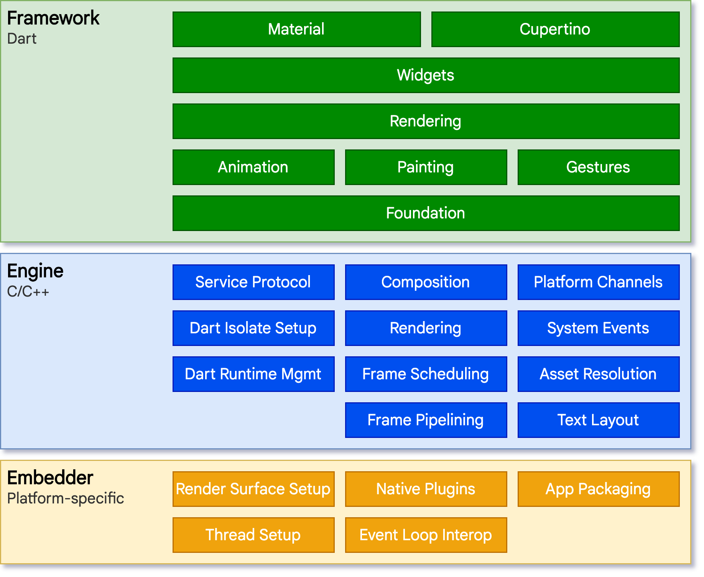

tags:: [[Flutter]]
---

- ## 学习路线
	- [[Flutter Architecture]]
	  logseq.order-list-type:: number
	- Framework Layer
	  logseq.order-list-type:: number
		- [[Flutter Widget Concept]]
		  logseq.order-list-type:: number
		- [[Flutter Rendering Concept]]
		  logseq.order-list-type:: number
	- Embedder Layer
	  logseq.order-list-type:: number
		- logseq.order-list-type:: number
- ## Overview
	- {:height 794, :width 706}
	- 此图其他地方也有用到, 不要删除