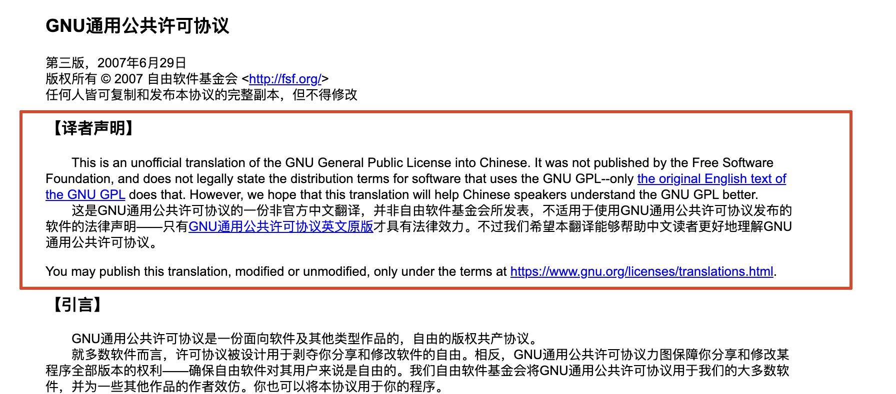

tags:: [[GNU License]]
---

- ## FSF 不承认 GNU License 翻译版本的合法性
	- FSF 不承认 GNU License 翻译版本的合法性, 因为:
		- 审查这些翻译很困难, 也很昂贵 (需要其它国家双语律师的帮助).
		  logseq.order-list-type:: number
		- 如果翻译版本中有错误, 将对自由软件社区产生灾难性后果.
		  logseq.order-list-type:: number
	- 所以, FSF 只给出了一些非官方的翻译, 以免产生法律危害.
		- 为了强调这些翻译不被官方承认有效, FSF 和 GNU 不在网站上发布这些翻译, 而 **只是提供链接** .
- ## 对翻译人员的要求
	- 要求翻译人员:
		- 必须熟悉 [[Copyleft]] 和 [[Free Software]] 等概念.
		  logseq.order-list-type:: number
		- 必须熟悉 License 文本中的出现的 **哲学原则 (philosophical principles)** .
		  logseq.order-list-type:: number
- ## 对翻译版本的要求
	- 要求:
		- **翻译版本** 必须标记为 **非正式 (unofficial)** .
		  logseq.order-list-type:: number
		- **翻译版本** 必须同意接受 GNU 社区认为更准确的 **修改请求**
		  logseq.order-list-type:: number
		- **翻译版本** 不能托管在 **商业网站** , 也不能指向 **任何公司** .
		  logseq.order-list-type:: number
		- **翻译版本** 页面, 不能有指向除了 `fsf.org` 和 `gnu.org` 之外的链接.
		  logseq.order-list-type:: number
			- 可以接受指向其它 Free Software Packages 的链接, 但是最好还是不要有.
		- **翻译版本** 允许其他人 **按照翻译要求** , 复制, 修改, 和再分发.
		  logseq.order-list-type:: number
			- 另外, 需要将如下文本放到 **翻译版本** 中, 以声明这一点.
			- > You may publish this translation, modified or unmodified, only under the terms at [http://www.gnu.org/licenses/translations.html](https://www.gnu.org/licenses/translations.html).
	- 另外:
		- ==对于一些难以修复的历史遗留问题, GNU 也会接受对这些规则的 **小偏差**.==
- ## 如何将翻译版本标记为 Unofficial
	- ### 声明文本
		- > This is an unofficial translation of the GNU General Public License into language. It was not published by the Free Software Foundation, and does not legally state the distribution terms for software that uses the GNU GPL—only the original English text of the GNU GPL does that. However, we hope that this translation will help language speakers understand the GNU GPL better.
	- ### 标记方式
		- 将 **声明文本** 及其 **翻译语言** 版本, 依次放到 **翻译文本** 的开头.
		  logseq.order-list-type:: number
		- 在 **声明文本** 及其 **翻译语言** 版本, 做如下文本替换:
		  logseq.order-list-type:: number
			- 将 **声明文本** 中的 `"language"` 换成 **翻译语言** .
			  logseq.order-list-type:: number
			- 将 **声明文本** 中的 `"GNU General Public License"` 换成 **要翻译的 License 名称** .
			  logseq.order-list-type:: number
			- 将 **声明文本** 中的 `"GPL"` 换成 **要翻译的 License 名称缩写** .
			  logseq.order-list-type:: number
- ## 翻译声明示例
	- {:height 311, :width 594}
	- 源自: [GNU通用公共许可协议](https://jxself.org/translations/gpl-3.zh.shtml)
- ## GNU 官方对链接的翻译版本的选择
	- GNU 不会链接所有已知的翻译版本.
	- 如果一个被 GNU 信任的 Free Software 组织, 发布了翻译版本:
		- GNU 可能会优先选择链接这个组织的 **翻译版本** (但仍不会被视为 **官方翻译** ).
- ## 各种 GNU License 的翻译版本
	- [GNU - Unofficial Translations](https://www.gnu.org/licenses/translations.html)
- ## 参考
	- [GNU - Unofficial Translations](https://www.gnu.org/licenses/translations.html)
	  logseq.order-list-type:: number