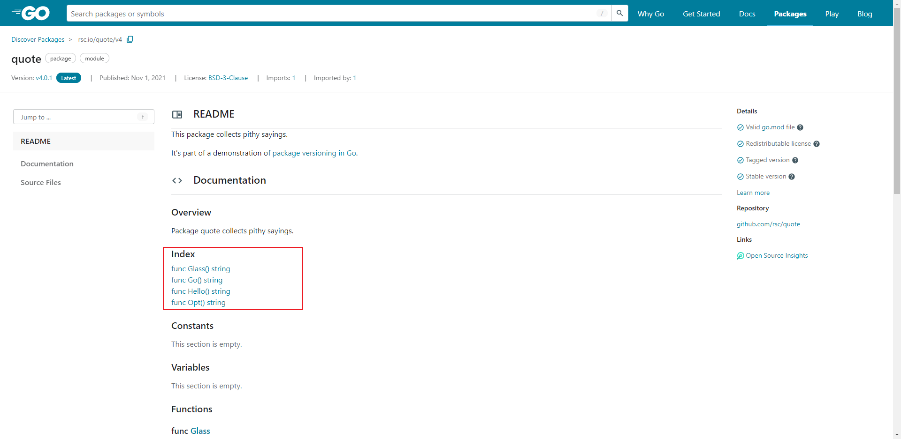

## Hello World
	- 新建一个 `hello` 文件夹。
	  logseq.order-list-type:: number
	  id:: 66163f9e-3e56-49ac-a39f-ae7f752b18ff
	- 在 `hello/` 下执行 `go mod init example/hello` ，以声明自身的 `模块路径` 。
	  logseq.order-list-type:: number
		- ```sh
		  E:\codes\go\learn\hello>go mod init example/hello
		  go: creating new go.mod: module example/hello
		  ```****
		- 执行后会在目录下生成一个 `go.mod` 文件，内容如下：
		- ```sh
		  module example/hello
		  
		  go 1.18
		  ```
	- 新建 `hello.go` 文件，输入如下内容：
	  logseq.order-list-type:: number
		- ```go
		  package main
		  
		  import "fmt"
		  
		  func main() {
		     fmt.Println("Hello, World!")
		  }
		  ```
		- 以上代码主要干了这几件事：
			- 声明了该文件 ( `hello.go` ) 所属的包为 `main` 。
			- 导入了 `fmt` 包（包含了 **格式化文本** 的函数，当然包括了 **打印文本到控制台** ）。
			- 实现了一个打印文本到控制台的 `main` 函数（当运行一个包时，会默认执行它的 `main` 函数）。
	- 执行 `go run .` 或者 `go run hello.go` 即可运行上述代码。
	  logseq.order-list-type:: number
		- ```sh
		  E:\codes\go\learn\hello>go run .
		  Hello, World!
		  ```
		- `go run .` 表示执行当前目录下的 `main` 函数，若有其他文件也定义了 `main` 函数，则会报错。
- ## 调用外部函数
	- 访问 [Go Packages](http://pkg.go.dev/) ，搜索 `rsc.io/quote` ，进入 [rsc.io/quote 的 v4 版本](https://pkg.go.dev/rsc.io/quote/v4) ，可以看到页面中显示了我们可以调用的函数。
	- 
	- 新建 `quote.go` 文件，输入如下内容：
	  logseq.order-list-type:: number
		- ``` go
		  package main
		  
		  import "fmt"
		  import "rsc.io/quote"
		  
		  func main() {
		     fmt.Println(quote.Go())
		  }
		  ```
		- 导入 `rsc.io/quote` 包，并调用 `Go()` 方法。
	- 执行 `go mod tidy` 以下载依赖包（在国内需要先设置镜像）。
	  logseq.order-list-type:: number
		- ```sh
		  E:\codes\go\learn\hello>go mod tidy
		  go: finding module for package rsc.io/quote
		  go: downloading rsc.io/quote v1.5.2
		  go: found rsc.io/quote in rsc.io/quote v1.5.2
		  ```
		- 执行后，在当前目录下生成了一个 `go.sum` 文件。
		- 同时， `go.mod` 文件也新增了内容，列举了本模块的依赖。
			- ```go
			  module example/hello
			  
			  go 1.18
			  
			  require rsc.io/quote v1.5.2
			  
			  require (
			  	golang.org/x/text v0.0.0-20170915032832-14c0d48ead0c // indirect
			  	rsc.io/sampler v1.3.0 // indirect
			  )
			  ```
	- 执行 `go run quote.go` 以执行上述代码。
	  logseq.order-list-type:: number
		- ```sh
		  E:\codes\go\learn\hello>go run quote.go
		  Don't communicate by sharing memory, share memory by communicating.
		  ```
- ---
- ## 参考
	- [Go 官方文档 - getting-started](https://go.dev/doc/tutorial/getting-started)
	  logseq.order-list-type:: number
-
-