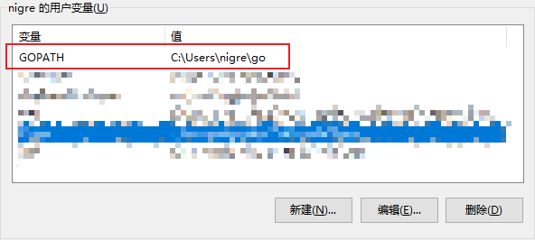

## 安装Go
	- **参考：** [Go官方文档](https://go.dev/doc/install)
	- ### Windows
		- #### 使用安装程序安装
			- [下载安装程序](https://go.dev/dl/)
			- 双击下载的 `gox.xx.windows-amd64.msi` ，选择安装路径，无脑下一步。
			- 安装完成后，命令行输入 `go version` 即可查看安装的版本（安装程序已经帮我们自动配置好了 **环境变量** ）。
			- ```sh
			  C:\Users\nigre>go version
			  go version go1.18 windows/amd64
			  ```
		- #### 编译源代码安装
			- [编译源代码安装](https://go.dev/doc/install/source)
- ## Go环境配置
	- ### 镜像配置
		- 不配置镜像，就无法下载 **外部的依赖包** 。
		- 执行如下命令：
			- ```sh
			  go env -w GO111MODULE=on
			  # 首选 https://goproxy.cn ，其他镜像可能出现问题
			  go env -w GOPROXY=https://goproxy.cn
			  ```
		- 执行 `go env` 可以查看所有的环境配置，用户的环境配置保存在 `%USERPROFILE%\AppData\Roaming\go\env`  文件。
		- **可用镜像：**
			- [官方镜像](https://goproxy.io/)
			- [七牛云 CDN goproxy.cn](https://goproxy.cn/) ([项目仓库](https://github.com/goproxy/goproxy.cn)) ==首选==
			- [阿里云镜像](https://mirrors.aliyun.com/goproxy/)
	- ### 本地依赖库配置
		- 安装程序帮我们设置了一个用户级的环境变量 `GOPATH` ，我们可以修改它为自定义地址： `E:\devtools\repos\go\public` 。
		- {:height 274, :width 592}
		- 以防万一，我们可以再设置一个系统级的环境变量 `GOPATH` （实际是用户的环境变量优先级更高）。
		- 执行 `go env` 可以查看配置是否成功。
		- 修改 `GOPATH` 后，发现 `go env` 结果中的 `GOMODCACHE` 也自动变为了 `{GOPATH}\pkg\mod` 。
-