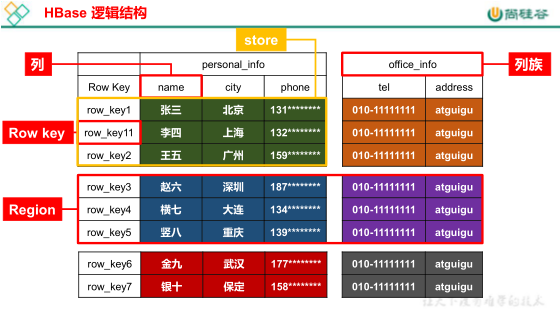
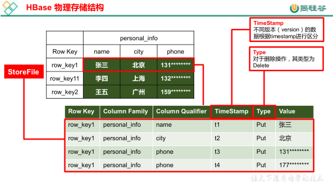

tags:: [[HBase]]
---

- ## 什么是 HBase
	- HBase 是一种分布式、可扩展、支持海量数据存储的 NoSQL 数据库。
	- HBase 的 **读操作** 比 **写操作** **慢** 。
	- HBase 的数据还是存储在文件系统中，只不过在内存中有数据的索引。
- ## HBase 的逻辑结构
	- {:height 324, :width 560}
- ### Name Space
	- 即 **命名空间** ，类似于关系型数据库的 `DatabBase` 概念。
	- 每个命名空间下有 **多个表** 。
	- HBase 有两个自带的命名空间，分别是 `hbase` 和 `default` 。 `hbase` 中存放的是 **HBase 内置的表** ； `default` 表是用户默认使用的命名空间，使用其中的表不用指定 `default` 前缀。
- ### Table
	- 即 **表** 。
	- 一张表，默认最初只有一个 `Region` ，随着记录数的不断增加而变大，起初的 `Region` 会逐渐分裂成多个 `Region` 。
- ### Column
	- 即 **列** 。
	- HBase 中的每个列都由 `Column Family(列族)` 和 `Column Qualifier(列限定符)` 进行限定，例如 info : name，info : age。
	- 建表时，只需指明列族，而列限定符无需预先定义。
- ### Column Family
	- 即 **列族** ，由多个列组成。
- ### Column Qualifier
	- 即 **列名 / 列限定符** 。
- ### Region
	- 由表 **横向** 根据 `RowKey` 分割成的多个记录。
	- HBase 定义表时只需要声明 **列族** 即可， **不需要声明具体的列** ，所以往 HBase 写入数据时， **字段可以动态指定** 。
	- 因此，和 **关系型数据库** 相比，HBase 能够轻松应对字段变更的场景。
- ### Row
	- HBase 表中的每行数据都由 一个 `RowKey` 和 多个 `Column(列)` 组成。
	- 数据按照 `RowKey` 的 **字典顺序** 存储。
	- 查询数据时只能根据 `RowKey` 进行检索，所以 RowKey 的设计十分重要。
- ### RowKey
	- 即 **行键** ，相当于每一行的主键，在一个表中要唯一。
	- 每次存储数据时都要指定 `RowKey` 。
- ## HBase 的物理存储结构
	- 
- ### Store
	- 是一个 **物理存储的单元** 。
	- 一个 `Region` 可以根据 `Column Family` 分割成多个 Strore 。
- ### TimeStamp
	- 用于标识数据的 **不同版本(Version)** 。
	- 每条数据写入时，如果不指定时间戳，系统会自动为其加上该字段，其值为写入 HBase 的时间。
- ### Cell
	- 由 `{RowKey, Column Family : Column Qualifier, Timestamp}` 唯一确定的单元。
	- `Cell` 中的数据是 **没有类型** 的，全部是 `字节码` 形式存贮。
- ### Type
	- 即 **数据操作的类型** ，有 `Put` 和 `Delete` 两种。
	- HBase 在存储数据时，会为每条数据都指定类型。
	- 我们新增一条数据时，会指定类型为 `Put` ；若将其删除，则会储存一条类型为 `Delete` 的相同的数据（ `Timestamp` 不同），真正的物理删除不会立刻发生；若重新推送一条 `RowKey` 相同的数据，则也会新增一条类型为 `Put` 的数据。
	- 而当我们查询此  `RowKey` 对应的数据时，则以最新的 `Timestamp` 为准；若最新的数据的类型为 `Delete` ，则表示数据已删除，不会返回给用户。
- ## HBase 基本架构
	-
- ---
- ## 参考
	- ```wiki
	  1. 尚硅谷官方学习资料。
	  2. https://www.cnblogs.com/swordfall/p/8737328.html
	  ```