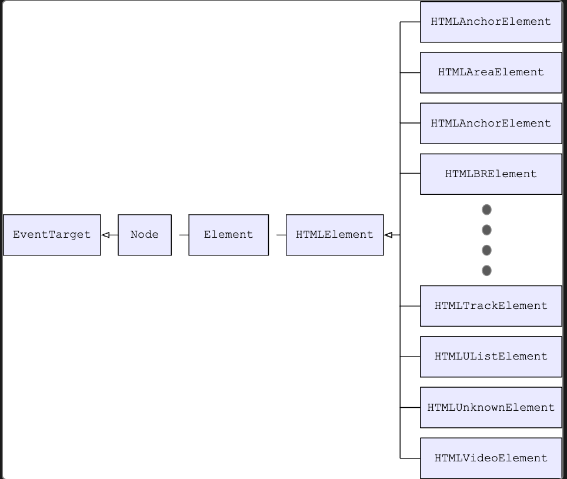

tags:: [[HTML DOM]]
---

- ## 规范
	- **DOM** 的规范由 [[DOM Spec]] 定义 .
	- **HTML DOM** 基于 [[DOM Spec]] , 对其进行增强, 增强部分的规范由 [[HTML Spec]] 定义 .
- ## HTML DOM 对 `Document` 的增强
	- `Document` 接口由 [[DOM Spec]] 定义,   [[HTML Spec]]  对 `Document` 接口进行了增强 .
	- [[HTML Spec]] 针对 `Document`  主要增加了如下内容:
		- 支持访问 HTTP headers 信息 .
		  logseq.order-list-type:: number
			- 如 cookie 可通过 `Document.cookie` 属性访问.
			- 如 referring site 可通过 `Document.referrer` 属性访问.
		- 支持访问 `<head>` 和 `<body>` 中的元素列表.
		  logseq.order-list-type:: number
			- 如  `Document.images` 获取文档中的所有 `` 元素 .
			- 如 `Document.links` 获取文档中的所有  `<area>` 元素和 `<a>` 元素的 `href` 属性的集合 .
			- 如 `Document.scripts` 获取文档中的所有  `<script>`  元素 .
		- 支持 **检查焦点** 和 **对可编辑内容执行命令** , 从而与用户交互 .
		  logseq.order-list-type:: number
			- 检查焦点: `Document.hasFocus()`
			- 可编辑内容 Global Attribute: `contenteditable`
		- 支持 HTML Spec 定义的事件的 Event Handler .
		  logseq.order-list-type:: number
			- 如 mouse and keyboard events, drag and drop, media control 等等
		- 支持可以传递到 **元素** 和 **文档** 的 Event Handler .
		  logseq.order-list-type:: number
			- 目前只支持 **copy, cut, paste** 操作.
- ## HTML DOM 对 `Element` 的增强
	- `Element` 接口被拓展为 `HTMLElement` 以及很多不同的子类.
		- `HTMLElement` 接口是通用的,  它包含 元素 ID, coordinates, HTML 文本, scroll position 等所有元素通用的信息.
		- 其他 HTML 元素都继承自 `HTMLElement` .
		- {:height 280, :width 451}
- ## HTML DOM API 分类
	- 参考: [MDN - HTML DOM API interfaces](https://developer.mozilla.org/en-US/docs/Web/API/HTML_DOM_API#html_dom_api_interfaces)
	- HTML element interfaces ( `HTMLElement` 及其子类 )
	  logseq.order-list-type:: number
	- Web app and browser integration interfaces
	  logseq.order-list-type:: number
		- [BarProp](https://developer.mozilla.org/en-US/docs/Web/API/BarProp)
		  logseq.order-list-type:: number
			- `locationbar` , `menubar` 等各种 Bar 的父接口.
		- [Navigator](https://developer.mozilla.org/en-US/docs/Web/API/Navigator)
		  logseq.order-list-type:: number
			- 代表  user agent 的状态和标识 (state and the identity)
		- [Window](https://developer.mozilla.org/en-US/docs/Web/API/Window)
		  logseq.order-list-type:: number
			- 浏览器中的每个 tab 都由一个 `Window` 对象表示 .
				- 尽管如此, 如 `resizeTo()` 和 `innerHeight` 等方法和属性, 仍然适用于包含当前标签页的整体窗口 .
				- 也就是说,  `Window` 对象虽然用于表示一个 tab , 但是它仍然可以用于操作整个浏览器窗口 .
			- 标签页加载的文档内容, 由 `Window.document` 表示 .
				- 可以使用 `document.defaultView` 来获取 `document` 所属的 `Window` 对象.
	- 其他 HTML DOM API
	  logseq.order-list-type:: number
	- Interfaces belonging to other APIs 
	  logseq.order-list-type:: number
		- 有些接口虽然由 HTML Spec 定义, 但其实属于其他 API , 如:
			- Web storage interfaces
			  logseq.order-list-type:: number
			- Web Workers interfaces
			  logseq.order-list-type:: number
			- WebSocket interfaces: [[WebSocket API]]
			  logseq.order-list-type:: number
			- Server-sent events interfaces: [[Server-sent events]]
			  logseq.order-list-type:: number
- ## 参考
	- [MDN - The HTML DOM API](https://developer.mozilla.org/en-US/docs/Web/API/HTML_DOM_API)
	  logseq.order-list-type:: number