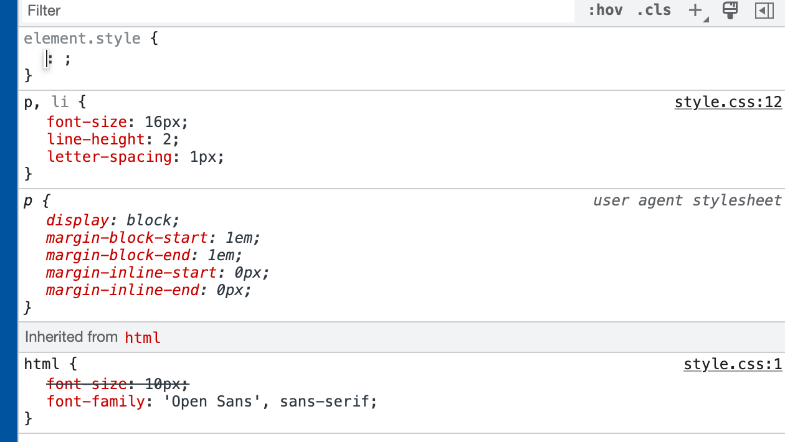

tags:: [[HTML]]
---

- ## 宽松的语法
	- 浏览器通过 **解释** HTML 显示结果，而非 **编译** 。
	- 浏览器解释 HTML 很 **宽松** ，即便 HTML 出现语法错误，也能显示结果 (只不过结果不是我们想要的)。
	- 在 web 创建的早期，人们要发布的 **内容本身** 比 **语法正确** 更重要；如果从一开始浏览器解释HTML就很严格，web可能没有现在这么受欢迎。
- ## HTML Validation
	- W3C维护的  [Markup Validation Service](https://validator.w3.org/) , 用于检测 HTML 语法 .
- ## browser developer tools
	- ### DOM inspector
		- 右击节点，会出现：删除节点、编辑、修改元素打开状态 (如 **:hover/:active/:focus** 等)、复制html、复制 CSS 选择器等功能。
	- ### CSS editor
		- CSS样式的应用，是按照 **most-to-least-specific** 的优先级，即 **最具体的选择器优先级最高** 。
		- 
-
- ---
- ## 参考
	- [Debugging HTML](https://developer.mozilla.org/en-US/docs/Learn/HTML/Introduction_to_HTML/Debugging_HTML)
	  logseq.order-list-type:: number
	- [browser developer tools](https://developer.mozilla.org/en-US/docs/Learn/Common_questions/What_are_browser_developer_tools)
	  logseq.order-list-type:: number