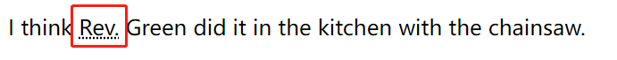

tags:: [[HTML]]
---

- ## 文本结构
	- ### `<hn>` 层级结构最佳实践
		- 一个页面只有一个 `<h1>` .
		  logseq.order-list-type:: number
		- 要按层级顺序来使用 `<hn>` ，例如不应该将 `<h2>` 作为 `<h3>` 的子级。
		  logseq.order-list-type:: number
		- 六个 `<hn>` 标签，在一个页面中，最多只用到第三层，其他更深层的内容最好在其他页面展示。
		  logseq.order-list-type:: number
	- ### 为什么我们需要一个好的文本结构
		- 便于用户查看内容.
		  logseq.order-list-type:: number
		- 利于 SEO (Search Engine Optimization) .
		  logseq.order-list-type:: number
		- 便于视障人士找到他想要的内容 (否则他可能需要听完整个网页的内容) .
		  logseq.order-list-type:: number
		- 便于 css 和 js 的使用.
		  logseq.order-list-type:: number
- ## 为什么要使用语义化的标签
	- 同样在页面呈现一个 **标题** ，我们可以有以下两种做法：
	- 1. 使用 `<h1>` 标签。
		- ```html
		  <h1>This is a top level heading</h1>
		  ```
	- 2. 使用 `<span>` + css 。
		- ```html
		  <span style="font-size: 32px; margin: 21px 0; display: block;">Is this a top level heading?</span>
		  ```
	- 虽然最终实现的效果一致，但是第一种方式更友好，因为更易于人类和机器阅读。
	- 所以尽量使用 **语义化** 的标签。
- ## lang 设置语言
	- ### `<html>` 标签设置语言
		- 用于指定网页使用的主要语言 .
		- **作用：**
			- 可用于正确地显示文字 .
			- 可以用于 **网页阅读器** 为 **视障用户** 读出正确的读音 (比如法语和英语中都有 six ，但读音不同) .
		- 可选值：zh-CN、en-US 等:
		- ```html
		  <html lang="zh-CN">
		  …
		  </html>
		  ```
	- ### 其他标签设置语言
		- ```html
		  <p>Japanese example: <span lang="ja">ご飯が熱い。</span>.</p>
		  ```
- ## 强调元素
	- ### `<em>`
		- 用 **斜体** 表示 强调; **screen reader** 会用不一样的语气读这个标签中的内容。
		- 注：如果仅仅是要使用 **斜体** ，最好用 `<span>` +  `css` 或者 `<i>` 标签。
	- ### `<strong>`
		- 用 **粗体** 表示 更强烈的强调; **screen reader** 会用不一样的语气读这个标签中的内容。
		- 注：如果仅仅是要使用 **粗体** ，最好用 `<span>` +  `css` 或者 `<b>` 标签。
	- ### `<mark>`
		- 给文字加黄色背景 (黄色马克笔效果)
- ## 表象元素 (presentational elements)
	- 仅仅影响 **样式** ，而没有 **语义** 的元素。
	- `<b>` : 加粗。
	- `<i>` : 斜体。
	- `<u>` : 下划线。(建议仅将下划线用于链接，因为人们已经认为有下划线的文字是个链接)
- ## 不常用文本元素
	- ### `<dl>` 描述列表
		- 可用于 **名词解释** ；也可用于 **问答** 。
		- `<dl>` : description list 描述列表
		- `<dt>` : description term 描述项
		- `<dd>` : description details 描述详情，会有 **缩进** 的效果。
		- ```html
		  <dl>
		    <dt>soliloquy</dt>
		    <dd>
		      In drama, where a character speaks to themselves, representing their inner
		      thoughts or feelings and in the process relaying them to the audience (but
		      not to other characters.)
		    </dd>
		    <dt>monologue</dt>
		    <dd>
		      In drama, where a character speaks their thoughts out loud to share them
		      with the audience and any other characters present.
		    </dd>
		    <dt>aside</dt>
		    <dd>
		      In drama, where a character shares a comment only with the audience for
		      humorous or dramatic effect. This is usually a feeling, thought, or piece of
		      additional background information.
		    </dd>
		  </dl>
		  ```
		- **一个 `<dt>` 对应多 `<dd>`**
		- ```html
		  <dl>
		    <dt>aside</dt>
		    <dd>
		      In drama, where a character shares a comment only with the audience for
		      humorous or dramatic effect. This is usually a feeling, thought, or piece of
		      additional background information.
		    </dd>
		    <dd>
		      In writing, a section of content that is related to the current topic, but
		      doesn't fit directly into the main flow of content so is presented nearby
		      (often in a box off to the side.)
		    </dd>
		  </dl>
		  ```
	- ### `<blockquote>` 块引用
		- 引用的内容会有 **缩进** 的效果。
		- `cite` : 指定引用内容的链接。
		- ```html
		  <p>Here is a blockquote:</p>
		  <blockquote cite="https://developer.mozilla.org/en-US/docs/Web/HTML/Element/blockquote">
		    <p>
		      The <strong>HTML <code>&lt;blockquote&gt;</code> Element</strong> (or
		      <em>HTML Block Quotation Element</em>) indicates that the enclosed text is
		      an extended quotation.
		    </p>
		  </blockquote>
		  ```
	- ### `<q>` 行内引用
		- 引用的内容会被 **引号** 引起来。
		- `cite` : 指定引用内容的链接。
		- ```html
		  <p>
		    The quote element — <code>&lt;q&gt;</code> — is
		    <q cite="https://developer.mozilla.org/en-US/docs/Web/HTML/Element/q">
		        intended for short quotations that don't require paragraph breaks.
		    </q>
		  </p>
		  ```
	- ### `<cite>` 引文
		- 被引用的文字会以 **斜体** 显示。
		- ```html
		  <cite>MDN blockquote page</cite>
		  ```
		- `<blockquote>` 和 `<q>` 的 `cite` 属性都无法被 **浏览器** 或者 **screen readers** 等读到，所以好像并未起任何作用。
		- 所以可以通过加 `<a>` 标签的方式使用 `<cite>` 标签 (会呈现一个 **斜体** 的 **超链接** )
		- ```html
		  <a href="/en-US/docs/Web/HTML/Element/blockquote">
		    <cite>
		        MDN blockquote page
		    </cite>
		  </a>
		  ```
	- ### `<abbr>` 缩写
		- `<abbr>` : 可以用于表明这是一个 abbreviation 或 acronym
			- `abbreviation` : 缩略语，如 HTML, Hypertext Markup Language
			- `acronym` : 首字母缩略词，如 Rev. , Reverend
		- `title` 属性 :
			- 会有 **下滑点线** 的显示效果；
			- **鼠标悬浮** 会显示 title 属性的值。
			- 
		- ```html
		  <p>
		    We use <abbr>HTML</abbr>, Hypertext Markup Language, to structure our web
		    documents.
		  </p>
		  <p>
		    I think <abbr title="Reverend">Rev.</abbr> Green did it in the kitchen
		    with the chainsaw.
		  </p>
		  ```
		- 曾经存在 `<acronym>` 专门展示 acronym，现已废除。
	- ### `<address>` 联系方式
		- 语义：联系方式。
		- 效果：所包含的内容会以 *斜体* 形式呈现。
		- ```html
		  <address>Chris Mills, Manchester, The Grim North, UK</address>
		  ```
		- #### 包裹复杂的结构
			- ```html
			  <address>
			    <p>
			      Chris Mills<br />
			      Manchester<br />
			      The Grim North<br />
			      UK
			    </p>
			    <ul>
			      <li>Tel: 01234 567 890</li>
			      <li>Email: me@grim-north.co.uk</li>
			    </ul>
			  </address>
			  ```
		- #### 包裹链接
			- 呈现为一个斜体的链接。
			- ```html
			  <address>
			  	Page written by <a href="../authors/chris-mills/">Chris Mills</a>.
			  </address>
			  ```
		- #### 最佳实践
			- `<address>` 应该仅仅用在 `<article>` (用于表示页面中独立的一部分：如一篇文章、一篇博客、一个post、一个评论、一张卡片等) 或 `<body>` 标签中，用于展示该 `<article>` 或 `<body>` 的 **联系信息** 。
			- 所以 `<address>` 一般用在:
				- **网页的 footer** 去展示该网站的 **联系信息** .
				- 一篇 **文章内** 展示作者的 **联系信息** .
			- 千万不要用于展示一些与网页内容无关的 **联系信息** 。
	- ### `<sup>` 上标 和 `<sub>` 下标
		- 一般用于 **日期** 、 **化学公式** 、 **数学方程式** 等。
		- ```html
		  <p>My birthday is on the 25<sup>th</sup> of May 2001.</p>
		  <p>
		  	Caffeine's chemical formula is
		  	C<sub>8</sub>H<sub>10</sub>N<sub>4</sub>O<sub>2</sub>.
		  </p>
		  <p>If x<sup>2</sup> is 9, x must equal 3 or -3.</p>
		  ```
	- ### 计算机代码相关
		- #### `<code>` 代码短片段
			- 表示 **代码短片段** ，使用默认的 **等宽字体** 呈现。
		- #### `<pre>` 代码片段
			- 表示 **代码片段** ，会保留任何 **缩进和空格** ，使用默认的 **非比例字体** 或 **等宽字体** 呈现。
		- #### `<var>` 变量
			- 表示 **变量** ，通常采用 **当前字体的斜体** 形式呈现。
		- #### `<kbd>` 文本输入
			- 表示 **文本输入** ，按照惯例，会以 **等宽字体** 呈现（但这并非HTML标准所要求的）。
		- #### `<samp>` 计算机程序输出
			- The Sample Output element
			- 表示 **计算机程序输出**  ，使用默认的 **等宽字体** 呈现。
		- #### 例子
			- 上述标签经常会嵌套使用。
			- ```html
			  <pre><code>const para = document.querySelector('p');
			  
			  para.onclick = function() {
			  alert('Owww, stop poking me!');
			  }</code></pre>
			  
			  <p>
			  You shouldn't use presentational elements like <code>&lt;font&gt;</code> and
			  <code>&lt;center&gt;</code>.
			  </p>
			  
			  <p>
			  In the above JavaScript example, <var>para</var> represents a paragraph
			  element.
			  </p>
			  
			  <p>Select all the text with <kbd>Ctrl</kbd>/<kbd>Cmd</kbd> + <kbd>A</kbd>.</p>
			  
			  <pre>$ <kbd>ping mozilla.org</kbd>
			  <samp>PING mozilla.org (63.245.215.20): 56 data bytes
			  64 bytes from 63.245.215.20: icmp_seq=0 ttl=40 time=158.233 ms</samp></pre>
			  ```
	- ### `<time>` 时间和日期
		- 使用 `datetime` 属性，提供一个计算机可读的时间（因为文本形式的时间多种多样）。
		- ```html
		  <time datetime="2016-01-20">20 January 2016</time>
		  ```
		- 有多种格式
		- ```html
		  <!-- Standard simple date -->
		  <time datetime="2016-01-20">20 January 2016</time>
		  <!-- Just year and month -->
		  <time datetime="2016-01">January 2016</time>
		  <!-- Just month and day -->
		  <time datetime="01-20">20 January</time>
		  <!-- Just time, hours and minutes -->
		  <time datetime="19:30">19:30</time>
		  <!-- You can do seconds and milliseconds too! -->
		  <time datetime="19:30:01.856">19:30:01.856</time>
		  <!-- Date and time -->
		  <time datetime="2016-01-20T19:30">7.30pm, 20 January 2016</time>
		  <!-- Date and time with timezone offset -->
		  <time datetime="2016-01-20T19:30+01:00">
		  7.30pm, 20 January 2016 is 8.30pm in France
		  </time>
		  <!-- Calling out a specific week number -->
		  <time datetime="2016-W04">The fourth week of 2016</time>
		  ```
-