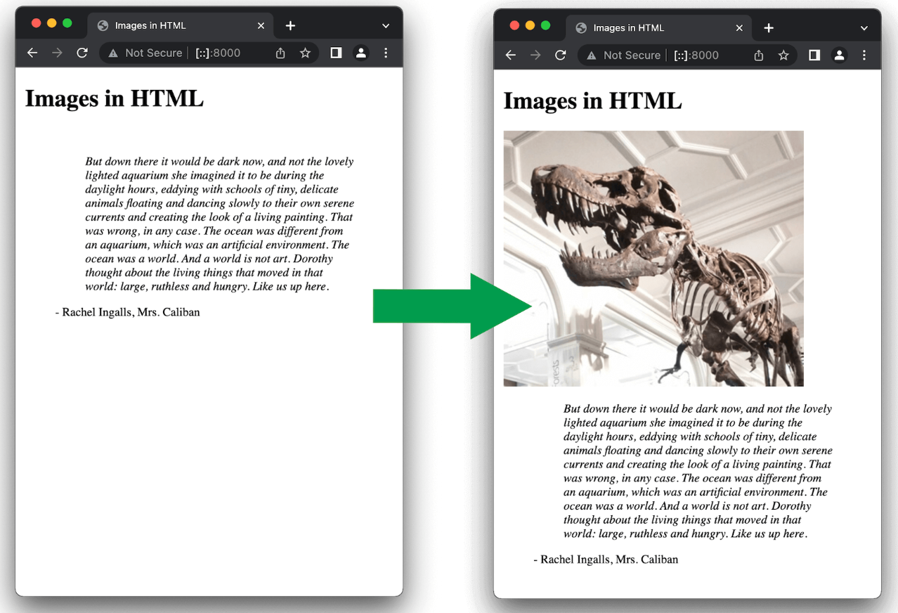
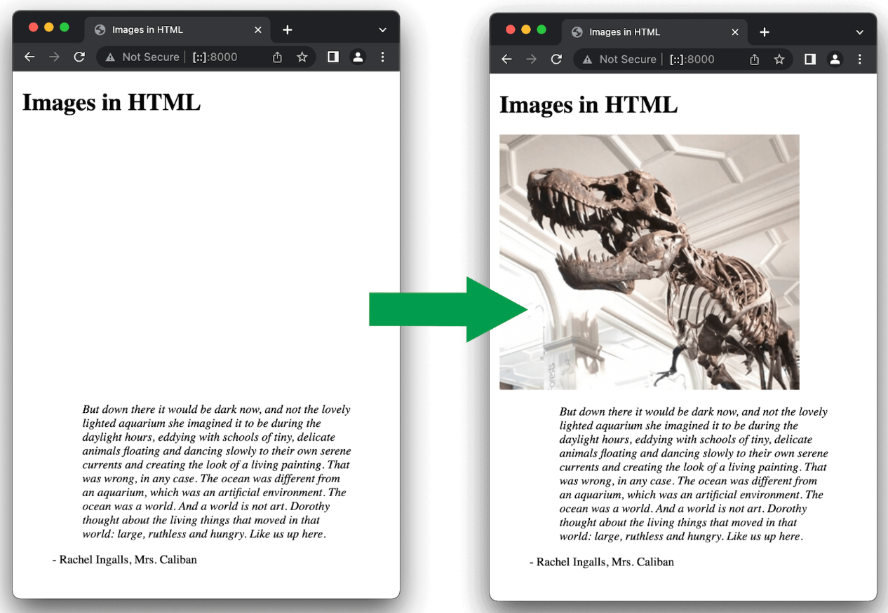

tags:: [[HTML]]
---

- ## Syntax
	- 这是一个 `void element/empty element` (没有子元素，没有结束标签)
	- ```html
	  
	  
	  ```
- ## Replaced elements
	- 像 `` 和 `<video>` 等元素，由于它的 **内容** 和 **大小** 由外部的资源决定 (即图片或视频文件) ，所以也被称为 [Replaced elements](https://developer.mozilla.org/en-US/docs/Web/CSS/Replaced_element) .
- ## Attribute - src
	- ### SEO
		- 为了SEO，文件名称要有 **可读性** 。比如 `dinosaur.jpg` 好于 `img835.jpg` 。
	- ### hotlinking
		- 未经授权不要使用别人网站的图片地址 (这被称为 **hotlinking** )。
			- 这样做会导致别人需要承担图片访问的流量;
			- 而且你也不能保证图片不会被删除或被替换。
	- ### path
		- 像如下这种 **绝对路径** 最好不要出现，因为：
			- 如果使用简单的部署，你需要将你的 **图片** 和 你的 **网站** 部署到同一台服务器。
			- 如果使用高级的部署，你需要使用 [CDN (Content Delivery Network)](https://developer.mozilla.org/en-US/docs/Glossary/CDN) 去分发你的 **图片** 。
		- ```html
		  
		  ```
- ## Attribute - alt
	- ### alt 使用
		- `alt` 属性用于 **图片无法展示** 或 **由于网速过慢导致渲染时间比较长** 时的文本展示。
		- ```html
		  
		  ```
		- 你可以通过错误拼写图片名称来查看效果。
	- ### alt 什么时候起作用
		- `screen reader` 能够听到这个内容；同时这个描述性的文字对其他用户也有用。
		  logseq.order-list-type:: number
		- 路径拼写错误。
		  logseq.order-list-type:: number
		- 浏览器不支持图片类型，比如 文本浏览器 [Lynx](https://en.wikipedia.org/wiki/Lynx_(web_browser)) 。
		  logseq.order-list-type:: number
		- 搜索引擎会匹配 alt 中的内容。
		  logseq.order-list-type:: number
		- 用户关掉了图片显示，以减少数据传输量或减少干扰，特别是手机用户或网络带宽限制或昂贵的地方。
		  logseq.order-list-type:: number
	- ### alt 应该写什么
		- alt 应该写什么，这取决于图片的用途：
		- **Decoration (装饰)** :
			- 如果图片只是装饰，应该使用 CSS background images (见下文) ，而不是用 HTML  , 这样的话, **screen reader** 就会去读它.
			- 如果图片不是内容的一部分, **screen reader** 没必要浪费时间去读它.
			- 如果非要使用 HTML  , 则 alt 应该是 `alt=""` (空字符串) .
		- **Content (内容)** :
			- 如果你的图片提供了重要内容，最好在 `alt` 中简短说明.
			- 更好的方式，是在正文中说明图片内容，这个时候可以设置 `alt=""` .
				- 否则，如果图片丢失，正文中将出现两份一样的内容.
		- **Link (链接)** :
			- 如果图片被嵌套在 <a> 中作为链接，则描述可以写在 `` 的 `alt` 属性，也可以写在 `<a>` 的 content 中.
		- **Text (文本)** :
			- 最好不要用图片来展示文本.
				- 比如你可能因为 header 需要一些特殊效果，就用图片来代替, 最好不要这么做，尽量使用 CSS.
			- 如果你不得不这么做，还是应该在 `alt` 中提供描述.
- ## Attribute - width and height
	- ``` html
	  
	  ```
	- `width` 和 `height` 不用写单位，默认单位是 pixel .
	- 使用 `width` 和 `height` 属性是最佳实践，因为：
		- 通常 HTML 文件会比图片小，所以通常页面显示出其他内容的时候，图片还没下载完成。
		- 而如果不使用 `width` 和 `height` 属性，页面是不会给图片预留空间的；
		- 但如果图片下载并渲染出来，就会使其周围的元素移动，这挺影响用户注意力的。
		- {:height 435, :width 572}
		- 但如果使用 `width` 和 `height` 属性，就会预留空间。
		- {:height 435, :width 572}
	- 同时, `width` 和 `height` 尽量使用图片的实际大小，否则可能导致图片变模糊、有颗粒感。
		- 所以，最好使用图片编辑工具实现处理好图片的大小，再使用。
		- 如果非要用代码改变图片的大小，请使用 CSS .
- ## Attribute - title
	- ``` html
	  
	  ```
	- `title` 的内容，在鼠标悬浮时显示，可以用作图片的标题 ( `alt` 用于描述图片内容)
	- 不建议使用这个属性，因为它有一些 accessibility 问题，因为：
		- screen reader 对这个属性的支持不可预测.
		  logseq.order-list-type:: number
		- 浏览器只在鼠标悬浮时，显示此属性内容 (那么键盘用户或者手机用户就看不了了)。
		  logseq.order-list-type:: number
	- 所以，如果是重要内容，最好写到正文中。
- ## License
	- ### License Types
		- 有如下几种 license 类型：
			- All rights reserved
			  logseq.order-list-type:: number
			- Permissive
			  logseq.order-list-type:: number
			- Public domain/CC0
			  logseq.order-list-type:: number
	- ### All rights reserved
		- 即 版权的持有者 拥有使用他们作品的专有权。
		- 如果要使用这种作品，需要满足以下条件之一：
			- 获得明确的书面许可。
			  logseq.order-list-type:: number
			- 支付费用。
			  logseq.order-list-type:: number
				- 可能是一次性付费，可以无限制地使用；
				- 也可能是按使用次数、时间、区域、行业、媒体类型付费。
			- 法律允许的合理使用 ( [fair use](https://fairuse.stanford.edu/overview/fair-use/what-is-fair-use/) or [fair dealing](https://copyrightservice.co.uk/copyright/p27_work_of_others) )
			  logseq.order-list-type:: number
		- 如果网上看到有作品没有声明版权，并不一定是没有版权，最安全的做法是，认为它 All rights reserved .
	- ### Permissive
		- 即 自由许可, 如 [MIT](https://mit-license.org/), [BSD](https://opensource.org/license/BSD-3-clause), or a suitable [Creative Commons (CC) license](https://chooser-beta.creativecommons.org/) 等 license.
		- 我们无需支付费用，只要满足 license 要求的条件即可.
	- ### Public domain/CC0
		- 公众领域的作品，我们可以在未经许可的情况下使用，无需满足任何条件。
			- 作品进入公众领域，原因可能是 版权到期 或者 版权持有人放弃权利等。
			- 将作品置于公众领域的一个方法是，将作品许可为 [CC0](https://creativecommons.org/share-your-work/public-domain/cc0/) .
		- 使用公众领域的作品时，记得保存能证明其属于公众领域的证据。
			- 比如 截图 .
			- 可以考虑在你的网站列出你使用的所有作品及其 license 要求.
	- ### Search for permissively-licensed images
		- 搜索自由许可图片时，可以加上类似如下的关键字：
			- "public domain images"
			- "public domain image library"
			- "open licensed images"
		- 使用 Google 搜索图片时，有选项可以限定 license
		- 一些 Image repository sites :
			- [[网站收藏/图片]]
- ## 使用 `<figure>` 给 `` 加 caption
	- 如果要给图片加 caption (标题) , 我们可以按如下方式编写:
		- ``` html
		  <div class="figure">
		    
		  
		    <p>A T-Rex on display in the Manchester University Museum.</p>
		  </div>
		  ```
	- 以上方式并不好, 因为图片和标题并没有产生语义上的关联, screen reader 并不能将二者关联起来。
	- 这时候, 可以使用 `<figure>` 和 `<figcaption>` :
		- ``` html
		  <figure>
		    
		  
		    <figcaption>
		      A T-Rex on display in the Manchester University Museum.
		    </figcaption>
		  </figure>
		  ```
		- `<figcaption>` 描述了 `<figure>` 中的内容.
		- `<figure>` 并非只用于描述一张图像, 它是一个独立的内容单元, 它可以是：
			- several images
			- a code snippet
			- audio
			- video
			- equations (方程)
			- a table
			- or something else
- ## CSS background images
	- ``` css
	  p {
	    background-image: url("images/dinosaur.jpg");
	  }
	  ```
	- 如果图片只用于装饰，则使用 CSS background images .
	- 如果图片有含义，则使用 HTML images .
- ## Other graphics on the web
	- 除了使用 `` 展示静态图片, 或使用 `background-image` 属性设置元素背景图片, 我们还可以:
		- 实时 (on-the-fly) 构建图像
		  logseq.order-list-type:: number
		- 事后 (after the fact) 操作图像
		  logseq.order-list-type:: number
	- 浏览器支持:
		- 使用代码创建 2D 和 3D 图像；
		  logseq.order-list-type:: number
		- 通过文件展示视频；
		  logseq.order-list-type:: number
		- 通过用户相机展示实时流媒体 (live streamed) .
		  logseq.order-list-type:: number
	- 可参考如下内容:
		- [[Canvas]]
		- [[SVG]]
		- [[WebGL]]
		- [[HTML/Video and Audio]]
		- [[WebRTC]]
		-
- ---
- ## 参考
	- MDN Guide: [Images in HTML](https://developer.mozilla.org/en-US/docs/Learn/HTML/Multimedia_and_embedding/Images_in_HTML)
	  logseq.order-list-type:: number