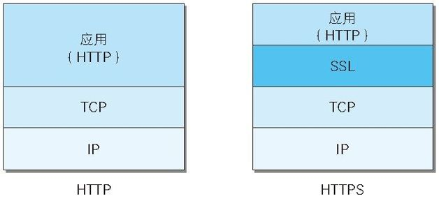

tags:: [[Computer Network]], [[Protocol]], [[Cryptography]]
---

- ## HTTP 的隐患
	- 通信使用明文可能会被窃听。
	  logseq.order-list-type:: number
	- 不验证通信方的身份就可能遭遇伪装。
	  logseq.order-list-type:: number
		- 客户端可以伪造，服务器端也可以伪造。
		  logseq.order-list-type:: number
		- 无法确定对方是否有访问权限。
		  logseq.order-list-type:: number
		- 即使是无意义的请求也会照单全收。无法阻止海量请求下的 DoS 攻击（Denial of Service，拒绝服务攻击）。
		  logseq.order-list-type:: number
	- 无法证明报文完整性，可能已遭篡改。
	  logseq.order-list-type:: number
- ## 如何对 HTTP 进行加密
	- ### 加密通信内容
		- 即 加密整个报文。
		- 通过和 SSL（Secure Socket Layer，安全套接层）或 TLS（Transport Layer Security，安全传输层协议）的组合使用，可以加密 HTTP 的通信内容。
		- 与 SSL 组合使用的 HTTP 被称为 HTTPS（HTTP Secure，超文本传输安全协议）或 HTTP over SSL 。
	- ### 加密传输的内容
		- 即 加密报文主体，而不加密报文首部。
- ## HTTPS = HTTP + 加密 + 认证 + 完整性保护
	- ### SSL（加密）
		- > HTTPS 并非是应用层的一种新协议。只是 HTTP 通信接口部分用 SSL（Secure Socket Layer）和 TLS（Transport Layer Security）协议代替而已。
		- 通常，HTTP 直接和 TCP 通信。
		- 当使用 SSL 时，则演变成先和 SSL 通信，再由 SSL 和 TCP 通信了。
		- 在采用 SSL 后，HTTP 就拥有了 HTTPS 的加密、证书和完整性保护这些功能。
		- 
		- SSL 是独立于 HTTP 的协议，所以不光是 HTTP 协议，其他运行在 **应用层** 的 `SMTP` 和 `Telnet` 等协议均可配合 SSL 协议使用。
		- 可以说 SSL 是当今世界上应用 **最为广泛** 的 **网络安全技术** 。
		- 由于 **非对称加密** 比较耗时，所以 SSL 采用混合加密机制，即 传输信息时，使用 **对称加密** ；而传输对称加密的秘钥（用于 解析 对称加密后的信息）时，则使用 [[非对称加密]] 。
		- HTTPS 使用 SSL（Secure Socket Layer） 和 TLS（Transport Layer Security）这两个协议。
		- 由于 SSL1.0 协议在设计之初被发现出了问题，就没有实际投入使用。SSL2.0 也被发现存在问题，所以很多浏览器直接废除了该协议版本。
		- IETF 以 SSL3.0 为基准，后又制定了 TLS1.0、TLS1.1 和 TLS1.2。
		- TSL 是以 SSL 为原型开发的协议，有时会统一称该协议为 SSL。
		- 当前主流的版本是 SSL3.0 和 TLS1.2。
	- ### 数字证书（认证）
		- > 看上去上述加密方式好像很完美，但是还有个小问题：就是当我们要给服务器发送加密信息时，我们要把对称加密的秘钥给服务器。此时我们必须用服务器的公钥加密我们对称加密的秘钥，再发送给服务器。所以，我们需要事先得到服务器的公钥；但是，我们无法判断收到的 **公钥** 是否被篡改过。
		- 为了解决上述问题，可以使用由 **数字证书认证机构** （CA，Certificate Authority）和 **其相关机构** 颁发的 **公钥证书** 。
		- 数字证书认证机构处于客户端与服务器双方都可信赖的第三方机构的立场上（比如威瑞信（VeriSign）就是其中一家非常有名的数字证书认证机构）。
		- 数字证书认证机构的 **业务流程** ：
			- 首先， **服务器的运营人员** 向数字证书认证机构 **提出公钥证书申请** 。
			  logseq.order-list-type:: number
			- 数字证书认证机构在 **判明提出申请者的身份** 之后，会对 **服务器** 的 **公钥明文** 做 [[Digital Signature]] ，然后将 [[Digital Signature]] 与 **公钥明文** **绑定** 在一起，形成 **公钥证书** （也叫 [[Digital Certificate]] (数字证书) ，或直接称为 **证书** ）。
			  logseq.order-list-type:: number
			- **服务器** 会将这份由 **数字证书认证机构** 颁发的 **公钥证书** 发送给 **客户端** 。
			  logseq.order-list-type:: number
			- 接收到证书的 **客户端** 可以使用 **数字证书认证机构** 的 **公钥** ，对那张证书上的 **数字签名** 进行 **验证** （查看 [[Digital Signature]] 了解具体如何验证，里面讲的报文即为这里的 **服务器的公钥明文** ）。
			  logseq.order-list-type:: number
			- 此处认证机构的 **公钥** 必须安全地转交给客户端。使用通信方式时，如何安全转交是一件很困难的事，因此，多数浏览器厂商发布版本时，会事先在内部植入常用认证机构的 **公钥** 。
				- 由于我们信赖浏览器厂商不会作恶（ **但是我们如何确定我们下载的浏览器不是被篡改的？比如，黑客用自己的公钥代替了浏览器中预存的认证机构的公钥，并用自己的私钥给我们发布了假的证书，同时证书中的公钥又是自己的另一个公钥，那么当他截获到我们的信息时，他就可以用对应的私钥解密了** ），所以我们可以认定认证机构的 **公钥** 绝对无误；如果我们用该 **公钥** 对 **证书** 进行验证，结果无误，那我们可以认定该证书使用的 **私钥** 确实是 **该认证机构** 的；由于只有 **认证机构** 自己知道自己的 **私钥** （理想情况下），所以我们认定该证书的内容确实是该认证机构发布的（即不是第三方黑客发布的，黑客不知道私钥无法正确加密数字摘要）；而我们又绝对信赖认证机构，相信她不会篡改 **服务器真实的公钥** ，所以我们信任该证书中的 **服务器公钥** 。
			- 所以，一旦验证通过， **客户端** 便可明确两件事：
				- 认证服务器的 **公钥** 的，是真实有效的 **数字证书认证机构** 。
				  logseq.order-list-type:: number
				- 由于 **数字证书认证机构** 可以信赖，所以她认证的 **服务器公钥** 是值得信赖的。
				  logseq.order-list-type:: number
			- > 还有一个问题：服务器如何安全地获取客户端的公钥？如果黑客用自己的公钥伪装成客户端的公钥发送给服务器，那么服务器会用黑客的公钥加密 **秘钥（对称加密）** ，并将加密后的秘钥和加密后的报文（使用秘钥加密的）一起发送给客户端；如果黑客截取到这些信息，那么黑客可以先用自己的私钥解密秘钥，然后用解密后的秘钥解密报文。
	- ### MAC（完整性保护）
		- 应用层发送数据时会附加一种叫做 MAC（Message Authentication Code）的报文摘要。MAC 能够查知报文是否遭到篡改，从而保护报文的完整性。
- ---
- ## 参考
	- [《图解HTTP》 上野宣 著（于均良 译）](https://weread.qq.com/web/reader/3da32b505dd9f43da9a1acakec532f2027fec5decca5182?)
	  logseq.order-list-type:: number
-