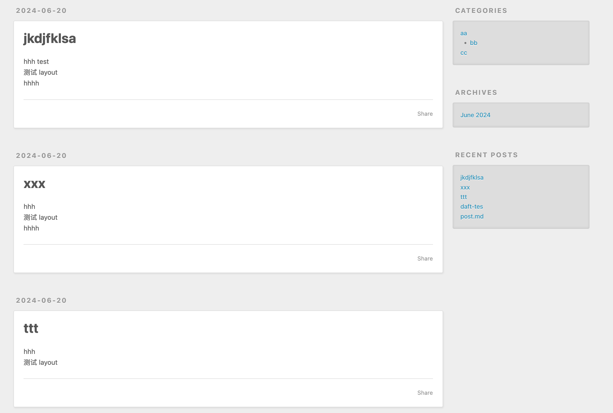
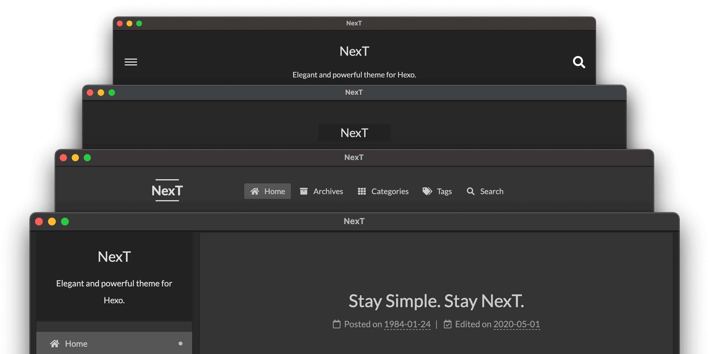
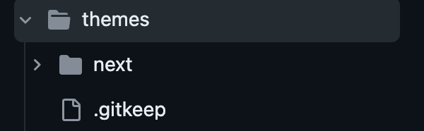
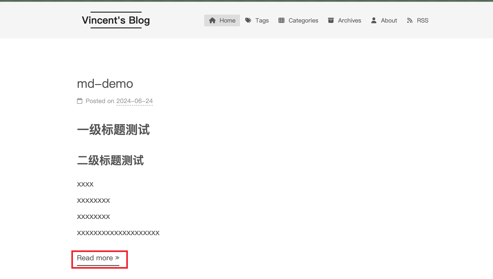

tags:: [[Hexo]]
---

- ## 为什么使用 Hexo
	- Hexo 可以将 Markdown 文件解析成静态网页;
	- 并且可以使用插件, 方便地将产生的静态网页一键部署到常用平台 (如 Github 、Vercel、私有服务器(使用 SFTP) 等) .
- ## 安装与初始化
	- 安装 Git 与 Node.js .
	  logseq.order-list-type:: number
	- 执行如下命名初始化一个 Hexo 项目 .
	  logseq.order-list-type:: number
		- ``` sh
		  # 全局安装 hexo-cli
		  npm install hexo-cli -g
		  # 初始化一个新的 Hexo 项目
		  hexo init 存放Hexo项目的目录
		  cd 存放Hexo项目的目录
		  npm install
		  # 启动 Hexo 服务
		  hexo server
		  ```
	- 访问 `http://localhost:4000` 即可访问我们初始化的 Hexo 网站 .
	  logseq.order-list-type:: number
- ## 目录结构
	- 初始化后，目录结构如下:
		- ``` sh
		  .
		  ├── _config.landscape.yml
		  ├── _config.yml
		  ├── node_modules
		  │   ├── @adobe
		  │   ├── @tootallnate
		  │   ├── ...
		  │   ...
		  ├── package-lock.json
		  ├── package.json
		  ├── scaffolds
		  │   ├── draft.md
		  │   ├── page.md
		  │   └── post.md
		  ├── source
		  │   └── _posts
		  └── themes
		  ```
	- `node_modules` 、 `package-lock.json` 和 `package.json` 是依赖相关文件。
	- `_config.landscape.yml` 和 `_config.yml` 是配置相关文件。
	- `scaffolds/` 目录保存文章的模板。
	- `source/` 目录保存文章内容 , 我们网站要展示的内容都来自这个目录 .
	- `themes/` 目录保存 Hexo 主题相关文件。
- ## source 与 public
	- 根目录执行 `hexo generate` 时，会解析 `source/` 目录下的内容，生成静态网页，规则如下：
		- 名称以 `_` 开头的文件 / 目录 (除了 `_posts` 目录) 和 隐藏文件 将会被忽略 ;
		  logseq.order-list-type:: number
		- Markdown 和 HTML 等可以被渲染的文件, 会被解析并放到 `public/` 目录下 ;
		  logseq.order-list-type:: number
		- 其他文件会被直接拷贝过去 .
		  logseq.order-list-type:: number
	- 静态网站所有的内容都在 `public/` 目录下，所以移动这个目录下的所有内容去部署即可。
- ## Article 、Layout 、Scaffold 与 source 的关系
	- `Layout` 在官方中文文档中被翻译为 [布局](https://hexo.io/zh-cn/docs/writing.html#%E5%B8%83%E5%B1%80%EF%BC%88Layout%EF%BC%89) .
	- `Scaffold` 在官方中文文档中被翻译为 [模板](https://hexo.io/zh-cn/docs/writing.html#%E6%A8%A1%E7%89%88%EF%BC%88Scaffold%EF%BC%89) .
	- (私以为 `Layout` 和 `Scaffold` 其实表示的都是 **模板** , 只是前者表示 **模板名称** , 后者表示 **模板文件** )
	- 几个重要概念的关系:
		- Hexo 网站的内容是由若干篇 `Article` 组成的 .
		- 每篇 `Article` 都对应着一种 `Layout` , 使用 `hexo new [layout] <title>` 命令创建 `Article` 时需要指定 `Layout` .
		- 每种 `Layout` 都对应着一个位于 `scaffolds/` 目录下的同名模板文件 , 使用 `hexo new [layout] <title>` 命令创建 `Article` 时 , 会基于模板文件进行创建 .
		- 使用 `hexo new [layout] <title>` 命令创建的 `Article` , 会保存在 `source/` 目录下的指定子目录中 .
- ## 创建文章
	- 参考: [Hexo Docs - Command - new ](https://hexo.io/docs/commands#new)
	- ### Layout 的种类
		- 默认 `Layout` : `draft`、 `post` 、 `page`
		  logseq.order-list-type:: number
		- 自定义 `Layout`
		  logseq.order-list-type:: number
		- `draft` : 即 文章的草稿 (如果不做特殊操作, 不会在最终的网站中显示) .
		- `post` : 即 帖文 , 会以 *文章流* 的形式展现 .
			- 如下:
			- {:height 279, :width 413}
		- `page` :  即 页面 , 和 `post` 的区别是, `page` 不会出现在 *文章流* 中, 需要通过 url 单独访问 .
		- 自定义 `Layout` : 与 `post` 一致, 只不过是创建 `Article` 采用的模板不同 .
	- ### post 文章
		- 执行 `hexo new [post] <title>` 命令 , 将会基于 `scaffolds/draft.md` 模板 , 生成 `source/_posts/{指定的 title}.md` 文件 .
		- ( `post` 是默认 **Layout** , 所以可以省略; `_config.yml` 文件中可以修改这个默认值 . )
	- ### draft 文章
		- 执行 `hexo new draft <title>` 命令 , 将会基于 `scaffolds/draft.md` 模板 , 生成 `source/_drafts/{指定的 title}.md` 文件 .
		- draft 文章 在默认情况下不会被展示，除非有以下几种情况：
			- 执行 `hexo publish <title>` ，此命令会将 draft 文章从 `source/_drafts/` 挪到 ``source/_posts/` .
			  logseq.order-list-type:: number
			- 执行 `hexo server --draft` (启动服务时展示 draft) 或者 `hexo generate --draft` (生成静态网站时展示 draft) .
			  logseq.order-list-type:: number
			- 修改 `_config.yml` 文件中的 `render_drafts` 配置 .
			  logseq.order-list-type:: number
	- ### page 文章
		- 执行 `hexo new page <title>` 命令 , 将会基于 `scaffolds/page.md` 模板 , 将会生成 `source/{指定的 title}/index.md` 文件 .
	- ### 自定义文章
		- 执行 `hexo new {自定义Layout} <title>` 命令 , 将会基于 `scaffolds/{自定义Layout}.md` 模板 , 生成 `source/_posts/{指定的 title}.md` 文件 .
		- (这里 `自定义文章` 只是使用了自定义的模板，其本质和 `post 文章` 一致，所以也生成在 `source/_posts/` 目录下)
- ## 写文章最佳实践
	- 本地电脑执行 `git pull` 拉取最新的博客内容 , 执行 `npm install` .
	  logseq.order-list-type:: number
	- 执行 `hexo server` , 将项目运行起来 (接下来的编辑博客时, 刷新页面即可以实时看到效果) .
	  logseq.order-list-type:: number
	- 执行 `hexo new draft <title>` 命令 , 生成草稿文章 .
	  logseq.order-list-type:: number
	- 编写文章，如果编写完成就执行 `hexo publish <title>` 将草稿文章发布为 `post` ，如果未编写完成，则不发布 .
	  logseq.order-list-type:: number
	- 提交编辑后的内容到代码仓库 .
	  logseq.order-list-type:: number
	- 执行 `hexo clean && hexo deploy` 将生成的静态网站推送到发布用的远程仓库 .
	  logseq.order-list-type:: number
	- 服务器拉取发布用的远程仓库的最新内容，对这个内容进行部署 .
	  logseq.order-list-type:: number
- ## 主题
	- 下面以 [hexo-theme-next](https://github.com/next-theme/hexo-theme-next) 为例介绍主题的使用：
	- {:height 219, :width 689}
	- ### 安装主题
		- 两种方案：
			- 执行 `npm install hexo-theme-next` 安装主题插件 (主题是一种插件) .
			  logseq.order-list-type:: number
			- 在  `themes/`  目录下创建主题子目录，将主题所需要的文件复制 (比如 git clone) 到该子目录下 (如果在 npm 仓库中不存在对应主题，可以采用此方式).
			  logseq.order-list-type:: number
				- {:height 95, :width 460}
			- (不建议采用 git clone 的方式，将主题项目复制到 `themes/` 目录的子目录；虽然可以用 git 对主题进行升级，但是感觉不太优雅)
	- ### 启用主题
		- `_config.yml` 文件中修改主题配置 (主题名称为主题的 npm 模块名 `hexo-theme-*` 去掉前缀 `hexo-theme-` ，或者 `themes/` 目录的子目录名称)
			- ``` yml
			  theme: next
			  ```
	- ### 主题配置文件
		- 两种方式：
			- 在根目录创建 `_config.{主题名}.yml` 文件，复制所有默认配置到此文件中，进行自定义配置 ( ==推荐采用这种方式，优雅== ).
			  logseq.order-list-type:: number
			- 在 `_config.yml` 文件中配置，配置前缀为 `theme_config` .
			  logseq.order-list-type:: number
				- ``` yml
				  theme_config:
				    xxxx: 
				  ```
			- (不建议直接使用主题项目根目录下的 `_config.yml` 文件，这个在升级主题时会被新的文件覆盖)
		- 参考: [NexT Docs - Configuration](https://theme-next.js.org/docs/getting-started/configuration.html)
- ## NexT 主题使用
	- 参考: [NexT Docs - Theme Settings](https://theme-next.js.org/docs/theme-settings/)
	- ### 字数统计
		- 执行如下命令。
		  logseq.order-list-type:: number
			- ``` sh
			  npm install hexo-word-counter
			  hexo clean
			  ```
		- 在 Hexo 的 `_config.yml` 文件中加入如下配置。
		  logseq.order-list-type:: number
			- ``` yml
			  # 非默认值 
			  # 参考: https://github.com/next-theme/hexo-word-counter
			  symbols_count_time:
			    # 文章的字数
			    symbols: true
			    # 文章的阅读时长
			    time: true
			    # footer 显示总字数
			    total_symbols: false
			    # footer 显示总阅读时长
			    total_time: false
			    exclude_codeblock: false
			    awl: 4
			    wpm: 275
			    suffix: "mins."
			  ```
		- 在 `_config.next.yml` 中作如下配置。
		  logseq.order-list-type:: number
			- ``` yml
			  post_meta:
			    # 非默认值
			    # 去掉 文章 meta 属性的文字描述，只保留图标和属性的值
			    item_text: false
			  
			  symbols_count_time:
			    # 非默认值
			    # 让字数统计的 mata 属性，和其他属性保持在同一行
			    separated_meta: false
			    item_text_total: false
			  ```
	- ### 文章更新时间
		- 参考: [NexT Docs - Post Meta Display](https://theme-next.js.org/docs/theme-settings/posts#Post-Meta-Display)
	- ### 将 Archives 设置为主页
		- 参考: [NexT Docs - Use Archive Page as Home Page](https://theme-next.js.org/docs/theme-settings/custom-pages#Use-Archive-Page-as-Home-Page)
	- ### 新增 Tags、Categories、404 页面
		- 参考: [NexT Docs - Custom Pages](https://theme-next.js.org/docs/theme-settings/custom-pages)
	- ### 阅读进度功能
		- 参考: [NexT Docs - Reading Progress](https://theme-next.js.org/docs/theme-settings/miscellaneous#Reading-Progress)
	- ### 本地搜索功能
		- 参考: [NexT Docs -Local Search](https://theme-next.js.org/docs/third-party-services/search-services#Local-Search)
		- 需要执行 `npm install hexo-generator-searchdb` 安装插件。
	- ### 取消页面动画
		- 在 `_config.next.yml` 中将 `motion.enable` 设置为 `false` 。
	- ### read more
		- 参考: [NexT Docs - Preamble Text](https://theme-next.js.org/docs/theme-settings/posts#Preamble-Text)
		- 使用 `<!-- more -->` 可以让首页的文章只显示部分内容，并新增一个 `Read more` 链接。
		- {:height 286, :width 503}
	- ### 去除 Keep on posting
		- 参考: [NexT Docs - Hide "Keep on posting" in Archive Page](https://theme-next.js.org/docs/advanced-settings/custom-files#Hide-Keep-on-posting-in-Archive-Page)
- ## RSS
	- 参考: [hexo-generator-feed](https://github.com/hexojs/hexo-generator-feed)
	- 需要执行 `npm install hexo-generator-feed` 安装插件。
- ## 插入图片
	- 参见: [[Hexo 文章如何插入图片]]
- ## 备份配置文件
	- 整个 Hexo 项目的搭建，两个文件极其重要，最好有备份：
		- `_config.yml` Hexo 配置文件。
		  logseq.order-list-type:: number
		- `_config.{主题名称}.yml` 主题配置文件。
		  logseq.order-list-type:: number
	- (两个配置文件中，搜索 `非默认值` 可知都改了哪些配置。)
- ---
- ## 参考
	- [Hexo Docs](https://hexo.io/docs/)
	  logseq.order-list-type:: number
-
- ## TODOs
	- SEO
	  logseq.order-list-type:: number