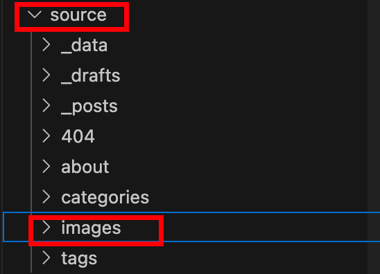
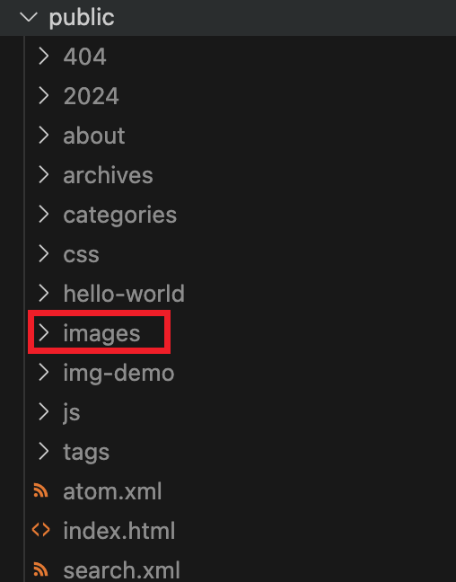
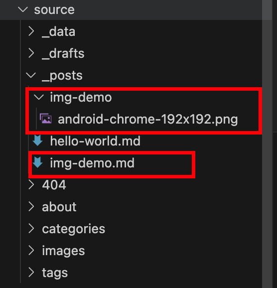
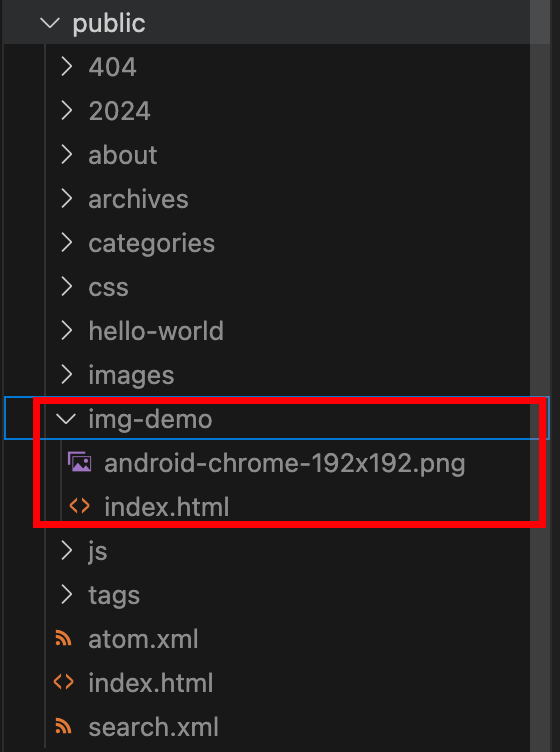
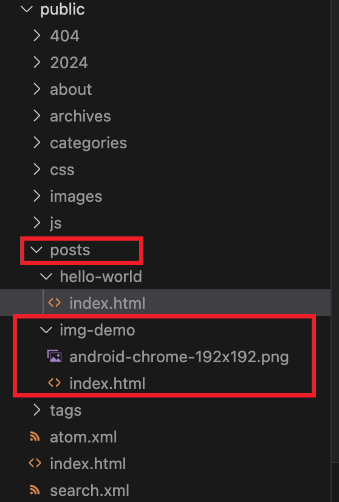

tags:: [[Hexo]]
---

- ## 原理
	- ### 需要知道的
		- 最终静态网页的所有内容，都会被生成在 `public` 目录下；
		- Markdown 中的图片引用，最终都要被解析成对 `public` 目录下指定图片的引用。
	- ### 我们的目标
		- 编辑 Markdown 时，图片可以正常显示 (即 使用 Markdown 语法，根据图片相对 Markdown 文件的相对位置引用图片)。
		  logseq.order-list-type:: number
			- 我们希望，最好在 Markdown 文件的同级目录，有同名目录存放所需图片，并使用文件系统相对位置进行引用。
			- 而且 Typora 支持为每一个文件创建同名文件夹存放图片，粘贴图片时自动将图片存放到同名目录。
			- (这样的话，如果要移动单个 Markdown 文件，只需移动 Markdown 文件及其同名目录即可，不需要费力去找它的图片)
		- 解析成静态网页后，图片可以正常显示 (即 解析时，对图片位置进行移动、对 Markdown 语法中图片位置字符串进行相应的变换处理，使得静态网页可以引用到相应位置的图片)。
		  logseq.order-list-type:: number
	- ### 相关配置
		- 不使用第三方插件，影响图片引用的 **配置** 有以下几个：
		- ``` yml
		  # 生成 post 文章链接的规则 (会影响 public 目录下文章页面的位置)
		  permalink: :year/:month/:day/:title/
		  
		  # 是否开启 post 资源文件夹
		  # 开启后，执行 `hexo new [layout] <title>` 会创建同名资源目录；
		  # 同时，生成静态文件时，会将 post 资源文件夹的内容解析到 public 目录中 (值为 false 则不会)
		  post_asset_folder: true
		  
		  # Hexo 内置插件: https://github.com/hexojs/hexo-renderer-marked
		  # 如下两个选项开启后，可以将 foo.md 中的  解析为 ，就是 foo.md 同名目录下的图片
		  # 但是这样在编辑 markdown 时无法预览图片，因为路径不对
		  # (此配置达到的效果与需求不符，下面不做讨论)
		  marked:
		    # 表示是否在图片前加前缀
		    # 配合 root 配置使用，一般 root 不进行配置，默认为 / 
		    # 如果自己定义 root 配置，可能会导致路径异常，各种静态文件无法访问
		    prependRoot: true
		    # 表示是否开启  解析为  的功能
		    postAsset: true
		    
		  # url 如果加上路径，如 https://example.com/blog，这也和 root 配置一样，可能会导致各种静态文件无法访问
		  # 所以不要轻易改动 (下面也不会讨论这个配置)
		  # https://example.com/blog/${root} 是最终所有资源访问的前缀
		  url: https://example.com
		  # 配置此配置对网页有影响，但是 Hexo 默认配置文件中似乎没有此配置
		  root: posts/
		  ```
- ## 方案一：使用 source 目录中的图片
	- 参见: [Asset Folders](https://hexo.io/docs/asset-folders.html)
	- ==(此方案是 Hexo 默认行为，无需做任何配置)==
	- 此时 (下面的 images 目录名称只是示例，可以用其他名称)：
		- `source/images/` 会被解析为 `public/images/` .
		  logseq.order-list-type:: number
			- {:height 162, :width 212}
			- {:height 401, :width 170}
		- Markdown 文章中使用的 `` 会被解析为 `` .
		  logseq.order-list-type:: number
	- 图片在静态网页正常显示，但是在 Markdown 文件中不能显示。
	- ==不推荐此方案，因为无法在 Markdown 文件中预览图片，而且无法自动为每一篇文章设置单独的图片文件夹 (需要手动创建)==
	- ==在 page 中可以使用此方案，而在 post 中不使用；因为毕竟 page 是特殊内容，不需要太考虑迁移的事情；而 post 是通用内容，需要考虑迁移==
- ## 方案二：permalink = :title/
	- 在 `_config.yml` 做如下配置:
		- ``` yml
		  permalink: :title/
		  
		  post_asset_folder: true
		  
		  # marked:
		    # prependRoot: true
		    # postAsset: true
		    
		  url: https://example.com
		  # root: posts/
		  ```
	- 此时：
		- `source/_posts/img-demo.md` 被解析为 `public/img-demo/index.html` .
		  logseq.order-list-type:: number
		- `source/_posts/img-demo/android-chrome-192x192.png` 被解析为 `public/img-demo/android-chrome-192x192.png` .
		  logseq.order-list-type:: number
		- `` 被解析为  ``.
		  logseq.order-list-type:: number
		- 图片正常！！！
		- {:height 185, :width 190}
		- {:height 352, :width 191}
	- ==注意：只有 `post_asset_folder: true` ，Hexo 才会保留同名资源目录中的图片。==
	- ==此方案可用，但是文章的路径将是 `https://example.com/img-demo` ，而我希望可以在所有文章前加个前缀，如 `https://example.com/posts/img-demo`==
- ## 方案三：permalink = posts/:title/ (无效)
	- 在 `_config.yml` 做如下配置:
		- ``` yml
		  permalink: posts/:title/
		  
		  post_asset_folder: true
		  
		  # marked:
		    # prependRoot: true
		    # postAsset: true
		    
		  url: https://example.com
		  # root: posts/
		  ```
	- 此时：
		- `source/_posts/img-demo.md` 被解析为 `public/posts/img-demo/index.html` .
		  logseq.order-list-type:: number
		- `source/_posts/img-demo/android-chrome-192x192.png` 被解析为 `public/posts/img-demo/android-chrome-192x192.png` .
		  logseq.order-list-type:: number
		- `` 被解析为  ``.
		  logseq.order-list-type:: number
		- 图片无法正常显示，因为解析后的图片路径缺少 `/posts/` 前缀。
		- {:height 185, :width 190}
		- {:height 225, :width 186}
	- ==注意：只有 `post_asset_folder: true` ，Hexo 才会保留同名资源目录中的图片。==
	- ==此方案无效，需要借助插件，为 Markdown 语法的图片路径加上前缀==
- ## 方案四：(permalink = posts/:title/) + hexo-relative-link (无效)
	- 参见: [hexo-relative-link](https://github.com/2-3-5-7/hexo-relative-link)
	- 在 `_config.yml` 做如下配置:
	  logseq.order-list-type:: number
		- ``` yml
		  permalink: posts/:title/
		  
		  post_asset_folder: true
		  
		  # marked:
		    # prependRoot: true
		    # postAsset: true
		    
		  url: https://example.com
		  # root: posts/
		  ```
	- 执行 `npm install hexo-relative-link --save` 以安装 hexo-relative-link 。(记得先卸载可能会有冲突的插件，比如 `hexo-asset-image` )
	  logseq.order-list-type:: number
	- 此时：
		- `source/_posts/img-demo.md` 被解析为 `public/posts/img-demo/index.html` .
		  logseq.order-list-type:: number
		- `source/_posts/img-demo/android-chrome-192x192.png` 被解析为 `public/posts/img-demo/android-chrome-192x192.png` .
		  logseq.order-list-type:: number
		- `` 被解析为  `` ，==图片显示正常== .
		  logseq.order-list-type:: number
		- `` 被解析为  `` ，图片无法显示.
		  logseq.order-list-type:: number
		- About 页面的 `` 被解析为 `` ，图片无法显示 .
		  logseq.order-list-type:: number
		- ==其实就是给每个 图片路径加上了 `path/postname` 前缀。==
		- {:height 185, :width 190}
		- {:height 225, :width 186}
		- ==不采用此方案，一个是它导致 about 页面图片异常，一个是这种方式感觉怪怪的==
- ## 方案五：(permalink = posts/:title/) + hexo-asset-image (无效)
	- 参见: [hexo-asset-image (已归档)](https://github.com/xcodebuild/hexo-asset-image)
	- 在 `_config.yml` 做如下配置:
	  logseq.order-list-type:: number
		- ``` yml
		  permalink: posts/:title/
		  
		  post_asset_folder: true
		  
		  # marked:
		    # prependRoot: true
		    # postAsset: true
		    
		  url: https://example.com
		  # root: posts/
		  ```
	- 执行 `npm install hexo-asset-image --save` 以安装 hexo-asset-image 。(记得先卸载可能会有冲突的插件，比如 `hexo-relative-link` )
	  logseq.order-list-type:: number
	- 此时：
		- `source/_posts/img-demo.md` 被解析为 `public/posts/img-demo/index.html` .
		  logseq.order-list-type:: number
		- `source/_posts/img-demo/android-chrome-192x192.png` 被解析为 `public/posts/img-demo/android-chrome-192x192.png` .
		  logseq.order-list-type:: number
		- `` 被解析为古怪的  ``.
		  logseq.order-list-type:: number
		- `` 被解析为古怪的  ``.
		  logseq.order-list-type:: number
		- 图片无法正常显示，因为路径解析出现异常。
		- {:height 185, :width 190}
		- {:height 225, :width 186}
- ## 方案六：(permalink = posts/:title/) + 改进后的 hexo-asset-image
	- 参见: [hexo-asset-image (已归档)](https://github.com/xcodebuild/hexo-asset-image)
	- 在 `_config.yml` 做如下配置:
	  logseq.order-list-type:: number
		- ``` yml
		  permalink: posts/:title/
		  
		  post_asset_folder: true
		  
		  # marked:
		    # prependRoot: true
		    # postAsset: true
		    
		  url: https://example.com
		  # root: posts/
		  ```
	- 执行 `npm install hexo-asset-image --save` 以安装 hexo-asset-image 。(记得先卸载可能会有冲突的插件，比如 `hexo-relative-link` )
	  logseq.order-list-type:: number
	- 修改 `node_modules/hexo-asset-image/index.js` 将第 24 行的 `var endPos = link.lastIndexOf('.');` 改为 `var endPos = link.length-1;` ，修改后完整内容如下：
	  logseq.order-list-type:: number
		- ``` js
		  'use strict';
		  var cheerio = require('cheerio');
		  
		  // http://stackoverflow.com/questions/14480345/how-to-get-the-nth-occurrence-in-a-string
		  function getPosition(str, m, i) {
		    return str.split(m, i).join(m).length;
		  }
		  
		  hexo.extend.filter.register('after_post_render', function(data){
		    var config = hexo.config;
		    if(config.post_asset_folder){
		      var link = data.permalink;
		      var beginPos = getPosition(link, '/', 3) + 1;
		      var appendLink = '';
		      // In hexo 3.1.1, the permalink of "about" page is like ".../about/index.html".
		      // if not with index.html endpos = link.lastIndexOf('.') + 1 support hexo-abbrlink
		      if(/.*\/index\.html$/.test(link)) {
		        // when permalink is end with index.html, for example 2019/02/20/xxtitle/index.html
		        // image in xxtitle/ will go to xxtitle/index/
		        appendLink = 'index/';
		        var endPos = link.lastIndexOf('/');
		      }
		      else {
		        var endPos = link.length-1;
		      }
		      link = link.substring(beginPos, endPos) + '/' + appendLink;
		  
		      var toprocess = ['excerpt', 'more', 'content'];
		      for(var i = 0; i < toprocess.length; i++){
		        var key = toprocess[i];
		  
		        var $ = cheerio.load(data[key], {
		          ignoreWhitespace: false,
		          xmlMode: false,
		          lowerCaseTags: false,
		          decodeEntities: false
		        });
		  
		        $('img').each(function(){
		          if ($(this).attr('src')){
		            // For windows style path, we replace '\' to '/'.
		            var src = $(this).attr('src').replace('\\', '/');
		            if(!(/http[s]*.*|\/\/.*/.test(src)
		              || /^\s+\//.test(src)
		              || /^\s*\/uploads|images\//.test(src))) {
		              // For "about" page, the first part of "src" can't be removed.
		              // In addition, to support multi-level local directory.
		              var linkArray = link.split('/').filter(function(elem){
		                return elem != '';
		              });
		              var srcArray = src.split('/').filter(function(elem){
		                return elem != '' && elem != '.';
		              });
		              if(srcArray.length > 1)
		              srcArray.shift();
		              src = srcArray.join('/');
		  
		              $(this).attr('src', config.root + link + src);
		              console.info&&console.info("update link as:-->"+config.root + link + src);
		            }
		          }else{
		            console.info&&console.info("no src attr, skipped...");
		            console.info&&console.info($(this));
		          }
		        });
		        data[key] = $.html();
		      }
		    }
		  });
		  ```
	- 此时：
		- `source/_posts/img-demo.md` 被解析为 `public/posts/img-demo/index.html` .
		  logseq.order-list-type:: number
		- `source/_posts/img-demo/android-chrome-192x192.png` 被解析为 `public/posts/img-demo/android-chrome-192x192.png` .
		  logseq.order-list-type:: number
		- `` 被解析为  ``.
		  logseq.order-list-type:: number
		- `` 被解析为  ``.
		  logseq.order-list-type:: number
		- About 页面的 `` 被解析为 `` .
		  logseq.order-list-type:: number
		- 图片都正常显示！！！
		- {:height 185, :width 190}
		- {:height 225, :width 186}
		- ==此方案有效，但不优雅，需要手动修改依赖中的代码。==
- ## 方案七：(permalink = posts/:title/) + hexo-asset-img (最佳实践)
	- 参见: [hexo-asset-img](https://github.com/yiyungent/hexo-asset-img)
	- 在 `_config.yml` 做如下配置:
	  logseq.order-list-type:: number
		- ``` yml
		  permalink: posts/:title/
		  
		  post_asset_folder: true
		  
		  # marked:
		    # prependRoot: true
		    # postAsset: true
		    
		  url: https://example.com
		  # root: posts/
		  ```
	- 执行 `npm install hexo-asset-img --save` 以安装 hexo-asset-img 。(记得先卸载可能会有冲突的插件，比如 `hexo-asset-image` )
	  logseq.order-list-type:: number
	- 此时：
		- `source/_posts/img-demo.md` 被解析为 `public/posts/img-demo/index.html` .
		  logseq.order-list-type:: number
		- `source/_posts/img-demo/android-chrome-192x192.png` 被解析为 `public/posts/img-demo/android-chrome-192x192.png` .
		  logseq.order-list-type:: number
		- `` 被解析为  `` ，图片正常显示。
		  logseq.order-list-type:: number
		- `` 被解析为  ``, 图片无法显示 (符合预期)。
		  logseq.order-list-type:: number
		- About 页面的 `` 被解析为 `` ，图片正常显示。
		  logseq.order-list-type:: number
		- {:height 185, :width 190}
		- {:height 225, :width 186}
		- ==此方案有效，为最佳实践==
-