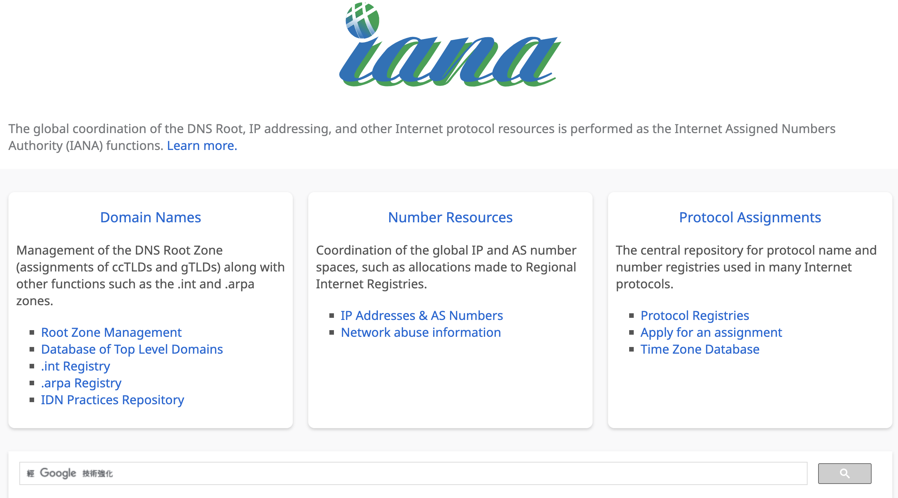

tags:: [[Coordinating Organization]], [[Standard Organization]]
alias:: [[Internet Assigned Numbers Authority]]
---

- ## 学习路径
	- [[IANA Concept]]
	  logseq.order-list-type:: number
	- [[IANA, PTI 与 ICANN]]
	  logseq.order-list-type:: number
- ## Index
	- [IANA 维护的所有内容](https://www.iana.org/)
		- {:height 351, :width 657}
	- ==IANA 维护的标准==
		- Domain Names
		  logseq.order-list-type:: number
			- [[Reserved Domain]]
			  logseq.order-list-type:: number
		- Number Resouces
		  logseq.order-list-type:: number
		- Protocol Assigmemts
		  logseq.order-list-type:: number
			- [[Media Type]]
			  logseq.order-list-type:: number
	-