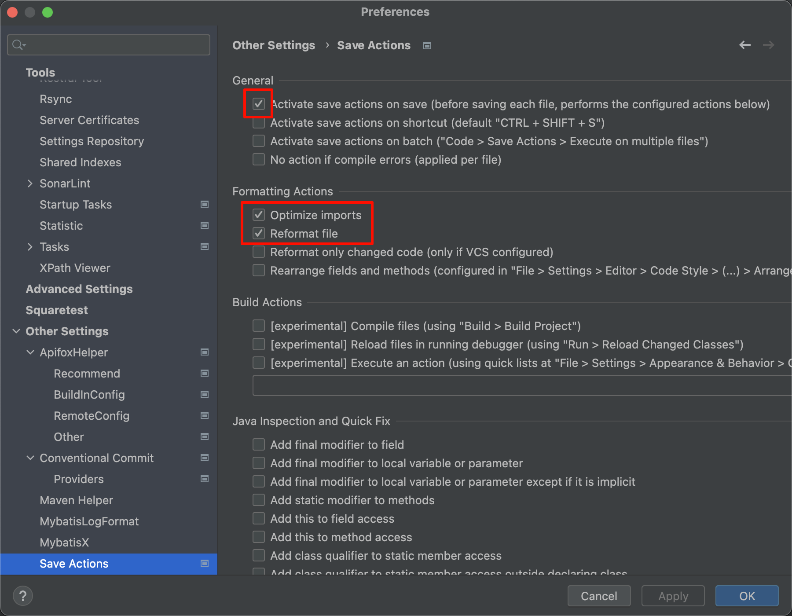

tags:: [[Intellij IDEA]]
---

- ## 代码质量
	- SonarLint
	  logseq.order-list-type:: number
	- Alibaba Java Coding Guidelines
	  logseq.order-list-type:: number
- ## 代码风格
	- CamelCase (标识符风格转换，大小驼峰式、连字符式、下划线式)
	  logseq.order-list-type:: number
	- Save Actions
	  logseq.order-list-type:: number
		- {:height 229, :width 742}
- ## Maven
	- Maven Helper
	  logseq.order-list-type:: number
- ## MyBatis
	- MyBatisX
	  logseq.order-list-type:: number
	- MybatisLogFormat
	  logseq.order-list-type:: number
- ## 控制台日志
	- Grep Console (过滤和高亮控制台打印的日志)
	  logseq.order-list-type:: number
	- logseq.order-list-type:: number
- ## Git
	- Conventional Commit
	  logseq.order-list-type:: number
- ## AI 编码辅助
	- MarsCode AI
	  logseq.order-list-type:: number